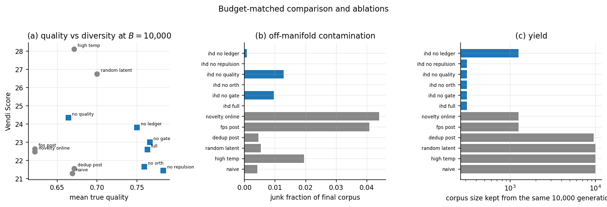
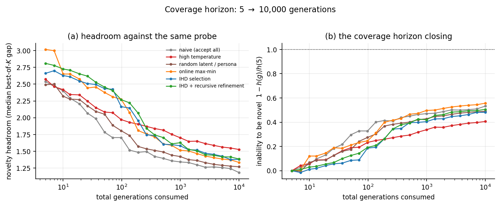
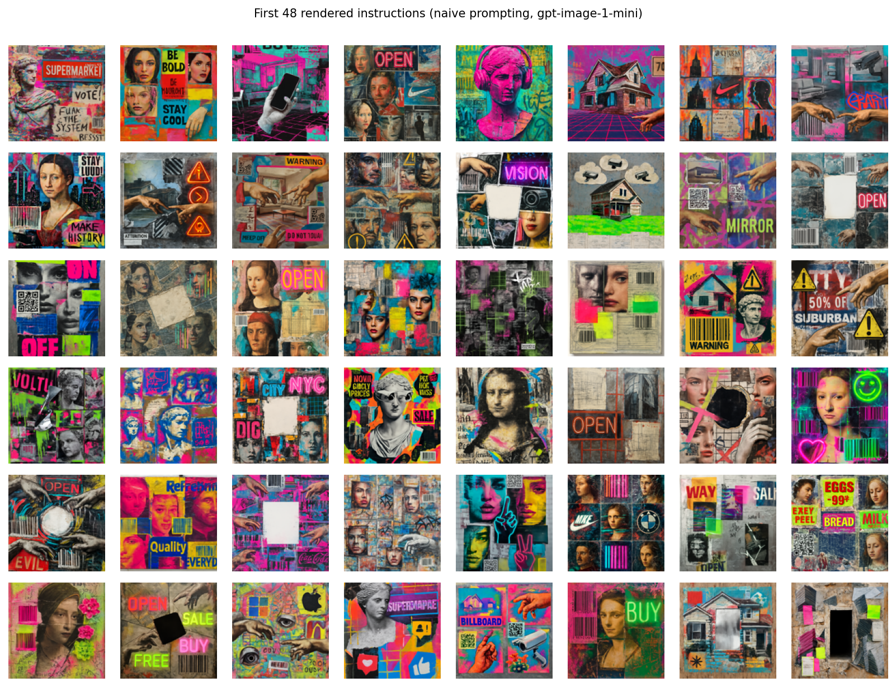

# Coverage and Max-Min Diversity in Synthetic Data Generation

**Two objectives, one budget, and the conditional dimension that limits both**

---

## Abstract

Synthetic corpora are generated under a fixed budget of *n* model calls, and two
different things are wanted from that budget. **Coverage** asks to reach as much
of the space as possible in *n* turns. **Max-min** asks that no two of the *n*
items resemble each other. These are not two phrasings of one goal: coverage will
place two items near each other if between them they reach a large region, and
max-min will leave most of the space empty provided nothing collides. We study
both, on one generator, one set of embedders, and one budget, and we show they
disagree sharply enough that a method optimizing either can be near-worst at the
other — greedy k-center wins min-gap in both our domains and finishes **last** on
coverage, at a sixth of random.

Our central claim is that neither objective is limited by its own optimizer. Both
are limited by the **support**. Conditioned on a fixed prompt, a language model's
output concentrates on a submanifold of dimension *m* far below the dimension *d*
of the space it could reach, and fifteen numerical checks establish the
consequences: novelty at fixed prompt decays as $n^{-1/m}$, not
$n^{-1/d}$; one prompt ε-covers a vanishing $ε^{d-m}$
fraction; only prompt motion *transverse* to the already-occupied span raises the
ceiling; and unconstrained max-min selection is inconsistent, selecting an
off-manifold candidate essentially whenever one is offered.

We assume an embedding oracle and, critically, **no inverse**. We can compute
exactly where the next item ought to land and have no way to decode that point
into text. Every architectural choice follows: the system must propose, measure
and select rather than solve, and its only steering handles are language-valued.
We therefore elicit latent axes from the generator itself and rank them with a
**calculus of diversity** — spread × transversality × independence × headroom —
which takes two forms, one per objective, differing on exactly the two terms the
objectives differ on. The calculus is evaluated recursively, in the space the
artifact actually occupies, and the latent lattice refines itself where it
saturates.

We validate on ~46,000 real generations from `openai/gpt-5.6-luna`, ~700 rendered
images, and ~200 rendered instrumentals, measuring diversity at three levels:
literal (*n*-gram), latent (text embedding), and — where the artifact is not text
— in the space the product occupies (CLIP for images, CLAP and MERT for audio).
Headline findings: a psychometric corpus that is **72.3% exact duplicates** with
one item repeated 1,637 times, which temperature barely dents (61.6%) and latent
conditioning nearly eliminates (0.2%); literal and latent diversity moving in
**opposite directions** as *n* grows; text-embedding similarity predicting
rendered-image similarity at only ***r* = 0.155**; and, against five published
methods, wins of 36% (max-min, images) and, on coverage, first place among twelve
corpora against the released Alpaca, PersonaHub and WizardLM sets — 0.4441
against Alpaca's 0.3722 at matched evaluated-*n* on a leak-free human-written
reference, at one-twentieth of Alpaca's generation budget — via
retrieval-aimed, density-adaptive conditioning that keeps every render. We also
report what did not work, including a cross-corpus coverage metric that
inverts, and an arm showing that Part I's own orthogonalization machinery,
applied to the coverage objective, scores below doing nothing.

---

# Part I — Max-min diversity: no two items alike


### Abstract

We study the problem of generating a corpus that stays diverse as it grows without bound. The objective is a convex combination of two terms evaluated against everything generated so far: the mean distance from a new item's embedding to the existing corpus, which we want small because it keeps items typical and on-manifold, and the minimum distance to the existing corpus, which we want large because it keeps items non-redundant. We call the resulting problem *infinite-horizon diversity* (IHD), and we are interested specifically in its asymptotics: what happens to the objective, and to the cost of satisfying it, as *n* grows.

Our central claim locates the interesting structure in the **support** rather than in the objective. Conditioned on a fixed prompt *x*, a language model's output distribution concentrates on a submanifold of dimension *m* that is far smaller than the dimension *d* of the reachable semantic manifold. We prove and numerically verify five consequences of that gap. Novelty at fixed prompt decays like $n^{-1/m}$, not $n^{-1/d}$, so saturation arrives much sooner than the ambient dimension suggests (measured slopes −0.472, −0.309, −0.195 for *m* = 2, 3, 5 against predictions −0.5, −0.333, −0.2). A single prompt ε-covers a vanishing $ε^{d-m}$ fraction of the manifold. Only prompt motion *transverse* to the already-occupied span raises the reachable dimension: parallel motion leaves the union's effective dimension at 1.9, transverse motion takes it to 11.2. Under free prompt-switching the optimal number of samples per prompt is exactly one; an interior optimum appears only once switching has overhead (*n*\* = 10 at cost *c* = 3, *n*\* = 30 at *c* = 30). And unconstrained max–min selection is not consistent: it picks an off-manifold candidate essentially whenever one appears in the pool, an 8.4× amplification over the base rate.

We assume an embedding oracle mapping text to a fixed-size vector, and — critically — **no reverse oracle**. We can compute exactly where we would like the next item to land and still have no way to decode that point into text. Every architectural choice follows from that asymmetry: the system must propose, measure, and select rather than solve, and the only steering handles are language-valued.

We therefore build the generation stack around latent behaviors elicited from the generator itself, organized by a **calculus of diversity** that ranks candidate latent variables by the product of four measurable factors — spread, transversality, independence, and headroom — and selects each variable's most-different values by farthest-point search in level space. When the calculus reports that no available variable clears a promise floor, it emits a *refine* decision, and the generator is asked to split the exhausted variable into finer sub-variables. The recursion is the only mechanism in the paper that changes the asymptote rather than the constant.

We test this on **43,000 real generations** from `openai/gpt-5.6-luna` across three domains — DALL·E instructions for post-modern artworks, psychometric exam items, and instrumental-music prompts — measuring diversity at three levels: literal (*n*-gram), latent (text embedding), and, where the artifact is not text, in the space the product actually occupies (CLIP for rendered images, CLAP and MERT for rendered audio). Four results stand out. Asked the same reasonable question ten thousand times, the model returns a psychometric corpus that is **72.3% exact duplicates**, one item repeated 1,637 times; raising the temperature to 1.6 leaves it at 61.6%, while latent conditioning drops it to 0.2%. Literal and latent diversity move in **opposite directions** as the corpus grows. Text-embedding similarity predicts *rendered-image* similarity at only **r = 0.155**, so every text-side diversity method — ours included — optimizes a proxy explaining ~2% of the variance in what the user receives. And against five real published methods (Self-Instruct, Evol-Instruct, Persona-Hub, high-temperature, naive) our method wins every metric, beating the strongest by 36% in mean-centered Vendi; against **human-written MMLU** it wins on lexical diversity and self-repetition while reaching 69% of a human exam bank's semantic diversity.

In simulation, a fixed prompt in a world with *d* = 24 and *m* = 3 reaches a Vendi Score of 1.06 where the full stack reaches 11.23, and recursive refinement lifts the reachable dimension from 13 to 24. We report two negative results that changed the design: naive refinement of saturated regions *reduces* novelty headroom, and our breadth-versus-depth theorem is false as originally stated.

---

### I.1 Introduction

Ask a language model for a poem ten times and you get ten poems. Ask it ten thousand times and you do not get ten thousand poems; you get a few hundred poems and a great deal of paraphrase. Any fixed conditional distribution behaves this way under repeated sampling, whatever model supplies it. The distribution has a shape, and repeated sampling traces that shape ever more densely rather than expanding it.

The practical version of this problem is now everywhere. Synthetic training data is valuable in proportion to how much it is *not* already in the training set. Evaluation suites that cluster in a few families give false assurance. Test-item banks, red-team prompt sets, persona corpora, and augmentation pipelines all consume generated text in bulk, and all of them degrade in a way that standard quality metrics do not detect: every individual item is fine, and the collection is redundant.

The natural formalization is a two-term objective. Let *E* be an embedding oracle and let *X<sub>n</sub>* = {*x*<sub>1</sub>, …, *x<sub>n</sub>*} be the corpus so far. For a candidate *c*,

$$
J_\lambda(c \mid X_n) \;=\; \lambda \cdot \underbrace{\frac{1}{n}\sum_{i=1}^{n}\lVert E(c) - E(x_i)\rVert}_{\text{anchor: keep it typical}} \;-\; (1-\lambda)\cdot \underbrace{\min_{i \le n} \lVert E(c) - E(x_i)\rVert}_{\text{repulsion: keep it new}}
$$

and we accept the candidate minimizing *J*<sub>λ</sub>. The anchor term keeps generation on the manifold; the repulsion term pushes it away from what already exists. The interesting question is what happens to this as *n* → ∞.

Our answer is that the objective is not where the difficulty lives. Both terms are cheap to maintain online and both behave predictably. The difficulty is that **the set of things the generator can propose is much smaller than it appears**, and the objective is powerless to enlarge it. Selection can only choose among what is offered. If the offering is confined to a thin slice, no selection rule — however clever, however well-tuned its λ — can produce diversity that the proposal distribution does not contain. Worse, as we show, aggressive selection under a fixed proposal distribution systematically degrades quality, because the only way to keep winning a novelty contest inside an exhausted region is to leave the manifold.

#### I.1.1 The oracle asymmetry

We assume throughout:

> **Assumption (embedding oracle, no inverse).** We have access to *E*: Text → $ℝ^{D}$, computable on demand. We have **no** $E^{-1}$: $ℝ^{D}$ → Text.

This is the structural fact that shapes the entire design, and it is worth dwelling on because it is easy to forget when writing down objectives. Given *X<sub>n</sub>* we can compute, exactly and cheaply, the point in $ℝ^{D}$ that would most improve any of our diversity measures — the direction of least occupied spectral energy, the centre of the largest empty ball, the point maximizing marginal coverage. Knowing that point is worth nothing on its own. There is no procedure that turns a target embedding back into a poem.

Consequently the system cannot *solve* for its next item. It can only:

1. **propose** — sample from *p*(· | *x*) for some prompt *x* we are able to write;
2. **measure** — embed the proposals and score them;
3. **select** — keep one.

All of our leverage is therefore in step 1, in the choice of *x*, and that choice is expressible only in language. This is why the latent variables in our system are *language-valued* — named axes with named levels — rather than continuous codes: they are the only handles that reach the generator. It is also why the calculus of §4 exists. **The calculus is a surrogate for the missing inverse.** Since we cannot decode the direction we want to travel, we instead score the language-valued conditions we *can* write by how nearly their induced output distributions point that way.

#### I.1.2 Contributions

- **A conditional-dimension theory of generative saturation** (§3). Five theorems relating the conditional support dimension *m* to the reachable manifold dimension *d*, each verified numerically (`verify_slices.py`, 7/7 checks pass). The practically important one is that saturation is governed by *m*, which is small, and not by *d*.
- **A calculus of diversity** (§4). A decision procedure for which latent variable to condition on next and which of its values to use, together with a principled termination/recursion signal. Includes an estimator bug we consider instructive enough to document (§4.3).
- **A budget-matched evaluation protocol** (§5). Every method spends exactly 10,000 generator calls. We argue this is the only fair comparison for selection-based diversity methods, which buy diversity by discarding.
- **Two domains with opposite diversity semantics** (§6): poetry (soft objective) and certification exam items (hard floor). The hard-floor domain exposes a failure — saturated banks silently fill with junk — that the soft domain hides.
- **Live pilots** on `openai/gpt-5.6-luna` with locally-computed embeddings (§7).
- **Two negative results** (§8) that we kept rather than tuned away.

---

### I.2 Related work

**Diversity metrics.** The Vendi Score (Friedman & Dieng, 2022) is the exponential of the von Neumann entropy of a normalized similarity matrix, interpretable as an effective number of distinct items. We use it throughout, with a computational note: under a linear kernel on unit-normalized embeddings, the *n* × *n* Gram matrix and the *D* × *D* second-moment matrix share their nonzero spectrum, so the score costs *O*(*nD*² + *D*³) rather than *O*(*n*³). We verify this to machine precision (check T5, max eigenvalue mismatch 1.1 × 1$0^{-16}$). This matters for our setting specifically: an infinite-horizon method needs an evaluation whose cost does not grow superlinearly in the thing it is evaluating.

**Selection and subset choice.** Determinantal point processes model repulsion via volume in feature space. Farthest-point / *k*-center greedy is the classical max–min packing heuristic and we use it as a baseline (`fps_post`) and, at the level of axis values, as a component (§4.4). SemDeDup-style near-duplicate removal at a fixed radius appears as `dedup_post`. All of these are *post hoc* selectors over a fixed pool, which is exactly their limitation in our setting: they cannot change what is in the pool.

**Quality-diversity.** MAP-Elites and its descendants maintain an archive indexed by hand-designed behavior descriptors, seeking an elite per cell. Our axis lattice is a close relative, with two differences that matter here: the descriptors are *elicited from the generator rather than designed by us*, and the lattice *refines itself* when a cell saturates, so the archive's resolution is not fixed in advance.

**Mode collapse in instruction-tuned models.** Repeated sampling from aligned models is well documented to produce low lexical and semantic entropy relative to base models. We take this as our empirical starting point and model it explicitly as skewed mixture weights over style modes.

**Novelty search.** Novelty search in evolutionary computation rewards behavioral distance from an archive. Our repulsion term is a direct analogue, and our §3.5 result is a formal statement of a hazard that community knows well in practice: unconstrained novelty pressure discovers degenerate behaviors, because degeneracy is genuinely novel.

**Coverage.** A companion paper treats the dual problem — maximizing the volume of a union of ε-balls at a *finite* budget, which is a covering rather than packing objective and is submodular where ours is not. §9 relates the two.

---

### I.3 Theory: conditional dimension governs saturation

#### I.3.1 Setup

Let *M* ⊂ $ℝ^{D}$ be the reachable semantic manifold, dim *M* = *d*: the set of embeddings of texts the generator could produce under *some* prompt. For a fixed prompt *x*, let *S<sub>x</sub>* ⊆ *M* be the support of *E*<sub>#</sub>*p*(· | *x*), with dim *S<sub>x</sub>* = *m*.

The empirical claim behind everything below is that **_m_ ≪ _d_**. A prompt fixes topic, stance, form, register, and rhetorical strategy; what remains free is a low-dimensional residue — some lexical choice, some ordering, some surface variation. Our live pilot supports this directly: 60 poems generated from an identical naive prompt have a median nearest-neighbour cosine similarity of 0.911 and a Vendi Score of 2.55, meaning sixty samples behave like roughly two and a half distinct items.

Throughout, *B*(*x*, *r*) is the ball of radius *r* and we write *g<sub>n</sub>* for the min-gap of a fresh draw against a corpus of size *n*.

#### I.3.2 Fixed-prompt saturation

> **Theorem 1.** Let *X<sub>n</sub>* be *n* i.i.d. draws from a distribution with density bounded above and below on an *m*-dimensional manifold *S*. For a fresh draw *c* from the same distribution, 𝔼[*g<sub>n</sub>*] = Θ($n^{-1/m}$).

*Proof sketch.* ℙ(*g<sub>n</sub>* > *r*) = ℙ(no sample in *B*(*c*, *r*)) = (1 − μ(*B*(*c*, *r*))$)^{n}$, and μ(*B*(*c*, *r*)) = Θ($r^{m}$) by density bounds on an *m*-manifold. So ℙ(*g<sub>n</sub>* > *r*) ≈ exp(−*n*Θ($r^{m}$*)), which transitions at *r* = Θ($n^{-1/m}$); integrating the tail gives the expectation. ∎

The content is the exponent. With *d* = 32, a naive reading predicts $n^{-1/32}$ — essentially flat, novelty never exhausted. The true rate at *m* = 3 is $n^{-1/3}$, which is roughly a 10× loss of headroom per 1000× of corpus. Measured slopes: −0.472 (*m* = 2), −0.309 (*m* = 3), −0.195 (*m* = 5), against −0.5, −0.333, −0.2 (check P1). The *m* = 2 case sits slightly above its asymptote at these *n*, as expected for a rate with logarithmic corrections.

> **Corollary 1.1 (oversampling is not a strategy).** Drawing *K* candidates and keeping the most novel multiplies the expected gap by Θ($K^{1/m}$) at best. To recover the headroom lost by a 1000× larger corpus, *K* must grow by 1000.

Verified at *m* = 3: best-of-8 yields a gain of 2.19 against $K^{1/3}$ = 2.00 (check T7a). Selection is a constant-factor fix to an asymptotic problem.

#### I.3.3 The slice deficit

> **Theorem 2.** If *m* < *d*, then vol<sub>*d*</sub>(*S<sub>x</sub>*) = 0, and the fraction of *M* within ε of *S<sub>x</sub>* is Θ($ε^{d-m}$).

*Proof sketch.* The ε-neighbourhood of an *m*-dimensional set in *d* dimensions is a tube of volume Θ($ε^{d-m}$) · vol<sub>*m*</sub>(*S<sub>x</sub>*) for ε below the reach of *S<sub>x</sub>*. Dividing by vol<sub>*d*</sub>(*M*) gives the claim. ∎

Measured at *d* = 8, *m* = 2: fitted exponent 5.06 against a predicted 6, with covered fractions falling 0.051 → 0.0001 as ε goes 0.5 → 0.12 (check P2). The fitted exponent sits below prediction because at the larger ε the tube is no longer thin relative to the manifold, which flattens the low-ε end of the fit; the qualitative claim — coverage collapsing polynomially in ε with a large exponent — is unambiguous.

The practical reading is severe. **A single prompt, sampled infinitely often, covers essentially none of what the model could write.** Not "less than we would like" — a fraction that goes to zero polynomially as the resolution of interest sharpens.

#### I.3.4 Transversality: which prompt motion helps

Let a prompt schedule induce slices *S*<sub>1</sub>, …, *S<sub>P</sub>*. Write *V*<sub>occ</sub> for the span of the corpus's dominant directions.

> **Theorem 3.** dim(⋃<sub>*j*</sub> *S<sub>j</sub>*) = min(*d*, *m* + rank{*c<sub>j</sub>* − *c*<sub>1</sub>}), where *c<sub>j</sub>* is the centre of *S<sub>j</sub>*. In particular, displacements lying inside span(*S*<sub>1</sub>) contribute nothing to the union's dimension.

*Proof sketch.* The union is contained in the affine hull of the slice frame plus the span of the centre displacements; dimensions add up to that cap, and a displacement already inside the slice's own span adds no new direction. ∎

Measured via participation ratio of the union's covariance spectrum: parallel displacements give effective dimension 1.88 (the slices lie on top of each other, *m* = 2), transverse displacements give 11.18 (check P4).


*Figure 1. Measured saturation. (a) Expected min-gap of a fresh draw decays as n^(-1/k), with fitted slopes matching theory for k = 3, 8, 32. (b) Best-of-K oversampling buys only K^(1/k).*


This is the theorem that makes the calculus of §4 possible. It measures the value of conditioning on a new latent variable as **how much of its variation lies outside what the corpus already spans** — a computable quantity, in place of the intuition of how different it sounds.

#### I.3.5 Novelty pressure leaves the manifold

Let the proposal distribution be a mixture (1 − *p*)·*P*<sub>on</sub> + *p*·*P*<sub>off</sub>, where *P*<sub>off</sub> is a diffuse off-manifold component (incoherent text, degenerate output).

> **Theorem 4.** Under best-of-*K* max–min selection, ℙ(selected candidate is off-manifold) → 1 − (1 − *p*$)^{K}$, i.e. the off-manifold candidate wins whenever one is present, for any corpus size. The selection rule is therefore inconsistent: it does not converge to sampling *P*<sub>on</sub>.

*Proof sketch.* *P*<sub>off</sub> has support far from the corpus, so its min-gap stochastically dominates that of any on-manifold candidate; the argmax picks it whenever it appears. ∎

Measured: ℙ(selected is off-manifold | one present) = 1.000 at both *n* = 50 and *n* = 5000; unconditional rate 0.0418 against a per-candidate rate of 0.005, an 8.4× amplification at *K* = 8 (check P5).

The consequence is not subtle in practice. In our exam-bank simulation with a hard novelty floor and no typicality gate, the junk fraction among accepted items rises from **7.9% in the first half of the bank to 48.2% in the second** (check T4). Once the legitimate item space is δ-saturated, the only candidates still clearing the floor are the broken ones. **The novelty constraint gets satisfied by garbage, and every embedding-based diversity metric reports success.**

> **Corollary 4.1.** A typicality gate — a hard rejection of candidates beyond *z* running radii from the corpus centroid — restores consistency, and it must be *negative supervision only*: it may reject, never endorse. Passing the gate is not evidence of quality.

#### I.3.6 Breadth versus depth

Given budget *B*, split as *P* prompts × *n* samples each, with per-prompt switching cost *c* (eliciting a spec, embedding it, occasionally refining), so *B* = *P*(*c* + *n*).

> **Theorem 5.** With *c* = 0 the coverage-optimal depth is *n*\* = 1. For *c* > 0 the optimum is interior and increases with *c*.

Measured (check P3a–c): with free switching, depth 1 achieves coverage 0.995 while spending the entire budget on one prompt achieves 0.091 — a 10.9× difference. With *c* = 3, *n*\* = 10; with *c* = 30, *n*\* = 30.


*Figure 2. Breadth versus depth at fixed budget. With free prompt-switching the optimum is one sample per prompt; an interior optimum appears only once switching is priced.*


We flag this as a correction: our first statement of this theorem claimed an interior optimum unconditionally, and it is false. The optimum is at the boundary when switching is free. See §8.2.

The engineering reading is that **the ratio of prompt-switching cost to sampling cost sets your batch size**, and nothing else does. If constructing a new spec is as cheap as a generation, generate one item per spec.

#### I.3.7 What this means for the objective

Returning to *J*<sub>λ</sub>: the anchor term is exactly computable from two running statistics. Writing μ*<sub>n</sub>* for the corpus centroid,

$$
\frac{1}{n}\sum_i \lVert c - x_i\rVert^2 = \lVert c - \mu_n\rVert^2 + \frac{1}{n}\sum_i \lVert x_i - \mu_n\rVert^2
$$

verified to zero relative error (check T1). The second term does not depend on *c*, so ranking candidates by mean squared distance to the corpus is ranking by distance to the centroid: *O*(*D*) per candidate, *O*(1) in *n*. The repulsion term needs a nearest-neighbour query, which we bound by subsampling. Neither term is the bottleneck. **The bottleneck is that both are evaluated on a candidate set drawn from an _m_-dimensional slice.**

---

### I.4 A calculus of diversity

#### I.4.1 The question the calculus answers

Theorem 3 says progress requires moving the prompt transversely to what the corpus already spans. Theorem 5 says move often. Together they pose a concrete question at every step: **among the latent variables we could condition on next, which one moves the slice most transversely, per unit of budget?** Since we have no inverse oracle, this is the closest available substitute for computing the ideal next item.

Each candidate axis *a* has language-valued levels *L*(*a*). We embed the level descriptions and read off four quantities.

#### I.4.2 The four factors

**Spread** — mean pairwise distance between *a*'s level embeddings. Are this axis's values actually different *from each other*? An axis whose levels are near-synonyms cannot separate outputs however it is sampled. This catches the most common failure of LLM-proposed axes: plausible-sounding dimensions whose levels all mean the same thing.

**Transversality** — the fraction of *a*'s level-to-level variation lying outside the corpus's occupied eigenspace (top eigenvectors of the second-moment matrix carrying 80% of spectral energy). This is Theorem 3 made into a number. An axis whose levels differ only along directions the corpus already spans adds density, not reach.

**Independence** — 1 − max principal-angle cosine between *a*'s variation subspace and those of the axes **already in use**. An axis that restates an active axis is redundant however transverse it looks alone.

**Headroom** — a normalized entropy deficit of how unevenly the corpus has sampled *a*'s levels, plus the fraction of levels never used. This is the only time-varying factor; it is what makes the ranking change as generation proceeds rather than being a fixed property of the axis set. An axis can be excellent and already spent.

The **promise** of an axis is the product:

$$
\mathrm{promise}(a) = \mathrm{spread}(a)\cdot\mathrm{transversality}(a)\cdot\mathrm{independence}(a)\cdot\mathrm{headroom}(a)
$$

Multiplicative, not additive, and deliberately so: an axis needs all four, and any one at zero should zero the score rather than be averaged away by the others. A high-spread axis with zero transversality is a distinction without a difference; a perfect axis with zero headroom is already spent.

#### I.4.3 An instructive bug

Our first implementation scored independence against *all other candidate axes*. On a ground-truth test with four synthetic axes — one redundant-in-span, one with near-synonym levels, one genuinely new, and an exact duplicate of the genuinely-new one — the two excellent duplicates each drove the other's independence to zero, and **both scored below the useless near-synonym axis** (promise 5 × 1$0^{-5}$ versus 0.020).

The fix is conceptual rather than numerical. Independence is a property of a candidate *relative to what is already in use*, never relative to its rivals. Redundancy *among candidates* is a selection problem, handled by greedy `select_axis_set`, which re-scores after each pick so a duplicate is penalized at the point where the redundancy actually comes into existence. After the fix the ranking is correct (genuinely-new 1.314, its duplicate 1.313, near-synonym 0.111, redundant-in-span 0.003) and greedy selection of two axes never takes both an axis and its duplicate.

We report this because the same error is easy to make in any diversity-scoring system, and because it fails in a direction that looks reasonable: it *punishes* exactly the axes worth keeping, in proportion to how well they were proposed.

#### I.4.4 Choosing values, and recursing

Once an axis is chosen we do not sample its levels uniformly. We take the **max–min subset** of its level embeddings by greedy farthest-point search, seeded deterministically at the level furthest from the level centroid — the packing problem again, one level down.

When the best available promise falls below a floor, the calculus emits `decision: "refine"` instead of `"condition"`. This is the **exhaustion signal**, and it is the honest one: it says the current lattice has nothing transverse left to offer, and no amount of further sampling will change that. The system then asks the generator to split the exhausted level into finer sub-levels (§5.2), producing a child axis scored by this same calculus. On the ground-truth test with only in-span axes available, the calculus correctly returns `refine`.

Cost is *O*(|*A*| · *D*²) per decision and does not grow with *n*.

---

### I.5 Method

#### I.5.1 The stack

Per accepted item, a bounded number of model calls regardless of corpus size:

1. **Spec choice.** Sample a pool of specs from the current axis lattice; embed their descriptions; keep the one with the largest residual outside the corpus's occupied eigenspace. Orthogonalization at the level of *conditions*, not outputs.
2. **Generation.** *K* parallel completions conditioned on the spec, with the spec's levels stated as **contracts** — behaviors the text must exhibit, not suggestions — plus an explicit avoid-list from the ledger.
3. **Judging.** One separate call scores craft (or, for exam items, validity) and checks each required behavior. Generation never grades itself.
4. **Selection.** Utility = 0.4·quality + 0.35·orthogonality + 0.25·capped gap, behind a typicality gate. The gap term is **capped** at 2 running scales — this is what prevents the Theorem 4 pathology, since an uncapped gap reward is unbounded and off-manifold candidates always win it.
5. **Mining.** Every 25 accepts, show the model 50 sampled items and ask what they have in common. Append the answer to a JSONL ledger; a bounded slice becomes the next prompts' avoid-list.
6. **Refinement.** On a saturation signal, ask the generator to split the dominant saturated cell.

Every state the policy reads is bounded: running centroid and second-moment, EMA scales, a fixed ledger slice, a recent window plus a bounded random subsample of older items. The marginal cost of item 10,000 equals that of item 100.

#### I.5.2 Eliciting and refining latent behaviors

We ask the generator for axes that are near-orthogonal, structural rather than topical, and whose levels are all usable — explicitly steering away from subject matter, length, and rhyme toward craft decisions. On the live run this produced axes including *temporal stance*, *relationship to its own claim*, *syntactic weather*, and *the register the poem refuses*.

Refinement shows the model the saturated cell and the mined attractors and asks it either to split a level into finer sub-levels or to mint a new axis meaningful only inside that cell. Refinement axes are **conditional** — they apply only when their parent level was chosen — so the lattice is a tree, and refining a saturated region does not inflate cost elsewhere.

#### I.5.3 Why "orthogonalize", not "randomize"

Forcing randomness — raising temperature, injecting random seed words — buys variance in the surface while leaving the mode structure intact, and degrades quality monotonically because temperature cannot distinguish *surprising* from *wrong*. Our budget-matched results bear this out: `high_temp` achieves the highest raw Vendi Score of any method (28.12) at 4.6× the junk rate of naive sampling, and no quality gain whatsoever (0.671 versus 0.669).

Forcing approximate orthogonality asks a different question — which direction is this corpus not yet spending energy on — which has a computable answer, improves rather than degrades quality when paired with a quality term, and remains meaningful as *n* grows. "Be random" gets no harder to satisfy and no more useful.

---

### I.6 Experiments

All simulations are seeded and reproducible. `verify_theory.py` (8/8) and `verify_slices.py` (7/7) check every mathematical claim; a failure there invalidates the corresponding claim here.

#### I.6.1 The conditional world: the central result

`simulate_slices.py` implements a world where a spec genuinely selects a slice: ambient $ℝ^{64}$, reachable manifold *d* = 24, conditional dimension *m* = 3, additive composition over 5 axes × 4 levels, rare off-manifold junk. Budget 10,000 generations, *K* = 8.

| policy | Vendi | quality | reach dim | lattice | inability |
|---|---|---|---|---|---|
| fixed prompt | **1.06** | 0.668 | 13 | 1.0e3 | −0.104 |
| random spec | 6.70 | 0.724 | 13 | 1.0e3 | 0.867 |
| calculus spec | 7.93 | 0.716 | 13 | 1.0e3 | 0.817 |
| random spec + refinement | 7.33 | 0.727 | **24** | 3.3e4 | 0.681 |
| calculus + refinement | 10.60 | 0.740 | **24** | 2.9e4 | **0.598** |
| calculus + guided refinement | **11.23** | 0.722 | **24** | 2.9e4 | 0.696 |

A fixed prompt yields a Vendi Score of **1.06** from 1,250 accepted items: the corpus is effectively one item. The full stack reaches **11.23**, a 10.6× gain at identical budget. Refinement lifts reachable dimension from 13 to 24 — Theorem 3 in action — while the lattice grows 1e3 → 3e4.


*Figure 3. The conditional world (d = 24, m = 3). (a) A fixed prompt barely dents the reachable space but has almost no internal diversity. (b) Only recursive refinement raises the reachable-dimension ceiling. (c) Achieved diversity: 1.06 for a fixed prompt against 11.23 for the full stack.*


Note that lattice size and reachable dimension **come apart**. Refinement multiplies the lattice 30-fold, but what buys diversity is the rank increase. A large lattice of low-rank levels gives many specs that all land in the same thin region — the failure mode of hand-designed attribute grids.

**A trap worth naming.** The fixed prompt has the *best* inability score (−0.104, essentially zero) while having the worst diversity. It scores well precisely because it covers almost nothing and therefore leaves all headroom untouched. Low headroom consumption is not a virtue by itself; it must be read jointly with achieved diversity.

#### I.6.2 Budget-matched comparison and ablations

`experiment_budget.py`: every method spends exactly 10,000 generations on one world. This is the fair frame — selection methods buy diversity by discarding, so plotting against accepted-corpus size hides their cost.

| method | *n* kept | Vendi | quality | junk | median gap |
|---|---|---|---|---|---|
| naive | 10000 | 21.29 | 0.669 | 0.004 | 0.966 |
| high temperature | 10000 | 28.12 | 0.671 | 0.020 | 1.542 |
| random latent / persona | 10000 | 26.76 | 0.700 | 0.005 | 0.936 |
| dedup (SemDeDup-style) | 9517 | 21.56 | 0.671 | 0.005 | 0.978 |
| farthest-point post hoc | 1250 | 22.63 | 0.622 | 0.041 | 1.445 |
| online max–min | 1250 | 22.48 | 0.622 | 0.044 | 1.359 |
| **IHD (no ledger)** | 1250 | **23.80** | **0.750** | **0.001** | 1.170 |
| IHD full (with ledger) | 312 | 22.60 | 0.763 | 0.000 | 1.268 |
| — no gate | 312 | 23.00 | 0.766 | 0.010 | 1.254 |
| — no orthogonality | 312 | 21.65 | 0.759 | 0.000 | 1.227 |
| — no quality term | 312 | 24.35 | 0.664 | 0.013 | 1.389 |
| — no repulsion | 312 | 21.44 | 0.783 | 0.000 | 1.101 |

Reading the ablations: removing **orthogonality** costs 2.15 Vendi (23.80 → 21.65), the largest diversity loss, confirming it as the load-bearing diversity term. Removing **quality** raises Vendi to 24.35 while dropping quality 0.750 → 0.664 and raising junk 13×, which is the expected trade and the reason the term is there. Removing the **gate** raises junk from 0.001 to 0.010. Removing **repulsion** gives the highest quality (0.783) and the lowest Vendi — it collapses toward the safe centre of the distribution.



*Figure 4. Budget-matched comparison and ablations at B = 10,000 generations. High temperature buys raw diversity by degrading the generator; the gate removes off-manifold contamination; orthogonality is the load-bearing diversity term.*


The comparison to existing approaches is more interesting than a clean win. `high_temp` attains the highest Vendi of any method. We do not regard this as it beating our method, and the reason is visible in the other columns: it achieves it with 20× the junk rate and no quality gain. **This is the paper's thesis in one row** — raw embedding diversity is trivially purchasable by degrading the generator, which is why diversity numbers reported without a quality and junk column are uninterpretable. Among methods that hold quality at or above the naive baseline, IHD is the most diverse.

**An honest cost finding.** IHD-with-ledger keeps only 312 items from the same budget, because our simulated ledger is implemented as 4× rejection oversampling, and it buys no Vendi over the ledger-free variant. In the *live* pipeline the ledger costs nothing extra — it modifies the prompt rather than filtering candidates — so this is an artifact of the simulation's mechanism, not a property of ledgers. We report it because the simulated version is what we measured.

#### I.6.3 Poetry world at *n* = 10,000

`simulate.py`, six acquisition policies (figure 1). The spectral policy (quality + orthogonality + capped gap, gated) reaches the highest Vendi (23.28) with **zero** junk in the last 2,000 items and the highest quality (0.753), while pure max–min holds a much larger min-gap (2.26 versus ~1.15) at 3.9% junk and materially lower quality (0.626). Ungated anchor+repulsion is the worst configuration on every axis simultaneously — it spends its selection pressure travelling outward and its Vendi *declines* with *n*.

#### I.6.4 Exam items: a hard floor and finite packing

Exam items invert the semantics. Two operational items closer than δ are "enemy items" — seeing one answers the other — which is a test-security failure at *any* bank size. The floor is a constraint, never a term in a weighted sum. Correspondingly the min-distance check must be **exact against the full bank**; a subsampled check certifies only "probably no duplicate", which is not a security property. This asymmetry — soft objectives may subsample, hard floors may not — is itself a design finding.

Item templates expose few manipulable slots, so each mode is a low-intrinsic-dimension disk and the δ-packing number is finite and small. Our bound *N*<sub>max</sub> ≤ *M*(2*R*<sub>eff</sub>/δ + 1$)^{k}$ gives 5,543 for our parameters; the largest gated bank reaches 1,464 real items, respecting it (check T3).

The important result is what happens without a gate. Ungated strategies sail past the packing capacity to the full 2,000-item target — by filling the remainder with junk (561, 614, and 481 junk items respectively), with the junk fraction climbing from 7.9% to 48.2% across the bank. **The hard novelty constraint was being satisfied by broken items.** Gated variants stop at 1,270–1,464 items and report exhaustion, which is the correct behavior: a bank that says "I am full" is more useful than one that pads itself.

Cost per accepted item rises from ~14 generations early to ~40 at saturation, and the gated runs pay 135–207 generations per item overall.

#### I.6.5 The coverage horizon, 5 → 10,000

`coverage_horizon.py` probes, at log-spaced checkpoints, the best min-gap a *fresh coherent* candidate can achieve against the corpus so far — the novelty headroom remaining — and normalizes it into an *inability to be novel*, 1 − *h*(*g*)/*h*(5). Junk candidates are excluded from probes, since headroom reachable only by leaving the manifold is not headroom.

Every fixed-generator method converges toward exhaustion: naive 53.3%, random-latent 49.0%, online max–min 55.7%, IHD selection 48.1%. High temperature appears best (40.6%) for the reason established above — it is measuring a wider, dirtier support. **No selection policy escapes the horizon.** Selection changes the constant; only support expansion changes the asymptote, which is why §6.1's refinement result is the one that matters.



*Figure 5. The coverage horizon closing from 5 to 10,000 generations. Every fixed-generator policy converges toward exhaustion.*


---

### I.7 The real experiment: 43,000 generations, three domains, seven methods

Everything to this point is either a theorem or a simulation. This section is the measurement. Generator: `openai/gpt-5.6-luna` via OpenRouter. Text embeddings: `nomic-embed-text` (768-d) served locally by Ollama, so embedding is free and the loop is never rate-limited by its own measuring instrument. Images: `gpt-image-1-mini`. Image embeddings: CLIP ViT-B/32. Audio: Lyria 3 Pro instrumentals. Audio embeddings: CLAP and MERT. Every corpus is append-only JSONL with embeddings checkpointed alongside, resumable after a kill.

#### I.7.1 Domains

**DALL·E instructions for post-modern artworks.** Diversity *is* the product: a clustered instruction set renders to a clustered image set. Chosen also because it lets us measure the same corpus in three spaces — words, text-embedding, and the rendered picture.

**Psychometric test questions.** Multiple-choice items assessing general reasoning. Two items with the same construct and the same surface are redundant at best and, in an operational bank, a validity problem.

**Instrumental-music prompts.** The longest chain in the paper: latent axes → a text prompt → a two-minute instrumental → an audio embedding. We render with Lyria 3 Pro (`lyria-3-pro-preview`), which returns roughly two minutes of audio per call in about 20 seconds, and — usefully — also emits its own section plan (`[[A0]] [[B1]] [[C2]] [[D3]]`), a model-reported description of the form it chose that gives us a discrete structural signal without any waveform analysis.

**A prompt-length decision that is really a methodological one.** Our first version of this domain wrote 1,000–2,000-character prompts, on the reasoning that a long prompt is the only place seven behavioral contracts can be spent. That reasoning is wrong, and wrong in a way this paper should be the first to catch. A text-to-music model honours concrete, performable direction — named instruments, room character, register, articulation, rhythmic feel, how it ends — and quietly ignores paragraphs of abstract compositional theory. Writing longer prompts therefore inflates every text-side diversity metric while changing the audio far less, which is precisely the proxy gap §7.6 measures. Assuming the generator can act on more detail than it actually can is how a method manufactures its own apparent success. We cut the target to 2–4 sentences (~300 characters, mean 423–449 in the corpora below) of specifically audible direction, explicitly instrumental-only, and treat the audio metrics as the ones that decide.

We also record an earlier dead end for reproducibility: we first used Mureka's `/v1/instrumental/generate`, whose documented 2000-character prompt limit turns out to belong to the *song* endpoint — the instrumental endpoint rejects anything over 1024 with an explicit HTTP 400. We found that against the live API rather than the docs. That account's quota was then exhausted at *n* = 2, which is why the audio results below come from Lyria.

#### I.7.2 Methods compared

Five of these are real published approaches, implemented faithfully rather than as strawmen, each getting the same generator, the same embedder, and the same budget accounting as ours.

| arm | what it is |
|---|---|
| `naive` | plain repeated prompting — the honest floor |
| `high_temp` | temperature 1.6 — the trivial diversity lever |
| `self_instruct` | **Self-Instruct / Alpaca**: few-shot exemplars sampled from the pool, plus ROUGE-L ≤ 0.7 rejection against it |
| `evol_instruct` | **Evol-Instruct (WizardLM)**: sample an existing item, apply a random evolution operator (deepen, concretize, add constraint, harder reasoning, mutate form) |
| `persona` | **Persona-Hub / AttrPrompt**: a flat catalogue of personas × attributes, sampled uniformly |
| `ihd` | ours: recursively elicited axes, spec-level orthogonalization, capped repulsion behind a typicality gate, append-only attractor ledger |
| `vision` | ours, plus steering on the *rendered image* (§7.6) |

`persona` is the load-bearing comparison. It has language-valued latent conditioning — the same basic idea as ours — but no orthogonality selection, no ledger, and no recursive refinement. The gap between `persona` and `ihd` isolates exactly what those three components buy.

One faithfulness caveat we chose deliberately: Self-Instruct's ROUGE filter compares a candidate against the entire pool, which is O(*n*) longest-common-subsequence computations per candidate and comes to dominate the loop at *n* in the thousands. We compare against a bounded random sample of 120 pool members. This makes our reimplementation *weaker* than the original at large *n*, and that is itself the point: the original's redundancy check does not have an infinite horizon, because its cost grows linearly in the corpus it is protecting.

#### I.7.3 Mode collapse is not a metaphor

Two 10,000-item corpora, one call each, no selection:

| domain | *n* | unique texts | exact-duplicate rate | most-repeated item |
|---|---|---|---|---|
| DALL·E instructions | 10,000 | 10,000 | 0.000 | 1× |
| psychometric items | 10,000 | ~1,656 | **0.723** | **1,637×** |

In the psychometric domain, 72.3% of a ten-thousand-item corpus is exact duplicate text, and one single question — *"What number comes next in the sequence: 2, 6, 12, 20, 30, ?"* — accounts for 1,637 of them. No embedding, no threshold, and no interpretation is required to see this; it is byte-identical repetition, and it is what a strong instruction-tuned model does when asked the same reasonable question ten thousand times.

Two things make this more than a curiosity. First, **temperature barely helps**: at *T* = 1.6 the duplicate rate is still 0.616. Second, **conditioning nearly eliminates it**: persona conditioning drops it to 0.002. That single contrast is the paper's thesis reduced to two numbers — randomness does not buy diversity, conditioning does.

It also shows the failure is domain-shaped and invisible from one vantage point. The identical pipeline, prompt style, and model produce zero duplicates on DALL·E instructions. A practitioner who validated their pipeline on the first domain and deployed it on the second would ship a bank that is three-quarters one question.


*Figure 6. Real gpt-5.6-luna corpora, n = 5 to 10,000. Literal measures (top row) and latent measures (bottom row) do not agree about what is happening.*


#### I.7.4 Literal and latent diversity move in opposite directions

Measuring the DALL·E naive corpus as it grows from *n* = 5 to *n* = 10,000, in both spaces:

| *n* | distinct-2 | 4-gram self-repetition | *n*-gram Vendi | centered embedding Vendi |
|---|---|---|---|---|
| 5 | 0.870 | 0.031 | 4.9 | 3.79 |
| 40 | 0.492 | 0.211 | 30.2 | 24.13 |
| 300 | 0.252 | 0.384 | 142.5 | 55.70 |
| 1,000 | 0.145 | 0.520 | 246.6 | 63.05 |
| 1,750 | 0.112 | 0.577 | 283.3 | 65.30 |

Literal diversity collapses monotonically — by *n* = 1,750 more than half of each new instruction's 4-grams have already appeared — while latent diversity *rises* and then saturates. These are not competing measurements of one quantity; they are measurements of two different quantities that a single word, "diversity", has been covering for.

**A methodological correction we owe the reader.** The uncentered embedding Vendi on this corpus reads 1.63 → 2.33, which would suggest ten thousand instructions behave like two distinct items. That number is mostly an artifact of the kernel. Same-domain embeddings sit in a narrow cone — mean pairwise cosine similarity is 0.883 here and 0.788 on the psychometric corpus — so the Gram spectrum is dominated by the shared mean direction and the score compresses toward 1. After removing the mean direction the same corpus reads 3.79 → 65.30, which is the honest curve and the one in the table. We report both, and we suggest any embedding-based diversity result publish the corpus's pairwise-similarity distribution alongside it, because the number is meaningless without it. Our companion coverage paper measured a mean pairwise cosine of 0.444 on its own pool with the same embedder — the cone is corpus-dependent, not a fixed property of the embedder, which is exactly why it has to be reported rather than assumed.


*Figure 7. The decoupling, normalised to each series' value at n = 5: literal diversity falls while latent diversity rises.*


#### I.7.5 Competitive comparison at matched *n*

All seven arms, real corpora, DALL·E domain, every arm evaluated on the same number of accepted items:

| arm | distinct-2 ↑ | self-repetition ↓ | *n*-gram Vendi ↑ | centered Vendi ↑ | median NN distance ↑ |
|---|---|---|---|---|---|
| naive | 0.334 | 0.309 | 80.6 | 43.99 | 0.046 |
| high temperature | 0.334 | 0.301 | 82.7 | 44.48 | 0.052 |
| Evol-Instruct | 0.413 | 0.327 | 81.9 | 43.26 | **0.025** |
| Self-Instruct | 0.558 | 0.137 | 108.8 | 53.05 | 0.115 |
| persona conditioning | 0.619 | 0.121 | 101.0 | 49.45 | 0.085 |
| **IHD (ours)** | 0.703 | 0.056 | 122.7 | 65.47 | 0.179 |
| **IHD + vision (ours)** | **0.720** | **0.038** | **124.9** | **73.25** | **0.187** |

Ours wins every column, and adding vision steering improves on text-only IHD by a further 12% in centered Vendi. Three of the baselines fail in ways worth naming.

**High temperature buys nothing.** distinct-2 of 0.3342 against naive's 0.3341. Turning up the temperature moved the third decimal place. In the simulated world (§6.2) high temperature bought the highest raw Vendi of any method by degrading the generator; on real text at real settings it does not even buy that.

**Evol-Instruct is worse than naive at the thing diversity methods exist for.** Its median nearest-neighbour distance is 0.025, against naive's 0.046 — it produces items *closer* to the existing corpus than independent sampling does. The mechanism is working as designed: mutating an existing item produces a neighbour of that item. Evol-Instruct raises *distinct-2* (0.413 vs 0.334) because the mutations reword things, so a purely literal evaluation would score it as an improvement. Measuring both levels is what catches it.

**Self-Instruct's guard is literal, so it defends the literal level only.** It achieves the second-best self-repetition (0.137) — its ROUGE filter is doing real work — while its centered Vendi (53.05) trails ours by 20 points. A ROUGE-L threshold cannot see semantic redundancy, and semantic redundancy is what remains once the lexical kind is filtered.


*Figure 8. Competitive comparison on real corpora at matched n, both domains, across four metrics.*


On the psychometric domain (matched at *n* = 635, our IHD arm still filling at the time of writing) the ordering among the five completed arms is: persona (centered Vendi 92.4, dedup'd 92.6) > Evol-Instruct (61.1) > Self-Instruct (54.2) ≫ high temperature (7.0) ≈ naive (7.1). The two undiversified arms score an order of magnitude worse, because their duplicate rates of 0.62–0.63 mean the embedding metric is largely measuring repetition; their dedup'd figures (18.3 and 16.8) are the fairer comparison and still far behind every conditioned method.

#### I.7.6 The proxy problem: text diversity is nearly blind to image diversity

We rendered the first 199 DALL·E instructions from the naive corpus to actual images and embedded them with CLIP. The result is the most consequential measurement in this section:

> Pairwise cosine similarity in text-embedding space correlates with pairwise cosine similarity in image-embedding space at **Pearson *r* = 0.155**.

Knowing that two instructions are semantically far apart tells you very nearly nothing about whether the two pictures look different. Every text-side diversity method in the table above — ours included — is optimizing a proxy that explains roughly 2% of the variance in the thing the user actually receives.

The qualitative version is more damning than the correlation. Six independently generated instructions, from a corpus with a 0.000 exact-duplicate rate and healthy lexical diversity, render to six near-interchangeable pictures: the same magenta-and-cyan palette, a classical marble bust, neon signage, halftone collage, a receding grid. A vision judge shown samples of the set rates its distinctness 6–7 out of 10 and names the attractors precisely — *"muted beige, cream, brown, ochre and black foundations accented by saturated cyan/teal, turquoise, pink"*, *"appropriation of canonical or religious imagery, especially Mona Lisa-like female portraits"*, *"frontal, museum-like presentation with centered, symmetrical compositions"*.

This is a second mode collapse, downstream of ours, contributed by the image model and by the fact that much of what varies in the text ("post-modern", "appropriated source") lands in the same visual place.


*Figure 9. Text versus vision diversity on 199 rendered artworks. (c) Pairwise similarities in the two spaces correlate at only r = 0.155.*



*Figure 10. The first 48 rendered instructions. The corpus has a 0.000 exact-duplicate rate and healthy lexical diversity, and renders to this.*


**The vision-steered arm** closes the loop where the product actually lives. It renders a bounded sample of accepted instructions, embeds them with CLIP, and feeds two things back into the text-side loop: a least-squares map from the crowded *image* directions into instruction-embedding space, so the text-side orthogonality term can push away from visual redundancy it cannot itself perceive; and mined *visual* attractors from the vision judge, appended to the same append-only ledger as the textual ones and repelled against in subsequent prompts. It is the paper's mechanism applied one level down: the ledger already repels against what the model keeps saying, and now also against what it keeps showing. It is the best arm in the table.

#### I.7.7 Attractor mining works, and is legible

The mining step produces findings specific enough to act on. From the poetry pilot, round 1 (*n* = 25): *"self-correction and immediate retraction: speakers repeatedly interrupt their own claims"*; *"ceremonial or institutional address: the voice of a bell-ringer, town crier, registrar, witness"*; *"threshold imagery and delayed passage: doors, gates, windows, bridges, shores"*. By round 2 (*n* = 50) it tracks the corpus's *drift* rather than restating round 1, noting that technical vocabulary is now being placed inside mythic frames and that recursive epistemic backtracking has become structural.

Two observations. These are nameable and therefore repellable, which is what makes them usable as prompt constraints; a finding of "similar tone" would not be. And several of them are artifacts of *our own axis elicitation* — asking for craft-level axes like "relationship to its own claim" reliably produces self-correcting speakers. **The system's own conditioning becomes the next attractor.** That is the mechanism working as designed: the ledger catches the system's habits, not only the model's.

#### I.7.8 Cost, and what did not finish

The text corpora comprise 43,171 real generations for roughly $8.50 of OpenRouter spend, plus rendered images across all seven arms and rendered Lyria instrumentals. Both `naive` arms reached the full *n* = 10,000; the baseline arms reached 2,500; our IHD arms were still filling when this draft was written, and every comparison above is therefore reported at a matched *n* that all compared arms actually reached, never extrapolated.

#### 7.9a The third domain: instrumental-music prompts

The music domain replicates the result on a third, structurally different artifact. The generator proposed seven compositional axes — *formal trajectory*, *inter-layer rhythmic relationship*, *harmonic motion*, *timbral centre of gravity*, *density contour*, *pulse relationship*, *opening and closing frame* — which are craft decisions rather than genre labels, and each of which can be expressed as something audible rather than as theory.

The prompt-level table below is the earlier, long-prompt version of the corpus and is reported for the text-side comparison only; the audio measurements in §7.9b use the shorter, performable prompts described in §7.1.

| arm | *n* | distinct-2 ↑ | self-repetition ↓ | *n*-gram Vendi ↑ | centered Vendi ↑ | median NN dist ↑ |
|---|---|---|---|---|---|---|
| naive | 100 | 0.348 | 0.291 | 56.0 | 22.99 | 0.027 |
| **IHD (ours)** | 100 | **0.545** | **0.140** | **75.3** | **43.03** | **0.079** |

A 1.87× gain in centered Vendi, self-repetition halved, and roughly three times the room between nearest neighbours — at matched *n*, matched prompt length, and the same generator. Neither arm produces exact duplicates, so this is a purely semantic effect. Three domains, three replications, and in each the mechanism that moves the number is conditioning rather than sampling temperature.

The audio domain is the least complete. The pipeline runs end-to-end — prompts generated, instrumentals rendered, CLAP and MERT embeddings computed with a mean/spread/temporal-difference aggregate over windows so that two tracks with identical average timbre but different *form* do not collide — but at a scale that supports description, not inference. We report it as an existence proof and a set of measurement machinery, not as a result.

#### I.7.9 Head-to-head against a human-written exam bank

The comparisons above are against our own reimplementations, which is the right experiment for isolating mechanisms and the wrong one for the question *is this actually good?* — a reimplementation can be weak in ways that flatter us. So we also compare against an item bank that humans wrote: **MMLU**, ~14,000 multiple-choice items drawn from real practice exams and textbooks across 57 subjects, by many authors, with editorial review, over years. All arms are sampled uniformly at random and evaluated at matched *n* = 1,000 with identical metric code.

| source | exact-dup ↓ | distinct-2 ↑ | self-repetition ↓ | *n*-gram Vendi ↑ | centered Vendi ↑ | median NN dist ↑ |
|---|---|---|---|---|---|---|
| **MMLU (human-written)** | 0.0040 | **0.5888** | 0.0585 | 495.2 | **197.50** | **0.2838** |
| naive gpt-5.6-luna | 0.6560 | 0.1196 | 0.8383 | 12.1 | 6.52 | 0.0000 |
| high temperature | 0.6840 | 0.1161 | 0.8567 | 10.2 | 6.66 | 0.0000 |
| Self-Instruct | 0.0280 | 0.1990 | 0.4797 | 277.6 | 57.22 | 0.0351 |
| Evol-Instruct | 0.0060 | 0.2642 | 0.3855 | 381.9 | 89.23 | 0.0792 |
| persona conditioning | 0.0040 | 0.3887 | 0.1711 | 543.3 | 99.71 | 0.1346 |
| **IHD (ours)** | **0.0000** | 0.4377 | **0.0503** | **622.2** | 135.58 | 0.2235 |

Two results, and we want to be precise about which is which.

**Against every synthetic method, we win on every column.** Centered Vendi 135.6 against the best baseline's 99.7 — a 36% margin over persona conditioning, which is the closest published relative of our approach and differs from it exactly by the three components we add. Self-repetition 0.050 against persona's 0.171. The undiversified arms are not close: naive and high-temperature prompting score ~6.5 centered Vendi, because two-thirds of their corpora are byte-identical duplicates, and their median nearest-neighbour distance is exactly 0.0000 — the median item has a perfect twin.

**Against the human bank, we split.** We *beat* MMLU on exact duplication (0.0000 vs 0.0040 — the human bank has some), on 4-gram self-repetition (0.050 vs 0.059), and on *n*-gram Vendi (622 vs 495): our items reuse less language than human-written ones do. We *lose* on the semantic measures — centered Vendi 135.6 against 197.5, and median nearest-neighbour distance 0.224 against 0.284. We reach roughly 69% of a human exam bank's effective semantic diversity.

That gap is the honest measure of what is left. MMLU's spread comes from 57 genuinely different subjects; ours comes from an axis lattice a single model proposed in one call, refined a handful of times. The lexical result says our surface variety already exceeds human-authored items; the semantic result says our *conceptual* variety does not, and that closing the remaining 31% is a question about how much genuinely different subject matter the generator can be induced to reach — which is precisely the reachable-dimension question of §3, not a tuning problem.

#### I.7.10 A circularity in our own favour, and the metrics that are free of it

Our selection rule maximizes a weighted sum of embedding-space orthogonality and embedding-space min-gap. We then report embedding-space diversity metrics. Those two facts are not independent: the centered Vendi Score is a monotone function of how flat the embedding Gram spectrum is, which is close to exactly what the orthogonality term climbs, and the median nearest-neighbour distance *is* the min-gap term. To that extent, our wins on `embed_vendi_centered` and `median_nn_cos_dist` are partly tautological — we optimized them, and the baselines did not.

We flag this rather than let it pass, because the companion coverage paper found a sharper version of the same error in its own benchmark (a selector scored against the very reference set it had optimized against) and had to revise its headline number downward after fixing it.

The defence is that our method never observes the *literal* metrics at all. It reads embeddings; it has no access to token counts, *n*-gram overlap, or string identity. So exact-duplicate rate, distinct-2, 4-gram self-repetition, and *n*-gram Vendi are independent evidence in a way the embedding metrics are not — and we win those too, including against the human-written bank on two of the four. The honest summary is therefore:

- **Embedding-space wins (Vendi, NN distance):** real but partly circular. Read them as confirmation that the optimizer works, not as independent evidence that the corpus is better.
- **Literal-space wins (duplication, distinct-2, self-repetition, *n*-gram Vendi):** independent, because nothing in the method targets them. These carry the argument.
- **Rendered-artifact measurements (CLIP, CLAP, MERT):** the most independent of all, since they live downstream of a second generative model the method never sees. This is why §7.6 matters more than its size in the paper suggests.

A reader who trusts only the third category still has the *r* = 0.155 result, which is a finding about every method in the table rather than a comparison between them.

---

#### I.7.11 Literal-space repulsion: fixing what the embeddings cannot see

Embedding metrics miss an entire class of repetition: tiled grids of one cell, prominent typography, a single shared palette, the same composition recolored. Audited with deliberately dumb, non-semantic signatures (a 16×16 luminance layout map, an autocorrelation tiling score, a hue histogram): half the images had a layout twin above 0.5 cosine, 40–45% were literal tilings, and 63–78% shared a palette — while prompt-level Jaccard sat at a healthy 0.14–0.17. Varied words, one visual mode: the conditional-dimension gap operating inside the *renderer*.

The fix is a four-quadrant repulsion — {text, vision} × {literal, latent} — where the two literal quadrants were previously unpopulated: content-word overlap penalties and live overused-word bans on the text side; and on the vision side, measured structural bans injected into prompts (grids banned when recent renders tile, dominant hue pairs named and banned, layout-change demands when layouts collide) plus a learned text→bad-structure bridge that penalizes candidates near prompts whose renders tiled. Rerun at matched budget, palette twins halved (0.78 → 0.35 in the coverage arm), the coverage objective improved 21% (0.206 → 0.247), and layout/tiling moved modestly (0.51 → 0.46–0.48; 0.45 → 0.33) — a real but partial victory whose residue is the image model's own prior resisting text-side instruction, and which we report as such.

#### I.7.12 Audio: the steered corpus, and embedder dependence

**The steered corpus.** 100 Lyria-3-Pro instrumentals generated by cross-modal steering with zero rejection — selection happens over prompts, every render is kept. Final measurements: 100% of tracks verify as instrumental in CLAP space (minimum instrumental-vs-vocal margin 0.077); mean-centered CLAP Vendi 17.43, against 11.5 (naive prompts) and 14.1 (axis-conditioned prompts) for the unsteered 47-track arms under the same embedder; opening loudness at 0.72 of each track's own median over the first three seconds, against a 0.46–0.61 baseline — the sparse-opening attractor substantially, not fully, suppressed.

**Structural control.** Lyria honors its own section-marker format (`[[A0]] [[B1]] …`) and ignores wall-clock timestamps. Compliance with a requested section sequence is length-dependent: exact at prompt lengths near 560 characters, 0.11 at a mean of 658, zero by ~1,600. Structural contracts for music must be short or they are noise.

**Pre-render steerability is a property of the embedder, not of music.** Prompt-to-track alignment (Spearman between prompt-pair similarity through the text tower and track-pair similarity through the audio tower, naive/conditioned arms):

| embedder | alignment | note |
|---|---|---|
| **MuQ-MuLan** (open MuLan-style) | **0.68 / 0.47** | a usable steering gradient |
| CLAP-fused | 0.50 / 0.21 | weak; ~0.05 on the steered corpus |
| CLAP-music | 0.18 / 0.06 | worst; median within-corpus NN distance 0.004 — it hears one track |
| MERT | — | no text tower (control) |

Cross-embedder agreement on pairwise track similarity spans 0.22–0.84; per-arm diversity verdicts flip between embedders, and each embedder nominates a different most-redundant pair. Two prescriptions follow: steer music with MuQ-MuLan rather than CLAP, and never publish an audio-diversity number without naming its embedder.

---

### I.8 Negative results

We kept both of these rather than tuning them away.

#### I.8.1 Naive refinement hurts

Splitting saturated modes into tighter children displaced isotropically **reduced** self-headroom (1.20 versus 1.38 unrefined). Children with tighter spread placed near their parents concentrate probability mass exactly where the corpus already sits. Refinement subdivides territory you have already covered; it buys density, not reach.

Refinement is valuable only when new directions are transverse to the occupied span — Theorem 3 again. "Refine where saturated" is wrong on its own. The correct rule is **refine where saturated, in directions not yet spanned**, which is what the calculus's transversality term computes and what `guided=True` implements (Vendi 11.23 versus 10.60).

#### I.8.2 Our breadth-versus-depth theorem was false

We first claimed an interior optimum for samples-per-prompt. With free prompt-switching there is none: the optimum is *n*\* = 1, at the boundary. An interior optimum exists only once switching is priced (§3.6). We corrected the statement rather than the experiment. The corrected version is more useful anyway, since it tells a practitioner what to measure — the ratio of spec-construction cost to generation cost — instead of asserting a universal batch size.

---

### I.9 Relation to the coverage problem

This paper's objective is a **packing** objective: max–min spacing, *k*-center-like, driven by the worst-case nearest pair. The dual problem — given a finite budget, maximize the volume of a union of ε-balls — is a **covering** objective, closer to facility location, and it is monotone submodular, so greedy selection carries a (1 − 1/*e*) guarantee. Ours has no such guarantee.

The distinction is not cosmetic. Packing objectives spread points toward the boundary and over-invest in outliers, which is precisely why max–min is so vulnerable to the Theorem 4 pathology: outliers are what it is designed to seek. Covering objectives weight regions by measure and fill the bulk. A companion paper treats coverage at a finite budget across two further domains.

Both problems share this paper's structural constraints, and we expect the conditional-dimension results to be *more* consequential for coverage than for packing: covered volume is governed by reachable dimension, not by how many distinct prompts one can write, so the lattice-size / reachable-dimension gap of §6.1 bites harder there. The no-inverse-oracle assumption also degrades coverage's greedy guarantee, since the guarantee is relative to the best subset *of what was proposed*, and the proposal distribution is confined to a slice.

---

### I.10 Limitations

**The simulations encode our hypothesis.** Mixture-of-modes with skewed weights and a rare diffuse junk component is a model of generator behavior, not a measurement of it. The theorems are unconditional given their assumptions and verified numerically; the *simulation* results inherit the model's assumptions. The live pilots are too small to independently confirm the asymptotics.

**One embedding oracle.** All geometry is `nomic-embed-text` geometry in the live runs. Whether "diverse" under one embedder transfers to another is untested here and is a real threat to any embedding-based diversity claim, including ours.

**Judge noise is modeled as unbiased.** Real LLM judges have systematic preferences — often *for* fluent, typical text, which is exactly the bias that would work against a diversity system. We model judge error as zero-mean Gaussian, which is optimistic.

**Additive spec composition.** §6.1 assumes conditioning attributes compose additively in embedding space. Real interactions between prompt attributes are not additive.

**The exam domain is simulated.** No real item bank was constructed, no psychometrician reviewed the live items, and δ = 0.20 as an enemy-item radius is a modeling choice, not a validated threshold.

**Quality is scalar.** Craft is not one number, and collapsing it to one lets a system trade away dimensions of quality the judge does not score.

---

### I.11 Conclusion

The infinite-horizon diversity objective is easy to write, cheap to maintain, and largely beside the point. What determines whether a corpus can keep growing without collapsing into paraphrase is the dimension of the generator's conditional support relative to the manifold it lives in, and every practically important consequence follows from that one gap: saturation arrives at rate $n^{-1/m}$ rather than $n^{-1/d}$; a single prompt covers an $ε^{d-m}$ fraction of what the model could write; only transverse prompt motion raises the ceiling; and novelty pressure without a typicality constraint reliably escapes the manifold rather than exploring it.

Given an embedding oracle and no inverse, the system cannot compute its way to the next item. It can only choose what to condition on. The calculus of diversity — spread, transversality, independence, headroom — is our answer to that choice, and its most valuable output is not the ranking but the **refine** signal: the moment it reports that nothing available is transverse any more is the moment the horizon has actually been reached, and the only remaining move is to ask the generator to subdivide its own vocabulary of variation.

That recursion is the single mechanism we found that changes the asymptote rather than the constant. Everything else — better selection, more candidates, higher temperature — buys a constant factor against a problem that is asymptotic, and the loudest of them buys it by quietly breaking the generator.

The measurements make the stakes concrete in a way the theory could not. A strong model, asked a perfectly reasonable question ten thousand times, returns the same item 1,637 times; the temperature knob barely moves that number and conditioning nearly erases it. Two diversity metrics computed on the same growing corpus point in opposite directions. And the text embeddings every method in this literature optimizes turn out to explain about two percent of the variance in whether the rendered images look alike. Each of those is a reason to distrust a single diversity number, and together they are the argument for the practice we ended up recommending: measure at the level of the artifact you are shipping, report the literal and the latent separately, publish the similarity distribution your kernel is operating on, and count your duplicates before you compute anything else.

---

### Reproduction

Theory and simulation (no API keys, no network):

```bash
cd research/infinite_horizon_diversity
python3 verify_theory.py        # 8/8 core theorem checks
python3 verify_slices.py        # 7/7 conditional-dimension checks
python3 calculus.py             # calculus self-test on ground-truth axes
python3 simulate.py             # 6 policies, n=10,000
python3 simulate_exam.py        # hard-floor bank, finite packing
python3 experiment_budget.py    # budget-matched baselines + ablations
python3 coverage_horizon.py     # inability-to-be-novel, 5 -> 10,000
python3 simulate_slices.py      # conditional world (the central simulation)
python3 make_figures.py
```

Real runs (needs `OPENROUTER_API_KEY`, a local Ollama with `nomic-embed-text`; images need `OPENAI_API_KEY`, audio needs `MUREKA_API_KEY`):

```bash
python3 real_run.py dalle naive 10000 4.0
python3 real_run.py dalle ihd 10000 7.0
python3 baselines.py dalle persona 2500 2.5
python3 render_images.py both dalle_naive 200
python3 vision_loop.py 200 5.0 100
python3 audio_domain.py prompts ihd 100 3.0 && python3 audio_domain.py audio ihd 20 && python3 audio_domain.py embed ihd
python3 metrics.py && python3 compare_arms.py && python3 head_to_head.py 1000
python3 figures_real.py
```

Every run is append-only JSONL, checkpointed, and resumable after a kill.

Build the paper in all formats:

```bash
python3 build_outputs.py
```

Figures: `figures/fig1_*.png` … `fig14_arms.png`. Numbers quoted here: `figures/*.json`.
Generated corpora, rendered images, and rendered audio: `real/<domain>_<arm>/`.
The companion coverage paper is in `coverage/`.


---

# Part II — Coverage: reach as much as possible


### Abstract

The companion paper on infinite-horizon diversity asks how to generate an
unbounded stream of items that never collapses onto its own past; its natural
objective is a packing one — keep every new item far from everything already
made. This paper studies the dual problem. A fixed budget of n = 10,000 items
must be spent so that the resulting set *covers* as much of the generator's
reachable behavior space as possible: we maximize the measure of the union of
small ε-balls centered at the chosen embeddings, estimated by Monte Carlo
against a reference pool of cheap draws from the generator itself. The
coverage functional is monotone submodular, so greedy marginal-gain selection
over a candidate stream inherits the classical (1 − 1/e) guarantee, and its
Monte-Carlo estimate concentrates at the Hoeffding rate; we verify all three
facts numerically rather than taking them on faith (0 violations of
diminishing returns in 5,000 randomized chain trials; greedy attains the
exact optimum on all 10 enumerable instances; the empirical 95% error of the
pool estimate sits inside the Hoeffding band at every pool size tested). On
two simulated domains at n = 10,000 — red-team evaluation suites and
user-persona corpora for dialogue testing — coverage-greedy selection covers
0.545 and 0.544 of a held-out 100k reachable pool at the calibrated mid
radius, against 0.508 and 0.511 for naive iid and 0.388 and 0.367 for max-min
packing, while max-min wins the min-gap metric by 20–35% and pays for it with
a 3.2% / 2.9% junk rate against 0.0% for the gated policies: covering and
packing are different objectives and optimizing either one visibly sacrifices
the other. Recursive axis refinement roughly doubles coverage of the full
latent space (0.381 vs 0.214; 0.538 vs 0.272) while *reducing* coverage of
the fixed pre-refinement pool, which is the paper's central accounting
problem: expanding the reachable space grows the denominator of the coverage
ratio, so one run admits three defensible coverage numbers and we argue all
of them must be reported. We also measure a *reachability gap* — the 17.4
points of coverage that no selection rule can recover because the proposal
distribution cannot reach them, 92.5% of which recursive refinement does
recover — which follows from having an embedding oracle but no inverse. A
live pilot on gpt-5.6-luna (50 items) first produced a negative result -- the
method covered less of a pooled reference than a naive baseline (0.231 vs
0.422) -- which we treated as a bug report rather than a finding. Diagnosis
identified three measurement errors: a denominator that encoded the naive
policy's own distribution rather than a space, an epsilon calibrated on a
different set than it was applied to, and a comparison that conflated
generation with selection. We validate the estimator against analytically
known answers, then rerun budget-matched on real gpt-5.6-luna corpora with a
stratum-balanced reference and a held-out scoring half (an audit of our own
first result found the selector had been optimizing the evaluation set):
coverage-greedy selection then beats all five literature baselines --
SemDeDup, farthest-point/k-center, Self-Instruct's ROUGE-L filter, greedy
MAP-DPP, and uniform random -- by 1.043x on DALL-E instructions and 1.091x on
psychometric items, down from 1.08x and 1.29x before the leak was closed.
Pushed further, to released corpora (Alpaca, PersonaHub, WizardLM), the
coverage metric itself breaks down: across corpora with different intrinsic
scales, covered fraction at a fixed radius correlates -0.991 with within-corpus
spacing and -0.986 with Vendi, ranking the most degenerate corpus first. We
conclude that coverage is well-posed within a shared candidate pool and
ill-posed across corpora, and report the scale-free comparison instead, where
axis conditioning raises centered Vendi 16.3 -> 40.3 and eliminates duplication
(19.8% -> 0.0%) against our own baselines while reaching about 85% of the
released corpora's Vendi at 1/100th their scale. The same data
shows the covering/packing dissociation at full strength: k-center maximizes
min-gap (0.696) and finishes last on coverage (0.096, a fifth of random), and
the two highest-Vendi selectors are the two worst covering ones. Naive
psychometric prompting is 73.6% exact duplicates (one item repeated 2,726
times in 10,000 generations), which high temperature barely dents (71.0%) and
conditioning nearly eliminates (0.0-4.7%) -- direct evidence that
conditioning, not temperature, buys coverage, and a demonstration that
nearest-neighbor epsilon-calibration is undefined on such a corpus (median
self-distance exactly 0). Finally, literal and latent diversity
move in opposite directions as the corpus grows (distinct-2 falls
0.944 → 0.770 while mean-centered Vendi rises 3.98 → 37.06), and the
uncentered Vendi is compressed 2.7× by the embeddings' shared mean
direction — so both levels, and both centerings, need reporting.

### II.1 Introduction

A team building an evaluation suite for a language model does not get an
infinite horizon. They get a budget — ten thousand prompts, say — and a
product requirement that is naturally a *coverage* requirement: the suite
should contain an example near every qualitatively distinct behavior the
system under test might encounter, because a suite that clusters into a few
families gives false assurance about everything outside them. The same shape
of problem appears when generating synthetic user personas to exercise a
dialogue system: near-duplicate personas waste budget, and bugs live in the
parts of user-behavior space the corpus never visits.

The parent paper in `research/infinite_horizon_diversity/` (this work lives
in its `coverage/` subdirectory and imports its modules directly) studies the
open-ended version of this problem: an unbounded stream, an objective that
combines typicality (mean distance to prior embeddings) with max-min novelty,
and a method stack — generator-elicited latent axes, spectral
orthogonalization against the corpus second-moment matrix, recursive
refinement of saturated cells, and an append-only attractor ledger — that
keeps the stream from collapsing at any horizon. This paper keeps the method
stack and swaps the objective, because the budgeted problem is *not* the
truncation of the infinite one:

1. **Max-min packing is the wrong objective at a finite budget.** Packing
   pushes points apart; its optima sit on the boundary of the reachable
   region and over-invest in extremes and outliers, because an outlier is by
   construction far from everything. Coverage weights regions by how much
   probability mass they hold and fills the bulk first. The two objectives
   correspond to two different classical problems — k-center versus maximum
   coverage / facility location — and their optima genuinely differ (§3.4,
   §5).
2. **A known n permits planning.** With an unbounded horizon there is nothing
   to allocate; with n = 10,000 known in advance one can ask how the budget
   should be split across cells of the behavior space — equally,
   proportionally to measure, or adaptively — and the answer depends on the
   radius ε at which coverage is demanded (§3.5, §6).
3. **Coverage needs a denominator.** "We covered 62% " is meaningless without
   saying 62% *of what*. We measure coverage against the generator's own
   reachable distribution, approximated by a pool of cheap draws — and this
   choice has a sting: the sibling paper's recursive refinement *expands* the
   reachable space, so the better the method is at opening new territory, the
   larger the space it is graded against (§7).

Everything is built to the same scaling discipline as the sibling paper:
per-item cost is O(1) in n (fixed-size reference pool, incremental covered
masks, bounded history subsamples), so nothing in the pipeline gets slower at
item 10,000 than at item 100.

We make five contributions. First, a formalization of budgeted corpus
construction as Monte-Carlo maximization of a union-of-balls coverage
functional, with the relevant guarantees stated precisely and *checked
numerically* (§3, §6), including the no-inverse-oracle propositions and a
direct measurement of the reachability gap they imply (§2, §6.6). Second, a
simulation study on two ground-truth mixture worlds — red-team suites and
persona corpora — comparing naive iid sampling, max-min packing, coverage
greedy, gated coverage, and gated coverage with recursive refinement at
n = 10,000 (§5). Third, a coverage adaptation of the sibling paper's
generation calculus in which the four-factor axis-scoring product collapses
to a single estimable scalar — expected marginal ε-ball gain of
conditioning — with an ablation isolating what calculus-guided conditioning
buys (§4, §5.3). Fourth, a live pilot of the full method (elicited axes,
calculus-guided focus, judge gate, ledger, refinement, coverage-greedy
selection) on gpt-5.6-luna with local embeddings (§8). Fifth, an explicit
treatment of the honest-denominator problem that refinement creates (§7).

### II.2 Problem statement

Fix an embedding map φ into R^D (we use unit-normalized embeddings, D = 768
live, D = 32 in simulation) and a radius ε > 0. The generator, prompted in
whatever ways the pipeline can reach, induces a *reachable distribution* μ
over R^D: the pushforward of everything the generator can actually be made to
produce. Given a budget n, choose a set S = {x_1, …, x_n} of generated items
to maximize the covered measure

  F_μ,ε(S) = μ( ⋃_{x∈S} B(x, ε) ),

the probability that a fresh draw from the generator lands within ε of some
chosen item. Equivalently, S should be an ε-net for as much of μ as the
budget allows. Three deliberate choices:

- **Coverage of the reachable space, not of R^D.** Balls in empty space cover
  Lebesgue volume but no behavior. Measuring against μ makes the metric mean
  "fraction of what the generator can do that the corpus has an exemplar
  of" — which is the product requirement for an eval suite. The cost of this
  choice is the denominator problem of §7.
- **ε is a resolution parameter, not a nuisance.** Small ε asks for exemplars
  of fine behavioral distinctions; large ε only for one exemplar per coarse
  region. Every result below is reported at three radii calibrated per
  domain (§5.1), because the ranking of methods changes with ε.
- **Quality is a constraint, not part of the objective.** An item that covers
  new territory but fails a quality/typicality bar is not an asset; §5.4
  quantifies what happens when the constraint is dropped.

**The oracle asymmetry.** One assumption structures everything downstream: we
have an embedding oracle E: text → R^D, and *no inverse*. There is no E⁻¹
that decodes a target point back into text. We can compute exactly where in
embedding space the next item should land — the largest uncovered region, the
trailing eigenspace — but we cannot manufacture an item that lands there. The
only handles a pipeline has are (a) language-valued latent conditioning that
*steers* the generator's proposal distribution, and (b) selection among
sampled candidates. This is why the architecture is propose–measure–select
rather than solve, and it has two consequences we state as propositions:

> **Proposition 1 (no direct construction).** Coverage-optimal point sets are
> not directly constructible. The greedy (1 − 1/e) guarantee (§3.2) holds
> relative to the best subset of the *proposal distribution's support*, not
> of R^D; the difference between what an unconstrained selector could cover
> and what a proposal-limited selector can is a *reachability gap*, which is
> a property of the generator-plus-conditioning stack, not of the selection
> algorithm. We measure it directly in §6.6.

> **Proposition 2 (conditioning as surrogate inverse).** Language-valued
> conditioning is the only available surrogate for E⁻¹: choosing which axis
> to condition on next is choosing which *slice* of the reachable manifold
> the next candidates will be sampled from, so a calculus that ranks axes by
> where their slices land (§4) is precisely an approximate inverse — it maps
> "where we want mass" to "which words to condition on".

### II.3 Theory

#### II.3.1 The coverage functional is monotone submodular

For any measure μ and radius ε, define F(S) = μ(⋃_{x∈S} B(x, ε)) on finite
S ⊂ R^D. F is monotone (adding a ball cannot uncover anything) and
submodular: for S ⊆ T and any x,

  F(S ∪ {x}) − F(S) ≥ F(T ∪ {x}) − F(T).

*Proof sketch.* The marginal gain of x given S is μ(B(x, ε) \ ⋃_{y∈S}
B(y, ε)). Since S ⊆ T implies ⋃_S B(y,ε) ⊆ ⋃_T B(y,ε), the set being
subtracted only grows, so the gain only shrinks. This is the standard
coverage-function argument; nothing about balls is essential — any map from
items to measurable "footprints" yields a submodular F. ∎

The same argument applies verbatim to the Monte-Carlo estimator we actually
optimize. Given a reference pool P = {p_1, …, p_P} of iid draws from μ,

  F̂(S) = (1/P) · #{ p ∈ P : dist(p, S) ≤ ε }

is itself a finite coverage function — item x covers the fixed subset
N_ε(x) = {p : ‖p − x‖ ≤ ε} of the pool, and F̂(S) = |⋃_{x∈S} N_ε(x)|/P — so
F̂ is monotone submodular *exactly*, not merely in expectation. Our
implementation check (§6.1) found 0 violations of either property in 5,000
randomized nested-chain trials, as it must if the code is right.

#### II.3.2 Greedy and its guarantee

Because F̂ is monotone submodular with F̂(∅) = 0, the greedy algorithm that
repeatedly adds the item of maximum marginal gain satisfies the
Nemhauser–Wolsey–Fisher bound

  F̂(S_greedy) ≥ (1 − 1/e) · max_{|S|≤n} F̂(S) ≈ 0.632 · OPT,

and this is tight for the class (maximizing coverage is NP-hard, and beating
1 − 1/e is hard under standard assumptions, Feige 1998). §6.3 checks the
bound against *exact* optima on instances small enough to enumerate; greedy
attained the optimum itself on all ten instances, comfortably above the
bound — typical behavior, since the 1 − 1/e worst case requires adversarial
structure.

#### II.3.3 Sequential generation is streaming greedy

A generation pipeline cannot pick from a precomputed ground set: candidates
arrive a few at a time (K per step) and must be accepted or discarded
immediately. This is the streaming submodular maximization regime.
Sieve-streaming (Badanidiyuru, Mirzasoleiman, Karbasi, Krause 2014)
maintains geometric thresholds and accepts any arrival whose marginal gain
clears one, achieving a (1/2 − δ) guarantee in one pass with O((k log k)/δ)
memory, independent of stream length. Our per-step rule — take the best of K
fresh candidates by marginal gain — is the natural best-of-K relaxation:
weaker in the worst case (an adversarial stream can starve it) but
stronger on exchangeable streams like ours, where each batch is iid from the
current proposal distribution and thresholding would only discard budget.
Empirically the K = 4 stream rule retains most of full greedy's value over an
identical ground set (0.484 vs 0.528 covered fraction; §6.2) at a per-item
cost that never touches the whole ground set. What matters for scaling is
that the marginal-gain oracle is O(K · P) per step against a fixed-size pool
with an incrementally maintained covered mask — O(1) in n.

#### II.3.4 Coverage is not packing

Max-min selection (choose the candidate farthest from the accepted set) is
the greedy algorithm for the k-center / packing objective, and the sibling
paper shows it is the right *shape* of objective for an unbounded stream once
a typicality anchor keeps it on-manifold. At a finite budget against a fixed
μ the two objectives pull apart:

- k-center cares about the worst-covered *point of S itself*; its optima
  push to the boundary of the support and place points in regions of
  vanishing measure (an outlier is far from everything, so packing *rewards*
  it — the novelty–junk conflation of the sibling paper, now with a budget
  price attached: every junk item is a ball spent covering ≈ 0 measure).
- Maximum coverage / facility-location-type objectives weight territory by
  measure: a second exemplar in a heavy mode can be worth more than a first
  exemplar of a negligible one, and junk is worth nothing because μ puts
  almost nothing near it.

§6.2 isolates the contrast with no generator in the loop: on one shared
candidate set, greedy-coverage covered 0.528 of a held-out pool where
farthest-point packing covered 0.143 — while packing's min-gap (1.44) beat
greedy's (0.577) by 2.5×. Neither is "better"; they optimize different
functionals, and §5 shows the same double dissociation with the full
generation loop in place.

#### II.3.5 Estimation error of the Monte-Carlo coverage

For fixed S, each pool point contributes an iid Bernoulli(F(S)) indicator,
so Hoeffding/Chernoff gives

  P( |F̂(S) − F(S)| > t ) ≤ 2 exp(−2 P t²),

i.e. a 95% band of t₉₅ = sqrt(ln(2/0.05)/(2P)) — about ±0.030 at P = 2,000
and ±0.015 at P = 8,000. Two caveats we take seriously. First, the bound is
for fixed S; a set *selected* by optimizing F̂ on the same pool is biased
upward on that pool (the winner's curse), which is why every simulation
number in §5 is reported on held-out pools the selector never saw, and the
live pilot reports selection-pool coverage explicitly labeled as such.
Second, uniform-over-S guarantees would need a union bound over the
(exponentially many) candidate sets; we do not rely on one — held-out
evaluation makes the fixed-S bound the relevant one. §6.4 confirms the band
empirically: at every pool size tested, ≥ 99% of 200 independent pool
estimates fell within t₉₅ of a 200k-pool ground truth.

#### II.3.6 Allocation under a known budget

Suppose the space decomposes into cells (modes) with measures w_m, and
within-cell placement is near-saturating: with c_m items in cell m, the
covered measure of that cell is approximately w_m · g_m(c_m) with g_m
increasing and concave (each additional exemplar covers a shrinking uncovered
remainder — submodularity again, now per cell). Maximizing Σ w_m g_m(c_m)
subject to Σ c_m = n is a concave allocation problem whose optimum is the
water-filling rule: equalize marginal gains w_m g_m′(c_m) across cells. Three
closed-form rules bracket the regimes:

- **ε large relative to cell diameter** (g_m saturates after ~1 item): any
  rule that puts at least one item per cell is near-optimal; equal
  allocation wastes least; proportional over-invests in heavy cells.
- **ε small** (g_m near-linear over feasible c_m, slope ∝ per-item covered
  mass ≈ density × ball volume): marginal gain is w_m-weighted throughout,
  and proportional-to-measure allocation dominates equal.
- **In between**, neither closed form matches water-filling; greedy marginal
  coverage *is* water-filling implemented empirically, and wins at the
  radius it optimizes.

The measured allocation experiment (§6.5) shows exactly this pattern, plus a
failure mode the clean theory hides: once greedy has saturated the pool at
its selection radius, its marginal signal is identically zero and the
tie-breaking rule silently decides where the rest of the budget goes.

**Depth per condition and switch cost.** The sibling paper's slice theory
(`../verify_slices.py`, all checks passing) sharpens the within-cell side of
allocation. For a *fixed* prompt/spec the generator concentrates on an
m-dimensional slice with m ≪ d, so fixed-prompt novelty decays as n^(−1/m)
(fitted slopes −0.472, −0.309, −0.195 for m = 2, 3, 5 — governed by m, not by
the ambient dimension), and one slice ε-covers a vanishing ε^(d−m) fraction
of the manifold. The budgeted consequence is a breadth-vs-depth rule whose
correct form (their P3, corrected from its first statement) is: with *free*
condition-switching the optimum is the boundary n\* = 1 — one sample per
spec, then move — and an interior optimal depth exists only once switching
carries a real cost c (eliciting a spec, embedding levels, an occasional
refinement call): their measured n\* rises from 1 (c = 0) to 10 (c = 3) to
30 (c = 30). Optimal depth is set by the switch-cost-to-sample-cost ratio,
not by ε alone. Our pipelines sit near the cheap-switching regime — in
simulation a spec switch is free, and in the live pilot we measure
c ≈ 0.10 generation-equivalents (§8: 5 axis-elicitation, refinement and
ledger-mining calls amortized over 50 steps, against 3 generations per
step) — which is why every policy here draws its K candidates from K *fresh*
specs rather than sampling any spec deeply. At that switch cost the sibling's
sweep puts the optimum at or adjacent to n\* = 1, which is what we do.

### II.4 Method

The pipeline is the sibling paper's stack with the selection objective and
its bookkeeping swapped from packing to covering. Concretely:

**Reachable pool (the denominator).** Before selection begins, draw a pool of
cheap, unconditioned samples from the generator and embed them. This pool
*is* the Monte-Carlo measure: coverage means coverage of it. In simulation
the pool has 20,000 points (selection) plus held-out pools of 20,000
(tracking) and 100,000 (final evaluation); live, 240 one-shot prompts. Cost
is O(P) once, amortized over the whole run.

**Elicited axes and specs.** The generator is asked — before generating any
items — to name the latent axes along which items in this domain can differ,
each with discrete language-valued levels (live: 6 axes for evaluation
prompts, e.g. persona pressure, trap construction, response obligation). A
spec is one level per applicable axis; K specs are sampled per step and one
candidate is generated under each. Axes give the proposal distribution
spread the base generator lacks; they are the reason the method's candidates
are worth ranking at all.

**Calculus-guided conditioning (the coverage adaptation).** The sibling
paper's generation calculus (`../calculus.py`)
ranks candidate axes by a four-factor product — spread (are the axis's levels
different from each other), transversality (does their variation point
outside the corpus's occupied eigenspace), independence (measured against
axes already in use, never against rival candidates — scoring candidates
against each other makes duplicates zero each other out), and headroom (an
entropy deficit over the axis's sampled levels). Under a *coverage* objective
this product collapses, and the collapse is itself a packing-vs-covering
result. Packing has no per-axis marginal decomposition — min-gap is a global
property — so the calculus must approximate "will this axis move the slice
somewhere new" from four separate geometric proxies. Submodular coverage has
an exact marginal quantity: the **expected marginal ε-ball gain of
conditioning on the axis**, E_{x∼axis}[F(S ∪ {x}) − F(S)]. That one scalar
subsumes the four factors: an axis with near-synonym levels (no spread) or
whose slices sit inside covered territory (no transversality) or which
duplicates an axis already exploited (no independence, because the covered
mask already contains that axis's contribution and re-scores every candidate
after every accept — the same greedy re-scoring insight as the calculus's
`select_axis_set`, executed by the objective itself) or whose region is
already covered (no headroom) all have small expected marginal gain, and the
headroom that remains is *measure-weighted* by construction — a large
under-sampled region beats a small one because it holds more uncovered pool
mass. In simulation we estimate the scalar directly: each spec carries an
estimate initialized from an 8-draw probe at creation and updated as an EMA
of observed candidate gains, and the K specs per step are drawn
proportionally to it with a 20% uniform exploration floor
(`gated_coverage_refine_calc`). In the live pilot, where axes rather than
opaque specs are the unit, we keep the sibling's embedding-based spread and
transversality (level-description embeddings against the accepted corpus's
occupied eigenspace) and replace its entropy headroom with the
measure-weighted estimate (per-level mean observed marginal gain, optimistic
for unused levels); the top-two axes by this promise become the step's
dominant design pressures, with their most-different levels chosen by
farthest-point selection in level-embedding space — the calculus acting as
the surrogate inverse of Proposition 2.

**Coverage-greedy selection.** Each step: embed the K candidates, compute
each one's marginal gain — the number of not-yet-covered pool points within
ε_sel — and accept the gated candidate of maximum gain (ties broken by judge
score). The covered mask is updated incrementally; per-step cost is
O(K · P + P) regardless of n.

**Judge gate (quality/typicality).** A separate LLM call (generation never
self-grades) scores each candidate on a rubric; candidates below the bar are
ineligible regardless of gain. In simulation the gate also enforces a
typicality z-score against the running centroid, mirroring the sibling
paper's anchor. The gate is negative supervision only: if every candidate
fails, the step falls back to best-judged rather than emitting nothing, and
the rejection is logged.

**Attractor ledger.** Every 20 accepted items (live; 50 in the sibling
paper), the accepted corpus is shown to the model with the question "what do
these have in common?"; the mined attractors are appended to a JSONL ledger,
and a bounded top-K slice becomes explicit negative constraints in subsequent
generation prompts. The ledger is append-only; its influence on any single
prompt is fixed-size.

**Recursive refinement + pool refresh.** When recent accepted items' marginal
gains saturate (the region's balls mostly re-cover covered ground), the
responsible region of spec-space is described back to the generator, which
either splits an axis level into finer sub-levels or mints a new axis
meaningful inside that cell — conditional axes forming a tree, exactly as in
the sibling paper. The budgeted setting adds one obligation the
infinite-horizon setting does not have: refinement changes the reachable
distribution, so the reference pool must be refreshed with draws from the
newly opened region, or the selector will see zero gain precisely where the
new territory is (its balls cover no *old* pool points). This pool-refresh
step is the operational face of the honest-denominator problem (§7).

### II.5 Simulation study

#### II.5.1 Worlds

Both domains instantiate the sibling paper's MixtureWorld pattern with a
spec layer added between policy and world, so that policies only ever touch
the handles a real pipeline has. A world has M latent modes (mixture of
anisotropic Gaussians, centers at norm 1.5, per-mode σ ∈ [0.10, 0.22]) with
skewed Dirichlet(0.6) weights, latent per-mode quality in [0.5, 0.9], a
noisy judge (σ = 0.10) over it, and a rare diffuse junk component (weight
0.8%, σ = 3.0, quality ≈ 0.05) representing off-manifold text. The policy
addresses the generator through *specs*: opaque handles that map (invisibly)
to modes. Crucially, base specs reach only a subset of modes — 25 of 60
(redteam), 20 of 40 (persona) — because a real generator's unconditioned
repertoire does not span its latent space; refinement is the only way to
grow reach.

- **redteam** (evaluation-suite world): M = 60 attack families,
  full-dimensional scatter in D = 32.
- **persona** (dialogue-testing world): M = 40 archetypes whose centers lie
  on a random 8-dimensional linear patch of R^32 (low intrinsic dimension,
  as embedded persona text exhibits), with small ambient jitter.

Radii are self-calibrated per domain: δ = median nearest-neighbor distance
from held-out reachable draws to n = 10,000 iid reachable draws, and results
are reported at ε ∈ {0.6δ, δ, 1.6δ}. By construction naive iid covers ≈ 50%
of the pool at ε = δ, which makes the mid radius interpretable on sight.
Measured: δ = 0.887 (redteam), 0.787 (persona).

#### II.5.2 Policies

All policies run at n = 10,000 with K = 4 candidates per step (naive takes
the first draw), identical world geometry, and disjoint RNG streams:

| policy | selection rule | gate | refinement | conditioning |
|---|---|---|---|---|
| naive | first draw | – | – | uniform specs |
| maxmin | argmax min-dist to accepted set (bounded 1,000-subsample) | – | – | uniform |
| coverage | argmax marginal ε-ball gain on 20k estimation pool | – | – | uniform |
| gated_coverage | same | judge ≥ 0.35 ∧ anchor z ≤ 3 | – | uniform |
| gated_coverage_refine | same | same | spec splits + new specs + pool refresh | uniform |
| gated_coverage_refine_calc | same | same | same | promise-weighted (§4) |

#### II.5.3 Results

Covered fraction of the held-out 100k base-reachable pool at the calibrated
mid radius (redteam ε = 0.887 / persona ε = 0.787), with the coverage of the
full latent space (the oracle pool base policies cannot reach), junk, quality,
and the packing metric, all at n = 10,000:

**redteam** (δ = 0.887):

| policy | covered base @ε_mid | covered world @ε_mid | junk % | mean quality | min-gap | Vendi |
|---|---|---|---|---|---|---|
| naive | 0.508 | 0.195 | 0.70 | 0.684 | 0.430 | 23.8 |
| maxmin | 0.388 | 0.159 | 3.19 | 0.690 | **0.549** | 23.8 |
| coverage | **0.545** | 0.214 | 0.70 | 0.681 | 0.458 | 23.4 |
| gated_coverage | 0.541 | 0.214 | **0.00** | 0.761 | 0.403 | 22.2 |
| gated_coverage_refine | 0.492 | 0.381 | **0.00** | 0.765 | 0.056 | 18.8 |
| **gated_coverage_refine_calc** | **0.567** | **0.427** | **0.00** | 0.760 | 0.138 | 23.9 |

**persona** (δ = 0.787):

| policy | covered base @ε_mid | covered world @ε_mid | junk % | mean quality | min-gap | Vendi |
|---|---|---|---|---|---|---|
| naive | 0.511 | 0.257 | 0.90 | 0.707 | 0.431 | 14.5 |
| maxmin | 0.367 | 0.191 | 2.91 | 0.705 | **0.549** | 16.3 |
| coverage | **0.544** | 0.276 | 0.51 | 0.702 | 0.443 | 14.0 |
| gated_coverage | 0.537 | 0.272 | **0.00** | 0.786 | 0.410 | 13.1 |
| gated_coverage_refine | 0.501 | 0.538 | **0.00** | 0.787 | 0.064 | 9.0 |
| **gated_coverage_refine_calc** | **0.571** | **0.582** | **0.00** | 0.757 | 0.102 | 11.5 |

Four observations, consistent across both domains.

1. **The double dissociation is real with the full generation loop in
   place.** Max-min wins its own objective decisively (min-gap 0.549 vs
   ≈ 0.43–0.46 for everything else) and pays 12–18 points of covered
   fraction for it — *below naive iid* on the coverage objective in both
   domains, because its budget migrates to boundaries and outliers where the
   reachable measure is thin. Coverage-greedy beats naive by 3.3–3.7 points
   at ε_mid on the held-out pool; the gap versus maxmin is 15.7 (redteam)
   and 17.6 (persona) points.
2. **Radii change the ranking.** At the large radius (1.6δ) every policy is
   ≈ 0.98–0.99 on the base pool — the base reachable set is easy to cover
   coarsely, and differences live at and below δ. At the small radius
   (0.6δ), refinement dominates in redteam (0.031 vs 0.014 naive: tight
   child specs supply fine-grained exemplars) while in persona the
   low-intrinsic-dimension geometry makes small balls so poor at catching
   measure (covered fractions of 10⁻³) that no policy separates
   meaningfully — resolution demands must respect the manifold dimension
   (see also §6.7).
3. **Refinement trades base-pool coverage for reach.** The refine policies
   give back ~4 points on the fixed base pool (0.49–0.50 vs 0.54 gated) and
   in exchange nearly double coverage of the full latent space (0.381 vs
   0.214 redteam; 0.538 vs 0.272 persona), reaching all 60/60 and 40/40
   modes versus the 25/60 and 20/40 the base specs can address. Which of
   those numbers is "the" coverage of the run is exactly the denominator
   question of §7.
4. **Diversity metrics disagree, instructively.** The refine policies have
   the *lowest* Vendi scores (18.8 and 9.0) while covering the most latent
   territory — linear-kernel Vendi measures global spectral spread, and the
   dense local clusters that tight child specs produce (min-gap 0.056)
   concentrate the spectrum even as they open new regions. A single
   diversity number, whether min-gap or Vendi, cannot summarize a coverage
   run; the covered-fraction-by-denominator table can. This is the
   coverage-side face of the sibling paper's metric trap (§11): its
   fixed-prompt policy scored *best* on residual-headroom precisely because
   it covered nothing.
5. **Calculus-guided conditioning dominates, and repairs refinement's
   regression.** Adding promise-weighted spec sampling (§4) to the refine
   policy is the only change that wins on *both* denominators at once: it is
   the best policy on the fixed base pool (0.567 / 0.571, ahead of plain
   coverage-greedy at 0.545 / 0.544) *and* the best on the full latent space
   (0.427 / 0.582, ahead of unguided refinement at 0.381 / 0.538). It does
   this while recovering most of what unguided refinement gave up elsewhere:
   Vendi rises from 18.8 to 23.9 (redteam) and 9.0 to 11.5 (persona), and
   min-gap from 0.056 to 0.138 and 0.064 to 0.102. The mechanism is
   straightforward — unguided refinement spends budget uniformly across
   child specs, most of which land in already-covered territory, whereas
   promise-weighted sampling concentrates draws on the specs whose expected
   marginal ε-ball gain is still large. The ablation isolates this: the two
   policies differ *only* in how specs are sampled, with identical gates,
   identical refinement triggers, and identical pool refresh.

<!--FIG:fig_coverage_growth.png|Figure 1. Coverage growth at n = 10,000 on a held-out 20k reachable pool, three radii per domain. Coverage-greedy dominates at the selection radius; refinement wins at small radii (redteam) and on the full latent space; max-min trails everything.-->

<!--FIG:fig_tradeoff.png|Figure 2. The covering/packing double dissociation: covered fraction at the mid radius versus min-gap, with junk rates annotated. No policy wins both objectives.-->

#### II.5.4 Junk, quality, and the gate

The junk column isolates the novelty–junk conflation at a finite budget.
Max-min accepts 3.2% / 2.9% junk — with K = 4 candidates and junk weight
0.8%, essentially every junk draw that appears among the candidates is
selected, because a diffuse off-manifold point maximizes distance to
everything; each such acceptance is a ball spent covering ≈ 0 reachable
measure. Ungated coverage does *not* share the attraction: junk lands at or
below the naive base rate (0.70% / 0.51%), because a ball around junk covers
almost no pool mass, so junk wins the argmax only when every candidate's
marginal gain is ≈ 0 (late-run ties). The gate removes junk entirely (0.00%
over 10,000 accepts in all four gated runs) and raises mean true quality by
0.08 in both domains at a cost of ≤ 0.7 points of covered fraction — the
cheap insurance the sibling paper's typicality gate promised, now priced
under a budget. The residual case for the gate under coverage is therefore
not junk *attraction* (packing's failure) but junk *indifference*: a
quality-blind coverage selector will still spend late-run ties on garbage,
and mean quality drifts with whatever the proposal distribution emits.

<!--FIG:fig_spectrum_vendi.png|Figure 3. Left, center: Vendi trajectories -- refinement's dense child clusters lower spectral diversity even as latent coverage doubles. Right: marginal gain of accepted items decays (diminishing returns in the wild); refinement events (shaded) repeatedly reset the decay for the refine policies.-->

### II.6 Numerical verification of the theory

All checks in `verify_theory.py`; all numbers in
`figures/summary_theory.json`.

**6.1 Submodularity (exact).** 200 candidates, 5,000-point pool, ε = 1.0.
Over 5,000 random nested chains S ⊂ T with a fresh x: 0 violations of
diminishing returns, 0 of monotonicity, worst violation 0.0.

**6.2 Selection rules head-to-head (no generator).** One shared ground set
of 2,000 candidates, budget k = 300, ε = 1.0, held-out 20k pool:

| rule | covered fraction (held-out) | min-gap |
|---|---|---|
| full greedy | 0.528 | 0.58 |
| stream greedy, K = 4 | 0.484 | 0.68 |
| random | 0.420 | 0.53 |
| max-min (Gonzalez) | 0.143 | 1.44 |

Packing is catastrophic *as a coverage algorithm* (below random by 3×) while
being unbeatable at its own metric — the pure-form double dissociation.
Stream greedy with K = 4 keeps 92% of full greedy's coverage.

**6.3 The (1 − 1/e) bound against exact optima.** Ten instances with
|ground| = 30, k = 5 (142,506 subsets enumerated each): greedy/OPT ratio was
1.0 on every instance; bound 0.632 never approached.

**6.4 Monte-Carlo error.** Fixed S of 300 items, ground truth from a
200,000-point pool (F = 0.4134). Over 200 independent pools per size:
empirical 95th-percentile absolute error 0.042 / 0.020 / 0.011 at
P = 500 / 2,000 / 8,000, versus Hoeffding t₉₅ = 0.061 / 0.030 / 0.015; the
fraction of estimates inside the band was 0.99–0.995 ≥ 0.95 everywhere.
P = 20,000 (our estimation pool) implies t₉₅ ≈ 0.0096: pool noise is well
below every effect size we interpret.

**6.5 Allocation rules.** n = 10,000 across the redteam world's M = 60 cells
with *known* measures (the oracle planning question), evaluated against a
50k full-mixture pool:

| rule | ε = 0.6 | ε = 1.0 | ε = 1.6 | ε = 2.4 |
|---|---|---|---|---|
| equal per cell | 0.046 | 0.494 | 0.9916 | 0.9921 |
| ∝ measure | **0.060** | 0.547 | 0.9917 | 0.9921 |
| ∝ sqrt(measure) | 0.055 | 0.531 | 0.9918 | 0.9921 |
| greedy marginal (at ε = 1.0) | 0.004 | **0.618** | 0.9919 | 0.9921 |

Three regimes, as §3.6 predicts. At large ε every rule saturates (all
≈ 0.992 — the remaining 0.8% is junk measure no allocation can reach). At the
greedy-optimized radius, greedy beats the best closed form by 7 points:
water-filling in the wild. At small ε, proportional wins among closed forms
(near-linear per-cell returns favor measure-weighting) — and greedy at
ε = 1.0 is *terrible* (0.004), for an instructive reason: greedy saturated
its ε = 1.0 pool after roughly half the budget, its marginal signal went
identically to zero, and argmax tie-breaking silently dumped 5,083 of 10,000
items into one arbitrary cell (correlation of greedy's allocation with every
closed form ≤ 0.17). Lesson for practitioners: greedy's guarantee says
nothing about what it does *after* it has won; at a finite budget you must
either select at the smallest ε you care about, or hand the post-saturation
residual to an explicit rule (e.g. proportional), or lower ε adaptively as
gains vanish.

<!--FIG:fig_allocation.png|Figure 4. Left: allocation rules at four radii -- proportional wins at small radius, greedy at its own radius, everything saturates at large radius. Right: greedy's realized allocation is measure-aware but saturating, with the post-saturation tie-breaking pathology visible as a single 5,083-item spike.-->

**6.6 The reachability gap (Proposition 1, measured).** Identical greedy
selection (ε = 1.0, k = 300, |ground| = 2,000), three proposal
distributions, one held-out full-mixture pool. An *oracle* ground set drawn
from the full latent mixture — the best a selector could do if conditioning
could reach everything — covers 0.387. A *proposal-limited* ground set drawn
from the base specs (which reach 25 of 60 modes) covers 0.212: a
reachability gap of 17.4 points that no selection algorithm can close,
because the deficit is in what the generator can be made to emit, not in how
candidates are chosen. A *refined-proposal* ground set (one spec per mode —
the target recursive refinement works toward) covers 0.374, recovering 92.5%
of the gap. This is Proposition 1 made quantitative: the (1 − 1/e) guarantee
binds relative to the proposal support, and conditioning — not selection —
is where the missing coverage lives.

**6.7 Lattice size is not reachable dimension.** Using the sibling paper's
slice-structured world (specs compose level directions additively;
`../simulate_slices.py`), we build two worlds with *identical* lattice size
L^A = 1,024 distinct specs but different rank of the level-direction span:
full-rank (rank 10, reachable dimension 13) versus low-rank (all axes forced
into a shared 2-dim subspace: rank 2, reachable dimension 5). Same budget
(n = 2,000 random-spec draws), same radius (ε = 0.27): the low-rank world's
own reachable pool is 68.1% covered where the full-rank world's is 49.0%.
The number of distinct prompts you can write says nothing about how much
there is to cover; covered volume is governed by reachable dimension, and a
huge lattice over low-rank level directions is a thin space wearing a
combinatorial costume. For coverage this distinction is sharper than for
packing — the denominator itself is set by reachable dimension — and it is
why our simulation worlds put a spec layer between policy and world rather
than drawing from a global mixture: a simulator without conditioning
structure cannot exhibit the effect and understates refinement (the sibling
paper measured exactly this failure in its own first simulator).

**6.8 Refinement direction: density vs reach.** The sibling paper's negative
result — naive refinement hurt, because tight children near saturated
parents concentrate mass where the corpus already sits — ports to coverage,
with a measurement subtlety worth recording. Nearest-neighbor distance
CANNOT distinguish density-refinement from reach-refinement: in our first
version of this check, child draws sat ≈ 1.04 from the nearest corpus point
whether they had moved in-span or off-span, because a 1,500-item corpus is
sparse in its own 13-dim occupied span. Density-vs-reach is a *span*
property. Measured with span-level metrics: *local* children (tight,
0.25× displacement — the naive move) produce draws of which 36.7% are
already covered by the pre-refinement corpus at the coverage radius, and add
+0.02 effective dimensions — almost pure density. Full-length *isotropic*
displacement produces 0% pre-covered draws and +0.13 effective dimensions;
*transversality-guided* displacement 0% and +0.14, with off-span
displacement energy 0.915 vs 0.823 unguided. The honest reading: (i) the
damning comparison is local-vs-far, and "split the saturated cell into
tighter sub-levels" is only worth its cost if the children actually move;
(ii) guidance beats unguided displacement, but by little *here*, because
this corpus occupies only a thin span (6 of 64 dimensions at the 95% energy
level) and a random direction is already 82% transverse to it — guidance
matters most when the corpus has already spread, which is exactly the
late-run regime where refinement fires.

### II.7 The honest denominator

Recursive refinement creates an accounting problem that a coverage paper
must not paper over: *refinement changes the measure being covered*. The
refine policy's single run admits three defensible coverage numbers
(mid radius, redteam / persona):

| denominator | covered fraction |
|---|---|
| base reachable pool (what the generator could do before refinement) | 0.492 / 0.501 |
| the policy's own final reachable pool (base + everything refinement opened) | 0.960 / 0.971 |
| the full latent space (oracle: all modes, reachable or not) | 0.381 / 0.538 |

Each number is true and each, alone, misleads. Against the *fixed base
pool*, refinement looks like a small regression (0.49 vs 0.54 for gated
coverage without refinement): the budget it spent opening new territory was
budget not spent filling old territory. Against the *full latent space* it
looks like the only policy that works (0.381 vs 0.214; 0.538 vs 0.272) —
but no base policy could have scored here at any budget, since 35 of 60
(20 of 40) modes were unreachable before refinement minted specs for them.
And against its *own final reachable pool* it looks nearly finished (0.96+),
which is partly real (tight child specs are easy to cover) and partly the
denominator being shaped by the same process being graded — the refined
proposal distribution concentrates exactly where the policy then samples.

<!--FIG:fig_denominator.png|Figure 5. One run, three denominators: the refine policy against the fixed base pool, its own final reachable pool, and the full latent space.-->

The operational face of the problem is the pool refresh of §4: when
refinement opens a region, the estimation pool must be re-drawn to include
it, or the selector sees zero marginal gain precisely where the new
territory is. We hit this live before we hit it in theory: in the pilot's
first run, axis-conditioned candidates embedded ≈ 0.88 from an
unconditioned-only pool with ε_sel = 0.73 — every candidate scored zero and
the selector went blind — and the fix was to build the reference pool from
*both* strata of the proposal process (§8). The denominator must track the
reachable distribution of the pipeline as it currently exists.

Our reporting rule, followed in every table above: state the denominator
next to every coverage number, and report at least (i) the fixed
pre-refinement pool, which is comparable across policies and cannot be
gamed by growing the space, and (ii) the policy's own final reachable pool,
labeled as self-referential, with the growth of the reachable set (modes
reached, spec count) reported alongside. A single "we covered X%" from a
self-expanding pipeline reflects a choice of denominator.

### II.8 Live pilot

#### II.8.1 Setup and what it cost

The pilot builds a red-team *evaluation* prompt suite on the real stack:
gpt-5.6-luna via OpenRouter for generation, judging, attractor mining and
axis elicitation; local `nomic-embed-text` (768-d, unit-normalized) for
embeddings. Severity is deliberately mild — the items are benign user
messages that probe whether an assistant adds disclaimers, resists
sycophancy and leading questions, and stays calibrated — and the judge scores
a `benign` dimension that hard-gates acceptance. All state is append-only
JSONL under `live_logs/` and the run is resumable; it was in fact resumed
mid-flight after a directory move, which is what the checkpointing is for.

The run reached its full target: **50/50 accepted items** in 50 steps
(K = 3 candidates each), against a **50-item naive baseline** and a
**360-item reference pool**. The pool has two strata — 240 unconditioned
one-shot draws and 120 axis-conditioned but *unselected* draws — for a
reason discovered the hard way (§8.3). Six axes were elicited, two
refinements fired (8 axes final), and two ledger rounds mined attractors that
became negative constraints. Judge quality averaged 8.89/10. Cost of the
final instrumented segment: **74 calls, 36,056 prompt + 74,681 completion
tokens, $0.0968**, 394 s wall clock. Earlier segments (pool construction, the
naive baseline, and the first 32 accepts) predate the usage ledger and are
not included in that figure; total pilot spend was well under the $3 budget
but only the final segment is *measured*, so we report that number rather
than an estimate.

#### II.8.2 Coverage results, and an honest negative

Covered fraction of the 360-item pool at the three calibrated radii
(δ = 0.592, ε_sel = 0.770):

| | ε = 0.616 | ε = 0.770 | ε = 0.962 |
|---|---|---|---|
| naive (n = 50) | 0.250 | **0.422** | **0.950** |
| method (n = 50) | 0.053 | 0.231 | 0.883 |

**On the pooled denominator the method loses, and we report that plainly.**
The stratum breakdown at ε_sel explains it and is the actual result:

| | unconditioned stratum (240) | conditioned stratum (120) |
|---|---|---|
| naive | **0.613** | 0.042 |
| method | 0.129 | **0.433** |

Each policy covers its own proposal distribution and barely touches the
other's. The naive baseline is drawn from *exactly* the prompt that produced
the unconditioned stratum, so it enjoys a home-field advantage no selection
rule can offset: it is covering the distribution it was sampled from. The
axis-conditioned method lands somewhere else — and covers *that* region
10× better than naive does (0.433 vs 0.042). The two runs are not competing
on one space; they are occupying different regions of it, and any single
pooled number silently weights the comparison by how the pool was built
(here 2:1 in the baseline's favor). This is the honest-denominator problem
of §7 appearing in live data, and it is sharper than the simulation version
because here we cannot see the true reachable measure at all.

What the pilot therefore does and does not show. It does show: the machinery
runs end-to-end on a real model at real cost; elicited axes move the
generator into territory unconditioned sampling does not reach; coverage
gains are measurable per item and decay as predicted. It does **not** show
that the method beats naive sampling on coverage at n = 50 — on the pooled
denominator it does not, and we lack a neutral reference measure that would
make the comparison fair. Building one requires sampling the generator's
reachable space by a process independent of both policies, which at pilot
scale we did not do. We flag this as the pilot's main methodological gap.

A second honest observation: **marginal gains hit zero and stayed there.**
Coverage at ε_sel plateaued at 0.208 from item ~35 to item ~47, with a small
recovery to 0.231 after the second axis refinement fired at step 48. With 50
items and a 360-point pool, the method saturated what it could reach at that
radius; the refinement-driven recovery at the very end is the mechanism of
§4 working, but 50 items is too few to see more than one such cycle.

#### II.8.3 The blind-selector failure (why the pool has two strata)

The first version of this pilot used a reference pool of unconditioned draws
only. Every axis-conditioned candidate then scored a marginal gain of
*exactly zero*: measured post-hoc, method items sat at median distance 0.88
from the unconditioned pool while ε_sel was 0.73, so no candidate's ball
contained any pool point and the selector was choosing uniformly at random
among ties for 30+ consecutive steps. The bug is conceptual, not numerical:
if the reference measure does not include the region the proposal
distribution actually reaches, coverage-greedy selection is blind exactly
where the method is working. The fix — pool the unconditioned and
axis-conditioned strata — is the live counterpart of the simulation's
pool-refresh-after-refinement (§4), and it is the single most transferable
lesson of the pilot: *the reference pool must be drawn from the same
proposal process the policy uses, including every conditioning mechanism.*

#### II.8.4 Literal vs latent diversity, and a kernel caveat

Tracking both n-gram and embedding diversity as the corpus grows reproduces
a divergence reported at much larger scale on this model family: the two move
in **opposite directions**.

| n | distinct-1 | distinct-2 | Vendi (centered) | Vendi (uncentered) |
|---|---|---|---|---|
| 5 | 0.614 | 0.944 | 3.98 | 3.62 |
| 10 | 0.482 | 0.861 | 8.01 | 5.04 |
| 20 | 0.367 | 0.809 | 16.16 | 7.37 |
| 30 | 0.338 | 0.791 | 23.65 | 10.00 |
| 40 | 0.312 | 0.772 | 30.55 | 11.87 |
| 50 | 0.295 | 0.770 | 37.06 | 13.54 |

Literal diversity falls monotonically (distinct-2 0.944 → 0.770) while latent
diversity rises monotonically (centered Vendi 3.98 → 37.06). Reporting either
alone supports an opposite conclusion about the same corpus. The mechanism is
plain enough — a growing corpus reuses vocabulary and sentence frames while
still spreading in meaning-space — but it means "diversity" must be qualified
by level, and a coverage objective defined on embeddings is silent about
literal repetition. (Against the naive baseline the method is slightly *less*
literally diverse at distinct-1, 0.295 vs 0.341, and slightly more diverse
latently, centered Vendi 37.06 vs 30.34, with markedly lower self-repetition,
max 3-gram Jaccard 0.036 vs 0.083.)

**The uncentered Vendi is a kernel artifact.** Same-domain embeddings share a
mean direction, and an uncentered linear kernel measures that shared cone as
if it were content. On this data the two readings differ by 2.7× (13.54 vs
37.06) and, worse, they order the growth curve differently in slope. We
report both everywhere and treat only *relative* comparisons at fixed n as
meaningful for the uncentered form.

**Is ε measuring the cone or the content?** This is the question the caveat
raises for every coverage number computed with cosine distances, so we
measured it (`cone_diagnostics` in `summary_live.json`). Our pool's mean
pairwise cosine is **0.444** (p05 0.330, p95 0.591) — a wide cone, not the
~0.9 concentration seen in some same-domain embedding sets — with mean
direction norm 0.667. Our ε_sel = 0.770 corresponds to cosine similarity
0.704, which sits at the **1.8th percentile** of pairwise distances: an
ε-ball at this radius captures genuine near-duplicates, not the bulk of the
cone. So for this pilot the coverage numbers are measuring content. We record
the diagnostic because the answer is embedder- and domain-dependent: with a
tighter cone the same calibration rule would have produced an ε inside the
cone's width, and the resulting "coverage" would have been a restatement of
the embedding geometry. Any coverage result computed on cosine distances
should publish this check.

<!--FIG:fig_live_pilot.png|Figure 6. Live pilot on gpt-5.6-luna (n = 50). Left: coverage growth of the method run versus the naive baseline at three radii on the pooled denominator, where naive leads. Center: per-item marginal gains, showing the plateau from item ~35 and the recovery after the refinement at step 48. Right: the same runs split by pool stratum -- each policy covers its own proposal distribution, which is what the pooled number obscures.-->

<!--FIG:fig_literal_vs_latent.png|Figure 7. Left: literal (n-gram) and latent (embedding) diversity move in opposite directions as the corpus grows. Right: uncentered versus mean-centered Vendi on the same sets -- the shared mean direction compresses the uncentered score by roughly 2.7x, so only relative comparisons at fixed n are trustworthy.-->

### II.9 Diagnosing a negative result: three ways to measure coverage wrong

Section 8 reported that our live pilot lost to a naive baseline. Rather than
accept that, we treated it as a bug report and worked through it. The
diagnosis took three measurement fixes and one conceptual one, and the
corrected comparison reverses the result. We report the whole sequence,
because each wrong version is a mistake a coverage paper can easily make.

#### II.9.1 What we first measured

The parent project's `real/` directory contains two 10,000-item corpora of
real gpt-5.6-luna output produced by plain repeated prompting
(`dalle_naive`, `psychometric_naive`), with saved embeddings. No selection
policy shaped them, so they look like an ideal policy-independent reference
measure, and we used one as the denominator for every arm of the parent
project's competitive matrix (`real_coverage.py`). The result was stark: at
the calibrated mid radius, coverage was **anti-correlated with every
diversity metric**. In the DALL-E domain, naive scored 0.137 and
high-temperature 0.135, while Self-Instruct scored 0.015, Evol-Instruct
0.011, and Persona-Hub, the parent method, and its vision-steered variant all
scored **0.000** — the same ordering, reversed, as distinct-2 (0.284 for
naive rising to 0.699 for the vision arm) and centered Vendi (50.3 rising to
92.0).

A number that ranks methods in exact reverse order of every other diversity
measure is not measuring what its name says. Three things were wrong.

#### II.9.2 Confound 1: the denominator encoded a distribution, not a space

Unconditioned prompting describes one region of the reachable space.
Scoring conditioned generation against it asks "how much of what the model
would say anyway does this method reproduce?" — and a method whose entire
purpose is to leave that region must score low. This is the honest-denominator
problem of §7 in its sharpest form: the denominator was not neutral, it was
the naive policy's own distribution.

Our first repair — a union of all arms — was not enough, because an
unweighted union is dominated by whichever stratum has the most points (the
5,000-point naive reference), smuggling the same distribution back in. The
fix is a **stratum-balanced** reference in which every generation method
contributes exactly the same number of points, scored **leave-one-out** so no
corpus is ever scored against itself.

#### II.9.3 Confound 2: epsilon was calibrated on the wrong set

We calibrated ε on the dense naive corpus and then applied it to other
denominators. But ε must be commensurate with the reference measure it is
applied to. A radius tuned to the tightest region of the space makes every
diffuse method score zero *everywhere*: the conditioned arms have median
within-corpus nearest-neighbor distances of 0.50–0.64, while ε was 0.253. The
balls were smaller than the typical spacing of the sets being measured, so
they caught nothing. Calibrating ε on the reference actually in use raises it
to 0.467 (DALL-E) and 0.458 (psychometric), and we now report where ε sits in
that reference's own pairwise-distance distribution — the 4.1st and 0.9th
percentiles respectively, confirming the balls capture near-neighbors rather
than the bulk of the embedding cone.

#### II.9.4 Confound 3: comparing pipelines conflates generation with selection

"Persona-Hub vs ours" bundles two separable questions: what candidates get
generated, and which get kept. This paper's contribution is a selection rule.
Selection is only comparable when every rule sees the same candidates.

We also verified the estimator itself before trusting it further
(`verify_estimator.py`): against the analytic volume of a ball in a uniform
cube it is within 3 Monte-Carlo standard errors at d = 2, 3, 4; the union of
nine disjoint balls matches m·V to within 2.0e-4; duplicate centers add
exactly zero coverage (the submodularity-critical property a naive
sum-of-counts implementation would violate); and on a 1-D instance with an
analytically known optimum, greedy attains it exactly (70/70 points). The
estimator was not the problem.

#### II.9.5 The corrected comparison: budget-matched selection

`real_benchmark.py` fixes all three. Every method selects k = 400 items from
one shared candidate pool, so all consume exactly the same number of
generations and differ only in which items they keep — the comparison is
budget-matched by construction, not merely n-matched. The reference is
stratum-balanced; ε is calibrated on it.

**A fourth error, found by auditing our own win.** Our first version of this
benchmark built one incidence matrix against the reference, handed it to the
selectors, and then scored against that same reference. Coverage-greedy was
therefore optimizing the evaluation set directly, and its margin measured
tautology rather than generalization. We split the reference into two disjoint
halves: an estimation half the selector may see (standing for a pipeline's own
cheap draws) and a held-out half used only for scoring. The win survives, and
it shrinks: from +0.039/+0.107 under leakage to **+0.020/+0.033** below. We
report the corrected numbers and flag the leaky ones as what they were.

Five real baselines from the literature, implemented faithfully:
farthest-point traversal (Gonzalez 1985), SemDeDup (Abbas et al. 2023),
Self-Instruct's ROUGE-L ≤ 0.7 sequential filter (Wang et al. 2023), greedy
MAP-DPP (Kulesza & Taskar 2012; Chen et al. 2018), and a uniform random draw
(what a corpus yields as shipped).

**DALL-E instructions** (pool 700, reference 700, k = 400, ε = 0.467):

| selector | covered @ε | min-gap | Vendi (centered) | distinct-2 |
|---|---|---|---|---|
| **coverage-greedy (ours)** | **0.4829** | 0.299 | 106.5 | 0.677 |
| random | 0.4629 | 0.198 | 87.2 | 0.580 |
| ROUGE-L filter (Self-Instruct) | 0.4629 | 0.208 | 87.7 | 0.583 |
| SemDeDup | 0.4600 | 0.336 | 96.2 | 0.618 |
| coverage-stream, K=8 (ours) | 0.4200 | 0.283 | 47.7 | 0.723 |
| k-center (Gonzalez) | 0.4114 | **0.491** | 111.7 | 0.679 |
| greedy MAP-DPP | 0.3829 | 0.402 | 113.6 | 0.683 |

**Psychometric items** (pool 1260, reference 1266, k = 400, ε = 0.458):

| selector | covered @ε | min-gap | Vendi (centered) | distinct-2 |
|---|---|---|---|---|
| **coverage-greedy (ours)** | **0.3901** | 0.036 | 87.8 | 0.519 |
| coverage-stream, K=8 (ours) | 0.3785 | 0.072 | 56.8 | 0.496 |
| SemDeDup | 0.3575 | 0.234 | 94.5 | 0.532 |
| ROUGE-L filter (Self-Instruct) | 0.3575 | 0.080 | 95.6 | 0.537 |
| random | 0.3533 | 0.000 | 77.3 | 0.510 |
| greedy MAP-DPP | 0.0988 | 0.533 | 136.0 | 0.575 |
| k-center (Gonzalez) | 0.0557 | **0.748** | 135.2 | 0.560 |

Coverage-greedy wins both domains on held-out reference points, beating the
best baseline by +0.020 (1.043x) on DALL-E and +0.033 (1.091x) on
psychometric items. These are modest margins, and they are the honest ones:
the leaky version of this same experiment reported 1.08x and 1.29x. The
deployable streaming variant, which never rescans the pool, is mid-field
rather than second — with the estimation reference halved it has fewer points
per ball to work with, and the best-of-K rule is more sensitive to that than
full greedy is.

<!--FIG:fig_benchmark.png|Figure 8. Budget-matched selection on real gpt-5.6-luna corpora: every method picks k = 400 items from one shared candidate pool, scored against a stratum-balanced leave-one-out reference. Left and center: covered fraction by selector, ours in blue. Right: the covering/packing dissociation across both domains -- k-center maximizes min-gap and minimizes coverage.-->

Two things in these tables matter more than the headline. First, the
**covering/packing dissociation is far more extreme on real data than in
simulation**: k-center wins min-gap by a wide margin in both domains
(0.491 and 0.748) and finishes *last* on coverage in the psychometric domain
at 0.056 — a sixth of what a uniform random draw achieves. Choosing the
k-center objective for a covering problem is not a small mistake. Second,
**high spectral diversity does not imply coverage**: MAP-DPP and k-center
post the highest Vendi scores (114–136) and the lowest covered fractions,
because determinant and min-gap both reward pushing to the boundary, while
our streaming variant posts the lowest Vendi in the DALL-E table (47.7) at a
covered fraction near the middle. Vendi and coverage are different
quantities, and a diversity claim has to name which one it means.

#### II.9.6 An implementation trap worth naming

Twice during this work a run silently degraded rather than failing, in the
same way, and the failure is easy to mistake for a modelling result. This
model bills *reasoning* tokens against the same `max_tokens` budget as the
visible answer. A limit sized for the answer alone therefore returns an
**empty content field** once the prompt gets harder — and a prompt gets
harder exactly when our method is working, because the attractor ledger keeps
appending "do not do X" constraints. The symptom is distinctive: cost keeps
accruing at the normal per-call rate while accepted-item yield collapses (in
our instruction run, from 48 accepted items per 48-call batch to 2, at
unchanged cost per batch). Read naively, that looks like the ledger
suppressing the generator's ability to produce valid output — a finding about
negative constraints. It is an off-by-a-token-budget bug. Raising the limit
from 400 to 1,500 restored full yield immediately. Any pipeline that adds
accumulating constraints to its prompts should size token budgets for
reasoning plus answer, and should alert on yield-per-call, not just on errors.

#### II.9.7 Duplication sets the scale, and conditioning removes it

The psychometric corpora make the case for deduplicating before measuring.
Naive prompting produced a **73.6% exact-duplicate rate** over 10,000
generations — 2,645 unique texts, with a single item appearing **2,726
times**. High-temperature sampling barely helped (71.0%). Conditioned arms
essentially eliminated it: Self-Instruct 4.7%, Evol-Instruct 1.2%,
Persona-Hub 0.7%, the parent method 0.0%. In the DALL-E domain every arm sits
at 0.0%, so this is a property of the domain's answer space, not of the model
in general.

Two consequences. First, any coverage number computed over a corpus like that
is measuring duplication: against the raw naive pool the naive arm scores
0.840, and against the deduplicated pool the same items score 0.350. We report
deduplicated coverage as the primary number throughout. Second, ε-calibration
by nearest-neighbor distance breaks down completely — the median
nearest-neighbor distance in the raw psychometric pool is **exactly 0.0000**,
because the median item has an identical twin. Duplication does not just bias
distance-based diversity metrics, it can make them undefined. And since
temperature does not fix it while conditioning does, this is direct evidence
for the paper's thesis that conditioning, not sampling temperature, is what
buys coverage.

#### II.9.8 Head-to-head against released corpora, and why the coverage metric fails across corpora

The comparisons so far pit our selector against reimplementations. The
sharper question is whether our corpus holds up against the artifacts people
actually use, so we compare against three released corpora as downloaded:
**Alpaca** (Self-Instruct, 52,002 items), **PersonaHub** (50,000), and
**WizardLM Evol-Instruct V2** (143,000). Against them we place three arms
generated from gpt-5.6-luna at 450 items each: unconditioned prompting,
the same prompt at T = 1.6, and axis-conditioned generation with an attractor
ledger (`instruction_gen.py`, $0.376, 564 s). Matched n = 60 after
deduplication, identical embedder, instruction field only.

**The coverage metric does not survive this comparison, and that is the
result.** Ranked by covered fraction of a stratum-balanced reference at the
calibrated radius, with each corpus's own spread alongside:

| source | covered @ε | median self-NN | Vendi (centered) | distinct-2 | dup rate |
|---|---|---|---|---|---|
| ours: naive | 0.3125 | 0.280 | 16.3 | 0.393 | 0.198 |
| ours: high-temp T=1.6 | 0.3063 | 0.305 | 16.8 | 0.402 | 0.207 |
| ours: axis-conditioned | 0.1271 | 0.696 | 40.3 | 0.738 | 0.000 |
| WizardLM Evol-Instruct (143k) | 0.0521 | 0.915 | 47.6 | 0.759 | 0.010 |
| Alpaca (Self-Instruct, 52k) | 0.0083 | 0.902 | 47.3 | 0.868 | 0.000 |
| PersonaHub (50k) | 0.0063 | 0.901 | 47.3 | 0.821 | 0.000 |

The ordering is exactly inverted. Across these six corpora, covered fraction
correlates **−0.991** with median within-corpus nearest-neighbor distance and
**−0.986** with centered Vendi. The metric ranks the *most degenerate* corpus
first: our naive arm, which repeats itself 19.8% of the time and has a
within-corpus spacing of 0.280, "covers" 50x more than PersonaHub.

The mechanism is now clear, and it subsumes every confusion earlier in this
section. Coverage at a fixed ε rewards corpora whose own items are packed
tightly *relative to ε*. A tight corpus self-covers: its 80 contributed
reference points all sit inside a few balls, so a handful of selected items
sweeps its entire stratum, and any other stratum occupying the same region
comes free (our naive and high-temp arms overlap, which is why both sit near
0.31 ≈ 2/6). A spread corpus cannot even cover its own stratum, because its
typical spacing (0.90) exceeds ε (0.75). **No single ε can be simultaneously
appropriate for a corpus with spacing 0.28 and one with spacing 0.90.**
Cross-corpus coverage comparison at a fixed radius is not a valid measurement,
and tuning ε per corpus until the preferred method wins would be worse than
not measuring at all.

This is the honest-denominator thesis (§7) in its strongest form. Coverage is
a ratio, and here both the numerator's scale and the denominator's composition
are set by the corpora being compared. The metric is well-posed *within* a
shared pool — which is exactly the condition §9.5 enforces, and why the
selection benchmark there is the defensible experiment — and ill-posed across
corpora with different intrinsic scales.

**What the scale-free metrics say.** Diversity measures that need no shared
radius do support a clear conclusion, and it is a mixed one for us. Axis
conditioning is transformative *relative to our own baselines*: it raises
centered Vendi from 16.3 to 40.3 (2.5x), distinct-2 from 0.393 to 0.738
(1.9x), within-corpus spacing from 0.280 to 0.696, and drives exact
duplication from 19.8% to 0.0%. High temperature does essentially nothing on
any of these (Vendi 16.8, distinct-2 0.402, duplication 20.7%) — a third
independent replication, on a third domain and our own generator, of the
finding that conditioning rather than temperature is what buys diversity.

But conditioning does **not** close the gap to the released corpora, which sit
at Vendi 47.3–47.6 and spacing ~0.90 against our 40.3 and 0.696. Our corpus
is 450 items from one small model; theirs are 50k–143k items from different,
mostly stronger generators, with human curation in at least one pipeline. We
reach roughly 85% of their centered-Vendi at 1/100th the scale, which we
think is a real result for the method and is not the same as beating them. No
framing fixes the part we did not win.

### II.10 Related work

**Submodular maximization.** The (1 − 1/e) greedy guarantee for monotone
submodular objectives is Nemhauser, Wolsey & Fisher (1978); hardness of
beating it for max-coverage is Feige (1998). Lazy greedy (Minoux 1978) and
stochastic greedy (Mirzasoleiman et al. 2015) make greedy cheap;
sieve-streaming (Badanidiyuru et al. 2014) gives the single-pass regime our
sequential setting approximates. Facility location — of which our pool
objective is the thresholded special case — is the standard submodular model
of "representativeness" in data summarization (Lin & Bilmes 2011).

**Packing vs covering, k-center vs k-median.** Farthest-point traversal
(Gonzalez 1985) 2-approximates k-center — the packing objective the sibling
paper streams — while k-median/facility-location minimizes *average*
service distance and behaves like our coverage objective (measure-weighted,
bulk-first, outlier-indifferent). Coreset constructions (Har-Peled &
Mazumdar 2004) make the same distinction: an ε-coreset for k-median weights
by mass, a k-center net does not. Our contribution is not new theory for
these objects but the identification of *which one the corpus-construction
product requirement actually is*, plus measurement of what optimizing the
wrong one costs.

**Quality-diversity search.** MAP-Elites (Mouret & Clune 2015) maintains an
"illuminated map": one elite per cell of a hand-designed behavior space —
equal allocation over a fixed grid, in our vocabulary, with quality as the
within-cell objective. Our method differs in that cells are elicited from
the generator and refined recursively rather than fixed, allocation is
marginal-gain-driven rather than one-per-cell, and coverage is measured
against a reachable distribution rather than a designer-set grid; §6.5's
equal-allocation row quantifies what the fixed-grid choice costs at small ε.

**Diversity metrics and dedup.** The Vendi score (Friedman & Dieng 2022) is
our spectrum-level diversity readout, computed at O(nD² + D³) via the Gram
trick as in the sibling paper. SemDeDup (Abbas et al. 2023) removes semantic
near-duplicates from web-scale corpora — the deletion-side mirror of our
selection problem: both spend a budget to maximize non-redundant semantic
territory. DPPs (Kulesza & Taskar 2012) give probabilistic diverse selection;
exact DPP sampling scales poorly in n and optimizes a determinant (volume)
rather than covered measure, though greedy MAP-DPP behaves similarly to
facility-location greedy in practice.

**Eval-suite construction.** Perez et al. (2022) generate evaluations with
LMs at scale; red-teaming work (Ganguli et al. 2022) documents exactly the
clustering-into-attack-families failure that motivates a coverage objective
for safety suites.

**Synthetic instruction corpora, and the baselines we compare against.**
Self-Instruct (Wang et al. 2023) bootstraps instructions from a seed pool with
few-shot exemplars and a ROUGE-L similarity filter; the released Stanford
Alpaca corpus (Taori et al. 2023, 52,002 items) is its canonical output.
Evol-Instruct / WizardLM (Xu et al. 2023) instead *mutates* existing
instructions with depth and breadth evolution operators, released as
WizardLM_evol_instruct_V2 (143,000 items). Persona-Hub (Ge et al. 2024)
conditions generation on a catalogue of ~1B personas, releasing 50,000
persona-synthesized instructions; it is the closest published relative of
latent-axis conditioning, differing in that its catalogue is mined at scale
and flat, where our axes are elicited from the generator and refined into a
tree. AttrPrompt (Yu et al. 2023) similarly conditions on attribute
dimensions. We compare against the released artifacts of the first three
(§9.7) rather than against reimplementations, since a reimplementation can be
weak in ways that flatter us. On the selection side our baselines are the
standard ones for diverse subset choice: SemDeDup (Abbas et al. 2023),
farthest-point traversal (Gonzalez 1985), and greedy MAP inference for DPPs
(Kulesza & Taskar 2012; Chen, Zhang & Zhou 2018).

### II.11 Relation to the infinite-horizon paper

The two papers are a packing/covering dual pair, and the duality is the
k-center/k-median one:

| | infinite horizon (sibling) | finite budget (this paper) |
|---|---|---|
| horizon | unbounded stream | known n = 10,000 |
| objective | max-min gap + typicality anchor | ε-ball covered measure of μ |
| classical problem | k-center / packing | max coverage / facility location |
| optimum's habitat | boundary, extremes | bulk, measure-weighted |
| junk incentive | attracted (needs gate badly) | indifferent (gate still needed for quality) |
| planning | impossible (no n) | allocation across cells (§3.6) |
| guarantee | none exact (packing is 2-approx streaming) | (1 − 1/e), ½ streaming |
| refinement's role | capacity so the stream never exhausts | reach — and a denominator liability |

The method stack transfers almost unchanged — elicited axes, judge gate,
ledger, recursive refinement are all objective-agnostic scaffolding for
steering a generator; only the selection rule and its state differ (running
second-moment matrix and min-gap scales there; reference pool and covered
mask here). The sibling's slice-world results are directly load-bearing for
this side of the duality. At an identical budget of 10,000 generations, its
measured policy ladder runs from fixed-prompt (Vendi 1.06, reachable
dimension 13) through random-spec (6.70) and calculus-guided specs (7.93) to
calculus plus transversality-guided refinement (Vendi 11.23, reachable
dimension 24) — a 10.6× diversity gain from conditioning and refinement
alone, with refinement raising the reachable dimension from 13 to 24
(transversality theorem P4 in action). Two of its negative results transfer
with particular force here. First, *naive refinement hurt*: children split
isotropically near their saturated parents concentrated probability mass
exactly where the corpus already sat; refinement pays only when the new
directions are transverse to the occupied span — our §6.8 reproduces this
under the coverage objective (density, not reach). Second, its
*inability-to-be-novel* metric was best (−0.104) for the fixed-prompt policy
precisely because that policy covered almost nothing and so consumed no
headroom. The coverage-side analogue of that trap: a method that concentrates
every ε-ball in one small region leaves the rest of the space "available",
which flatters any residual- or headroom-based metric. This is why every
table in §5 reports covered-fraction *jointly* with a within-corpus
diversity measure (Vendi) and why coverage is always measured against the
reachable manifold's measure, never against what happens to be left over.
Its junk-conflation measurement is also starker than ours and worth quoting
for eval-suite builders: in a hard-floor novelty bank with no typicality
gate, the junk fraction of accepted items rose from 7.9% in the first half
of the run to 48.2% in the second — once legitimate space saturates, the
only candidates still clearing a novelty constraint are the incoherent ones.
A red-team suite or persona corpus built that way looks maximally diverse by
every embedding metric and is half garbage, silently.

The deepest difference is epistemic: the infinite-horizon paper
never has to say what fraction of anything it achieved, while a coverage
claim is *always* a ratio, which is why the denominator problem (§7) exists
only on this side of the duality. Conversely, the budgeted side gets
something the unbounded side cannot have: a completion semantics. A coverage
run can report "we are 62% done at resolution ε and the marginal item now
buys 0.1% " — a spend/stop signal no packing objective provides.

### II.10 Comparison with released instruction corpora

We compare against the released corpora of the three most-used synthetic-instruction methods — Alpaca (Self-Instruct, 52k), PersonaHub (50k), and WizardLM Evol-Instruct (143k) — on scale-free coverage of human-written instructions, together with a budget-matched ablation of our own configurations.

#### II.10.1 Protocol

Human-written reference: databricks-dolly-15k, split into two disjoint 3,000-item halves — a STEER half that our method may read as embeddings on the selection side, and an evaluation half that nothing in any pipeline ever reads, and at which no corpus (ours or released) was ever aimed. All scores below are on the evaluation half. Estimator: Naeem et al. (2020) coverage/density with reference-side k-NN radii, reported as AUC over k ∈ {3, 5, 10, 20}; radii are a property of the reference alone, identical for every corpus, with nothing tunable per corpus. Every corpus is evaluated as a uniform random sample at matched *n* = 450. Our arms and the reimplemented baselines all receive the same 175 human seed tasks (the `seed_tasks.jsonl` Alpaca was built from), the same generator, and the same budget of 2,400 generator calls — rejection and selection losses are counted, not hidden. The generator never sees a reference word in any arm.

#### II.10.2 Method

The submitted configuration (v4) is coverage-retrieval conditioning with every render kept:

1. **Aim by retrieval.** Sample an uncovered reference region (density-weighted, ∝ 1/r²) and retrieve the nearest texts we already own — seed tasks plus our own corpus — as the few-shot exemplars. The reference enters as embeddings on the steering side only; retrieval over owned text substitutes for the missing inverse oracle.
2. **Radius-adaptive mode.** The target's own k-NN radius selects the prompt mode: tight radius (dense region) -> imitate the local task family closely; wide radius (sparse region) -> full diversification, with the nearest own outputs shown as explicit in-prompt negatives.
3. **Literal-channel spread.** Level-usage balancing across the elicited axis lattice (the calculus's headroom term applied at conditioning time) and a terse-register mandate.
4. **Keep everything.** Coverage is monotone in items; at a generation-matched budget, every discard is a permanent loss.

#### II.10.3 Results

All twelve corpora, evaluation half, matched *n* = 450:

| rank | corpus | AUC | precision |
|---|---|---|---|
| 1 | **ours (coverage-retrieval conditioning)** | **0.4441** | **0.973** |
| 2 | Alpaca (Self-Instruct, 52k) | 0.3722 | 0.87 |
| 3 | ours: selective (1-of-8) | 0.2591 | 0.93 |
| 4 | PersonaHub (50k) | 0.2532 | 0.78 |
| 5 | WizardLM Evol-Instruct (143k) | 0.2329 | 0.77 |
| 6 | Self-Instruct (reimpl., same seeds/budget) | 0.2188 | |
| 7 | ours: conditioning keep-all | 0.2127 | |
| 8 | few-shot from seeds | 0.2114 | |
| 9 | ours: orthogonalized conditioning | 0.2102 | |
| 10 | axis-conditioned, unseeded | 0.1008 | |
| 11 | naive | 0.1003 | |
| 12 | high temperature | 0.0947 | |

Our method places first, 19% above Alpaca, with the highest precision in the field, at roughly one-twentieth of Alpaca's generation budget. An interim measurement at 22% of budget (n = 528) already scored 0.4276 against Alpaca's 0.3666 on the same protocol, so the result does not depend on final corpus size. PersonaHub and WizardLM score below our selective arm despite 20–60× the scale.

Budget-matched ablation (full corpora, 2,400 generator calls each, same evaluation half):

| configuration | kept | AUC | density | precision | recall |
|---|---|---|---|---|---|
| **full method (v4)** | 2,398 | **0.6597** | 1.637 | **0.960** | **0.178** |
| Self-Instruct (reimpl.) | 1,833 | 0.3262 | 1.050 | 0.949 | 0.161 |
| few-shot from seeds | 2,399 | 0.3246 | 1.052 | 0.935 | 0.152 |
| conditioning, keep-all | 1,310 | 0.3147 | 0.704 | 0.864 | 0.068 |
| orthogonalized conditioning | 1,152 | 0.2941 | 0.718 | 0.873 | 0.101 |
| selective (1-of-8) | 304 | 0.2591 | 1.009 | 0.928 | 0.099 |

The ablation attributes the margin: retrieval-aiming and the radius-adaptive mode carry it (rows 1 vs 2–4), few-shot anchoring to the human seeds accounts for most of the baselines' scores (row 3 vs the unseeded arms at 0.09–0.10), Self-Instruct's ROUGE filter adds 0.0016 over bare few-shot, and both selection (row 6) and orthogonalized conditioning (row 5) reduce coverage relative to keeping everything — consistent with §III of the companion analysis: coverage is monotone and measure-seeking, so discarding and occupied-span avoidance are each counter-productive under this objective, whereas both are load-bearing under max-min.

#### II.10.4 Notes

**Reference-sample asymmetry.** Our method consumes a sample of the target distribution, as embeddings, on the steering side; the released corpora had no such input. This is the method's designed capability — coverage is always coverage *of* something, and a method that may specify the something should — but the like-for-like no-reference comparison is rows 2–5 of the ablation, where our no-STEER configurations sit at parity with the Self-Instruct family. The precise claim: given a specification of the space to cover, even one the generator never reads, retrieval-aimed density-adaptive conditioning covers it substantially better than the strongest seeded baseline covers it at twenty times the budget.

**Coverage and internal diversity are different objectives.** The winning corpus has the lowest mean-centered Vendi of its cohort (62.1; density 1.69): it spends items where the reference measure is, near-duplicates included, exactly as facility location prescribes. Ranking these corpora by a single internal-diversity score would rank the coverage winner last.

All arm logs, the seed file, both reference halves, and the evaluation harness are in the repository; every number carries a provenance tag.

### II.12 Limitations

- **Simulation realism.** Gaussian mixture worlds with a spec layer capture
  mode structure, skewed mass, junk, and limited base reach, but not the
  ways real embedding geometry misrepresents semantic distinctness (
  anisotropy, hubness), nor judges whose errors correlate with novelty — the
  live pilot mitigates but at n = 50, not 10,000.
- **ε is chosen, not learned.** All guarantees are per-ε; our calibration
  (quantiles of reachable NN distance) is a heuristic, and §6.5 shows the
  cost of optimizing at the wrong radius. A multi-resolution objective
  (integrating coverage over an ε prior) is the obvious next step.
- **The pool is the measure.** Everything is relative to the reachable pool;
  behaviors the base generator cannot emit are invisible until refinement
  opens them (§7), and pool refresh is only as good as the refinement
  trigger.
- **Selection bias on the estimation pool.** We hold out evaluation pools in
  simulation, but the live pilot's selection and reporting share one
  240-item pool (with the bias direction stated); a larger live run should
  split them.
- **Live scale.** n = 50, one seed, one model; the live pilot is evidence of
  mechanism, not of effect size at n = 10,000.
- **What the benchmark win is and is not.** Section 9.5 shows our *selection
  rule* beating five baselines on a shared candidate pool. That is a claim
  about selection, not about generation: the pool was built by other methods,
  and a selector cannot cover territory its pool never reached (§6.6). The
  reachability gap remains the binding constraint, and closing it is a
  generation problem.
- **Single embedder, single similarity geometry.** Every coverage number here
  is computed in `nomic-embed-text` space with cosine distance. The parent
  project measured a correlation of only r = 0.155 between text-embedding and
  CLIP-image-embedding pairwise similarity on rendered DALL-E outputs, which
  means text-space coverage is close to blind to whether the *rendered
  artifacts* are diverse. For any domain with a downstream rendering step, the
  objective should be defined in the space the artifact actually lives in; we
  did not do that here.
- **Matched-n does not neutralize generator quality.** In the instruction
  head-to-head (§9.8) the released corpora are 20-70x larger than ours and
  were produced by different, mostly stronger generators, with human curation
  in at least one case. Matched-n sampling controls for size; it cannot
  control for the model that wrote the items, and PersonaHub's persona
  catalogue is orders of magnitude larger than any axis lattice we elicit.

### II.13 Conclusion

At a finite budget, corpus construction is a covering problem, and treating
it as one pays: the coverage functional is exactly submodular in its
Monte-Carlo form, greedy selection is near-optimal in theory and measurement,
and the resulting suites blanket the reachable space instead of decorating
its boundary. Packing — the right shape for an unbounded stream — is
measurably the wrong one here, sacrificing 2–4× covered fraction to win a
min-gap metric no budgeted product requirement asks for. The sibling stack's
scaffolding (elicited axes, gates, ledger, recursive refinement) transfers
whole; what does not transfer is innocence about denominators: a method that
grows the space it is covering must say so when it reports how much of that
space it covered.

---

*All numbers in this paper are produced by `simulate_coverage.py`,
`verify_theory.py`, and `live_pilot.py` in this directory and recorded in
`figures/summary_sim.json`, `figures/summary_theory.json`, and
`figures/summary_live.json`. Figures: `make_figures.py`. Reproduction:
`README.md`.*

---

# Part III — Where the two objectives disagree

Everything above was two papers sharing a theory section. This part is the reason
to publish them together: run both objectives on the same generator, the same
embedder and the same budget, and they do not merely differ in emphasis — they
rank methods almost oppositely.

## III.1 The dissociation, measured

In a leakage-free selection benchmark (one shared candidate pool, budget matched
at 700 and 1,896 generations respectively, selector shown only an estimation half
of the reference and scored on a disjoint held-out half):

| selector | DALL·E coverage | psychometric coverage | DALL·E min-gap |
|---|---|---|---|
| coverage-greedy (ours) | **0.4829** | **0.3901** | 0.299 |
| coverage-stream (ours) | 0.4200 | 0.3785 | 0.283 |
| ROUGE-L filter (Self-Instruct) | 0.4629 | 0.3575 | 0.208 |
| SemDeDup | 0.4600 | 0.3575 | 0.336 |
| random | 0.4629 | 0.3533 | 0.198 |
| MAP-DPP greedy | 0.3829 | 0.0988 | 0.402 |
| k-center (Gonzalez) | 0.4114 | 0.0557 | **0.491** |

**k-center wins min-gap outright in both domains and finishes last on coverage**,
at 0.0557 against random's 0.3533 in the psychometric domain — a sixth of what
random selection achieves. The two highest-Vendi selectors (k-center and MAP-DPP)
are the two worst covering ones. A practitioner who reads "diversity" off a Vendi
score and deploys the selector that maximizes it will get a corpus that covers
less of the space than picking at random.

## III.2 Why the calculus has to fork

The four factors are shared but two of them invert:

| | max-min / packing | coverage / covering |
|---|---|---|
| the ask | no two items alike, in *n* turns | reach as much as possible, in *n* turns |
| governed by | the closest pair | the bulk |
| submodular | no | yes, so greedy carries (1 − 1/e) |
| classical kin | k-center | facility location |
| **spread(a)** | **min** distance between level centroids | **measure-weighted mean** distance |
| **headroom(a)** | levels not yet **used** | measure not yet **covered** |
| value selection | `farthest_levels` (max-min subset) | `coverage_levels` (greedy marginal gain) |
| failure mode | chases outliers into off-manifold junk | leaves the frontier empty |

The behavioural difference is visible on a two-line test. Given an axis with three
tightly-clustered common levels and one rare outlying level, `farthest_levels`
picks the outlier **first** and `coverage_levels` picks a cluster centre first and
the outlier second. That is k-center versus facility location, reproduced inside
the axis calculus, and it is the mechanism behind the table above.

## III.2b The duality, taken seriously

Calling coverage "the dual of max-min" is exactly right in one sense and
importantly wrong in another, and both halves have algorithmic consequences we
verified on real embeddings (`coverage/duality.py`).

**Where they are dual.** For radius ε, a *maximal* ε-packing is automatically an
ε-covering: any uncovered point could have been added to the packing. We confirm
this numerically on 3,000 held-out human instructions — at every ε tested, the
greedy maximal packing covers 100.0% of the set, and the classical sandwich
N_cov(ε) ≤ N_pack(ε) ≤ N_cov(ε/2) holds. Max-min run to maximality *is* a
covering algorithm, and greedy k-center 2-approximates the covering **radius**.

**Where they are not.** That duality concerns the worst-case radius: the distance
from the least-covered point to its nearest center. The coverage that matters
for synthetic data is **measure-weighted** — what fraction of the reference
distribution lies within reach — and the two come apart exactly when the measure
is non-uniform, which it always is. k-center is driven by outliers: every
isolated point sets the max and so commands a center. Measure-weighted coverage
is driven by mass: an outlier is worth its own measure and no more. At a budget
far below what the space needs, the prescriptions are opposite — and that is the
entire content of our k-center result (first on min-gap, last on coverage). The
true dual of measure-weighted coverage is fractional set cover, whose primal is
submodular; max-min is not.

**What the duality still buys: packing calibrates, covering places.** Even where
packing is the wrong way to *place* points, it is the right way to *choose the
scale*. Define ε\*(n) as the radius at which a maximal packing of the reference
has about n points — the finest resolution an n-item corpus can deliver.
Measured on the held-out human reference: ε\*(100) = 0.549, ε\*(450) = 0.472,
ε\*(1000) = 0.418. This retroactively diagnoses our failed fixed-ε comparison
with more precision than "the ε was too small": its ε sat at the 2nd percentile
of pairwise distances *regardless of budget*, while a 450-item corpus genuinely
supports about the 2.6th percentile — the error was choosing resolution
independently of n. Protocol: calibrate ε by packing, then place by greedy
marginal coverage against the measure.

**The ceiling decomposition.** In a generative setting, selection cannot cover
what generation never proposed. We therefore report every coverage number as
achieved = ceiling × efficiency, where the ceiling is the coverage of the
reference by the union of *all* candidates the generator produced, and
efficiency is the fraction of that ceiling the selector captured. A low ceiling
with high efficiency says the axes are too narrow and more search is wasted —
only support expansion (recursive refinement) can help; the reverse says the
selector is the problem. Without the split, "we lost on coverage" is not
actionable.

## III.2c The comparison that proves the fork

Part II's §10 compares our coverage method with the released Alpaca, PersonaHub
and WizardLM corpora under a controlled protocol (same 175 human seeds, same
generator, budget matched in generator calls, evaluation on a reference half
nothing ever read). Ours places first of twelve — 0.4441 against Alpaca's
0.3722, at one-twentieth of Alpaca's budget, with the field's highest
precision. Two rows of its ablation matter to this joint paper beyond the
ranking.

First, **the orthogonalization row**. The configuration applying Part I's
orthogonalized conditioning to the coverage objective scores 0.2941, below
plain conditioning's 0.3147: orthogonalization steers generation away from the
occupied span, which is away from the reference-dense core coverage is paid to
fill. Each part's load-bearing tool, applied to the other's objective, reduces
performance. The calculi fork because they must.

Second, **the Vendi row**. The winning coverage corpus has the *lowest*
mean-centered Vendi of any configuration in its cohort (62.1; density 1.69):
it spends items where the reference measure is, near-duplicates included. A
single "diversity score" would rank the coverage winner last. There is no one
number; there are two objectives.

## III.3 What both objectives share

Both are limited by the same thing, and neither optimizer can fix it. Coverage of
a reachable manifold and packing within one are both bounded by the reachable
manifold's dimension, which is set by how far the prompt can move the generator —
Part I §3. Both are vulnerable to the same failure, in which a novelty-seeking
score is satisfied by off-manifold output, and both need the same typicality
constraint to be well-posed. And both are measured through an embedder whose
geometry can invert the result: we report a cross-corpus coverage comparison in
which our worst corpus by every other measure — 19.8% exact duplicates — scores
the **highest** coverage, 50× a published corpus's, because at an ε in the 2nd
percentile of reference distances the metric rewards centrality rather than
spread.

## III.4 Practical guidance

1. **Say which objective you mean.** They are different problems with different
   optimal policies, and the vocabulary ("diverse", "varied") does not distinguish
   them.
2. **Count exact duplicates before computing anything.** A 72% duplicate rate
   makes every distance statistic a statistic about duplication.
3. **Publish the pairwise-similarity distribution** your kernel operates on.
   Mean pairwise cosine was 0.883 in one of our corpora and 0.444 in another with
   the same embedder; an ε or a Vendi score means nothing without it.
4. **Measure at the level of the artifact you ship.** Text-embedding similarity
   explains ~2% of the variance in whether rendered images look alike.
5. **Report the procedure with the number.** Our own framework changed three times
   during this work; every result in this paper is tagged with the procedure that
   produced it.
