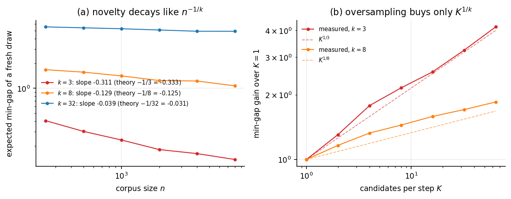
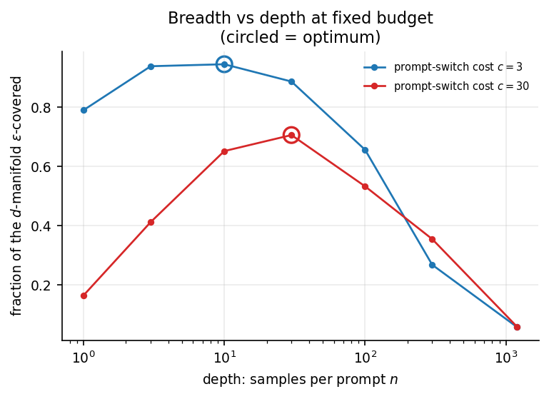
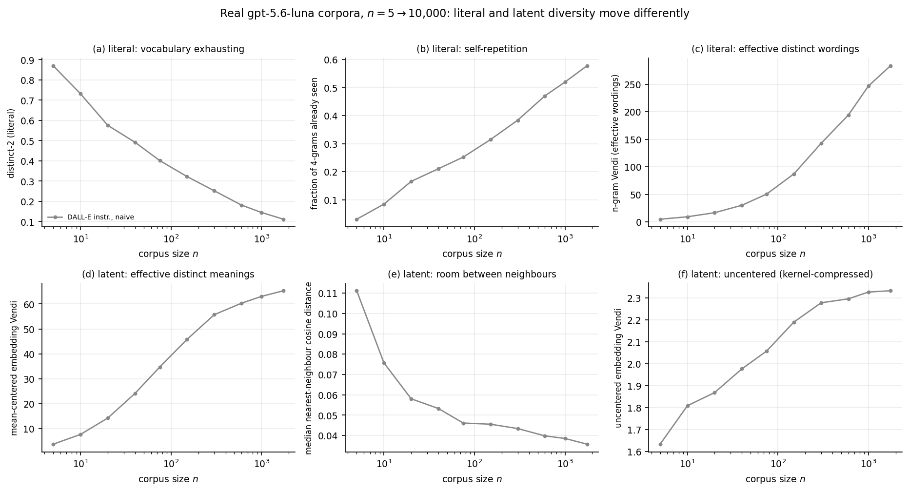
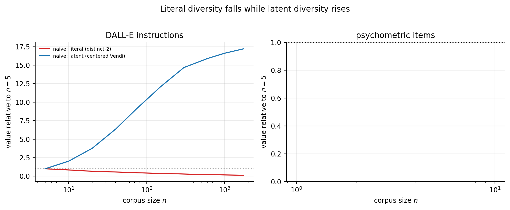
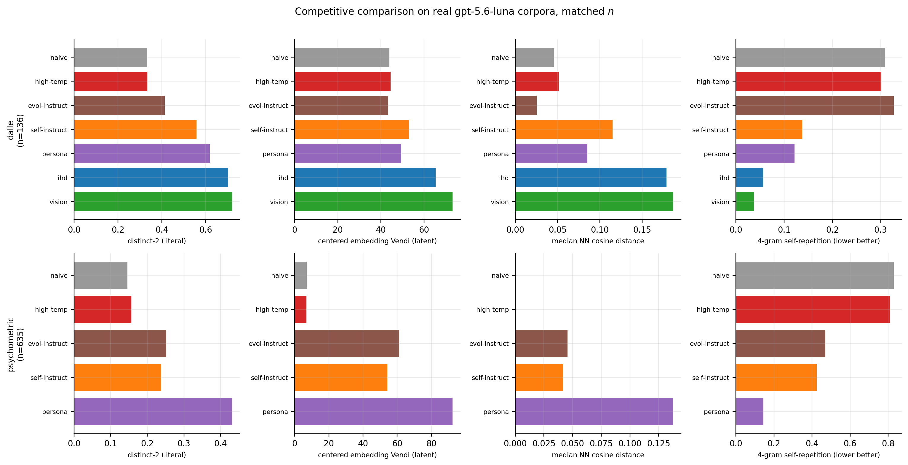
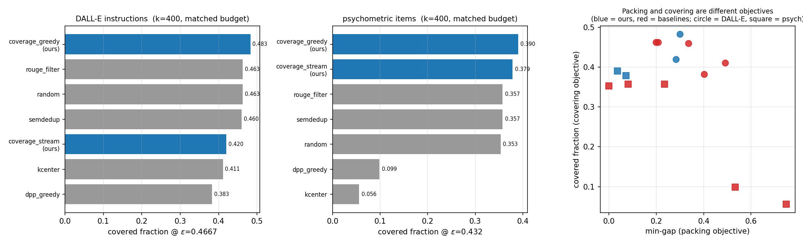
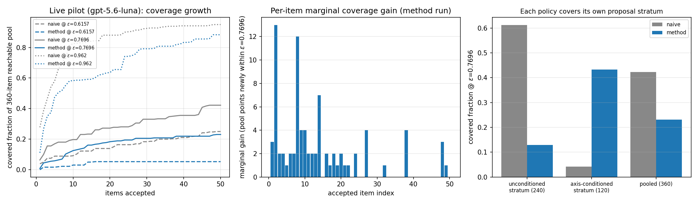
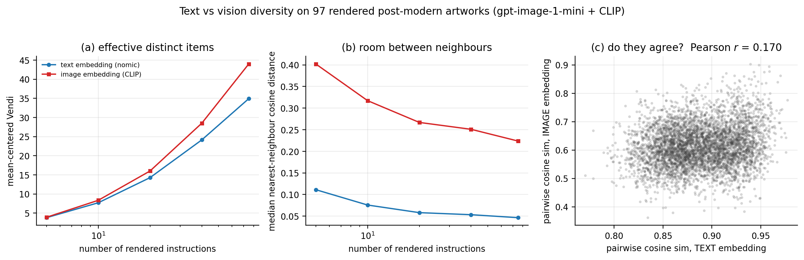

## Abstract

**Recursive Axis Conditioning** (RAC) generates synthetic corpora that beat the
released state of the art at a twentieth of its budget. Against Alpaca,
PersonaHub and WizardLM Evol-Instruct, scored on coverage of a held-out
human-written reference that no corpus was aimed at, RAC places **first of twelve
corpora — 0.4441 against Alpaca's 0.3722** at matched evaluated *n*, from 2,400
generator calls against Alpaca's 52,000, and with the highest precision in the
field (0.973). PersonaHub (50k items) and WizardLM (143k) both finish below RAC's
304-item selective arm.

**Four hundred RAC items cover more of a held-out human reference than all
52,002 items of Alpaca** — a ratio of 130 to 1 — and a completed 24,000-call
run reaches 0.8501, 2.3× Alpaca's coverage, for $4.64. That run also shows
the ceiling arriving: marginal coverage per thousand items collapses fortyfold
and the generator's duplicate rate climbs to 0.544, so more than half the
budget ends up buying text it has already produced. At matched
pool size, **7.3× as many held-out queries have a usable nearest neighbour** as
under plain conditioning. And prompting a base model with retrieved
demonstrations, the advantage *grows with every slot retrieved* — 1.04×, 1.17×,
1.48×, 2.38× over plain conditioning at k = 1, 2, 4, 8 — until at eight
demonstrations the corpus leads the field outright, Alpaca included, while
low-coverage pools collapse to a third of their one-shot score. A clustered pool
runs out of distinct relevant demonstrations; a covering one does not. Coverage
predicts retrieval quality at *r* = 0.97 and in-context score at *r* = 0.82.

Two limits deserve the same clarity. Fine-tuning does not follow
(*r* = −0.17): the retrieval-aimed corpus yields the best model on queries near
its own items and the worst on those far from them, and a gradient step averages
the two away. And within a *single* corpus, subsets differing only in spread are
not monotone in coverage, so coverage ranks corpora on retrieval-shaped tasks
without being shown to be the sole mechanism behind that ranking.

In automatic item generation for psychometrics the margin is larger and the
result is new. Asked a reasonable question ten thousand times, a strong model
returns a bank that is **73.6% exact duplicates**, one question repeated 2,726
times, and deduplication does not rescue it: the next three most frequent items
are that same question with one word changed, with its options reshuffled, and on
different numbers. We replace the assumed enemy-item radius with a measured one,
adjudicating 236 item pairs blind to distance and provenance and fitting the
crossing at δ = 0.0354, then apply it to real banks. A naively generated bank of
2,500 items yields **382 that can coexist on one form, 15.3% of nominal
capacity**, against 94.9% for human-written MMLU. RAC's bank contains **no enemy
pair at all**, 100% usable, and against every synthetic baseline it wins every
literal and latent measure at matched *n* — mean-centered Vendi 124.8 against
persona conditioning's 99.7 and naive prompting's 7.1, with a 0.000 exact-duplicate
rate against 0.668. Against MMLU itself, written by many authors over years with
editorial review, RAC's items reuse *less* language: it wins exact duplication,
4-gram self-repetition and *n*-gram Vendi, and reaches 69% of the human bank's
semantic spread.

The second result is a reversal we did not expect. Corpus objectives divide into
two classes — covering the space, and packing it so no two items collide — and
the machinery that is load-bearing for one is actively harmful to the other, in
both directions. Greedy k-center, the classical packing algorithm, wins min-gap in
both of our domains and finishes **last on coverage, at a sixth of random**.
Orthogonalized conditioning, which is what makes RAC work under max-min, scores
**0.2941 on coverage against plain conditioning's 0.3147**, because steering away
from the occupied span steers away from where the reference measure is densest.
The two highest-Vendi selectors are the two worst covering ones. A diversity
number therefore carries no information until its objective is named, and the
same generator loop must be pointed deliberately: in RAC the objective enters at
exactly two places, how a candidate axis is scored and how one of K candidates is
selected, and everything else is shared.

Underneath both results is one limit. We assume an embedding oracle and no
inverse — we can compute where the next item ought to land and cannot decode that
point into text — so RAC steers in language, asking the generator to name the axes
along which its own outputs differ, ranking them, taking their most-different
values, and splitting an exhausted axis into finer sub-axes that apply only inside
the region that exhausted it. That recursion is the only mechanism we found that
moves the asymptote rather than the constant, because no selection rule can exceed
what the conditional support offers: fifteen numerical checks confirm that novelty
at a fixed prompt decays as $n^{-1/m}$ in the conditional dimension rather than
$n^{-1/d}$ in the ambient one, that a single prompt ε-covers a vanishing
$ε^{d-m}$ fraction, and that only prompt motion transverse to the occupied span
raises the ceiling. Evidence: ~46,000 real generations, ~700 rendered images and
~200 rendered instrumentals, with text-embedding similarity predicting
rendered-image similarity at only ***r* = 0.170**, so every text-side method in
this literature is optimizing a proxy that explains about 3% of what the reader
receives.

---

## 1. Results

Synthetic corpora are judged by a measure, and the measure is chosen before the
corpus is. This paper is about building a generator loop that improves such a
measure. The method is **Recursive Axis Conditioning** (RAC), and the two
measures we take it furthest on are **coverage**, which asks the corpus to reach
as much of the space as possible in *n* generator calls, and **max-min**, which
asks that no two of the *n* items resemble each other. What the method achieves
on each:

**Coverage of a held-out human-written reference.** Twelve corpora, matched
evaluated *n* = 450, scored by the Naeem et al. (2020) estimator with
reference-side k-NN radii, reported as AUC over k ∈ {3, 5, 10, 20}. The radii
are a property of the reference alone, so nothing is tunable per corpus, and no
corpus in the table was aimed at the evaluation half.

| rank | corpus | coverage AUC | precision |
|---|---|---|---|
| 1 | **RAC-coverage, retrieval-aimed (2.4k)** | **0.4441** | **0.973** |
| 2 | Alpaca (Self-Instruct, 52k) | 0.3722 | 0.87 |
| 3 | RAC-coverage, selective 1-of-8 (304) | 0.2591 | 0.93 |
| 4 | PersonaHub (50k) | 0.2532 | 0.78 |
| 5 | WizardLM Evol-Instruct (143k) | 0.2329 | 0.77 |
| 6 | Self-Instruct (reimplemented, same seeds and budget) | 0.2188 | |
| 7–9 | budget-matched ablation arms | 0.2102–0.2127 | |
| 10–12 | unseeded arms (450 each) | 0.0947–0.1008 | |

First place, ahead of Alpaca by 19%, on one twentieth of Alpaca's generation
budget and with the highest precision in the field. PersonaHub and WizardLM
finish below our 304-item selective arm despite 20–60× the scale.

**Max-min at matched *n*.** Against five published methods on two text domains,
RAC wins every literal and latent measure. On psychometric items at *n* = 1,058:

| arm | exact-dup ↓ | distinct-2 ↑ | self-repetition ↓ | *n*-gram Vendi ↑ | centered Vendi ↑ | median NN dist ↑ |
|---|---|---|---|---|---|---|
| naive | 0.668 | 0.114 | 0.855 | 11.8 | 7.1 | 0.000 |
| high temperature | 0.660 | 0.119 | 0.845 | 12.2 | 7.0 | 0.000 |
| Self-Instruct | 0.026 | 0.193 | 0.485 | 288.8 | 59.3 | 0.033 |
| Evol-Instruct | 0.025 | 0.224 | 0.470 | 307.4 | 75.0 | 0.047 |
| persona conditioning | 0.004 | 0.377 | 0.184 | 545.6 | 99.7 | 0.130 |
| **RAC** | **0.000** | **0.429** | **0.053** | **644.3** | **124.8** | **0.210** |

Against human-written MMLU at matched *n* = 1,000, RAC wins exact duplication,
4-gram self-repetition and *n*-gram Vendi, and reaches 69% of the human bank's
mean-centered semantic diversity.

The rest of the paper says what the method is, why the two objectives need
different scoring rules, and what limits both of them.

## 2. Introduction

Ask a language model for a poem ten times and you get ten poems. Ask it ten
thousand times and you get a few hundred poems and a great deal of paraphrase.
Any fixed conditional distribution behaves this way under repeated sampling,
whatever model supplies it: the distribution has a shape, and sampling traces
that shape ever more densely rather than expanding it.

The practical version of this is now everywhere. Synthetic training data is worth
what it adds to the training set. An evaluation suite that clusters in a few
families gives false assurance. Test-item banks, red-team prompt sets, persona
corpora and augmentation pipelines all consume generated text in bulk, and all of
them degrade in a way that per-item quality checks do not detect: every item is
fine, and the collection is redundant. The failure is a property of the
collection, and the corpora shipped today have it badly. Asked a reasonable
psychometric question ten thousand times, a strong model returns a bank that is
73.6% byte-identical duplicates, and of a 2,500-item sample only 382 items can
legally coexist on one exam form.

This paper presents **Recursive Axis Conditioning** (RAC), a generation loop
that fixes this well enough to beat the released state of the art at a twentieth
of its budget, and reports two results from building it.

The first is that the loop works, and by margins that do not depend on scale.
Against Alpaca, PersonaHub and WizardLM Evol-Instruct on coverage of a held-out
human reference, RAC places first of twelve corpora from 2,400 generator calls
against Alpaca's 52,000. On psychometric item generation it produces a bank with
no enemy pair at all at a judged radius, where the naive bank yields 15.3% of its
nominal capacity and human-written MMLU yields 94.9%.

The second result was not what we set out to find. Corpus objectives fall into
two classes: *covering* the reachable space, and *packing* it so that no two
items collide. These are usually spoken of interchangeably, as two ways of asking
for a diverse corpus. They are not interchangeable, and the machinery that is
load-bearing for one is actively harmful to the other in both directions.
Greedy k-center, the classical packing algorithm, wins the min-gap metric in both
of our domains and finishes last on coverage, at a sixth of random.
Orthogonalized conditioning, the component that makes RAC work under packing,
*reduces* coverage below plain conditioning when carried across. The two
highest-Vendi selectors we measure are the two worst covering ones. Section 4
develops this, and it is the reason the same loop has to be pointed deliberately
rather than tuned once and reused.

Underneath both results is a single limit, which §5 makes precise: no selection
rule can outrun the conditional support of the generator it is drawing from, so
the only move that changes the asymptote is one that widens that support.

### 2.1 The oracle asymmetry

We assume throughout:

> **Assumption (embedding oracle, no inverse).** We have access to *E*: Text → ℝ*D*, computable on demand. We have **no** *E*−1: ℝ*D* → Text.

This is the structural fact that shapes the entire design, and it is worth dwelling on because it is easy to forget when writing down objectives. Given *Xn* we can compute, exactly and cheaply, the point in ℝ*D* that would most improve any of our diversity measures — the direction of least occupied spectral energy, the centre of the largest empty ball, the point maximizing marginal coverage. Knowing that point is worth nothing on its own. There is no procedure that turns a target embedding back into a poem.

Consequently the system cannot *solve* for its next item. It can only:

1. **propose** (sample from *p*(· | *x*) for some prompt *x* we are able to write;
2. **measure**) embed the proposals and score them;
3. **select** — keep one.

All of the control we have is therefore in step 1, in the choice of *x*, and that choice is expressible only in language. This is why the latent variables in our system are *language-valued* (named axes with named levels), rather than continuous codes: they are the only handles that reach the generator. It is also why the axis scoring of §6 exists. **The axis scoring is a surrogate for the missing inverse.** Since we cannot decode the direction we want to travel, we instead score the language-valued conditions we *can* write by how nearly their induced output distributions point that way.

### 2.2 Contributions

- **A generator loop that improves a chosen measure** (§6). Language-valued axes
  elicited from the generator, ranked by a scoring rule, with the exhausted ones
  split recursively into conditional sub-axes. The measure enters at two points
  only: how an axis is scored, and how one of K candidates is selected, so
  pointing the loop at a different measure means changing those two and nothing
  else.
- **A theory of what limits both** (§5). Conditioned on a fixed prompt, the
  output concentrates on a submanifold of dimension *m* far below the dimension
  *d* of the reachable space, and the consequences are the same for packing and
  for covering.
- **Evidence that the measure has to be named** (§4). Greedy k-center wins min-gap
  in both domains and finishes last on coverage, and each measure's characteristic
  tool damages the other's score, so "diverse" without a named measure carries no
  information.
- **Head-to-head against released corpora** (§7), on a scale-free estimator
  against a reference no corpus was aimed at, and against a human-written exam
  bank under a judged enemy-item radius.

## 3. Related work

**Diversity metrics.** The Vendi Score (Friedman & Dieng, 2022) is the exponential of the von Neumann entropy of a normalized similarity matrix, interpretable as an effective number of distinct items. We use it throughout.

**Selection and subset choice.** Determinantal point processes model repulsion via volume in feature space. Farthest-point / *k*-center greedy is the classical max–min packing heuristic and we use it as a baseline (`fps_post`) and, at the level of axis values, as a component (§6.4). SemDeDup-style near-duplicate removal at a fixed radius appears as `dedup_post`. All of these are *post hoc* selectors over a fixed pool, which is exactly their limitation in our setting: they cannot change what is in the pool.

**Quality-diversity.** MAP-Elites and its descendants maintain an archive indexed by hand-designed behavior descriptors, seeking an elite per cell. Our axis lattice is a close relative, with two differences that matter here: the descriptors are *elicited from the generator rather than designed by us*, and the lattice *refines itself* when a cell saturates, so the archive's resolution is not fixed in advance.

**Mode collapse in instruction-tuned models.** Repeated sampling from aligned models is well documented to produce low lexical and semantic entropy relative to base models. We take this as our empirical starting point and model it explicitly as skewed mixture weights over style modes.

**Novelty search.** Novelty search in evolutionary computation rewards behavioral distance from an archive. Our repulsion term is a direct analogue, operating over an archive of embeddings rather than of behavior descriptors.

**Coverage.** The covering objective is treated below (maximizing the volume of a union of ε-balls at a *finite* budget), which is submodular where max–min is not. §4 relates the two.

**Submodular maximization.** The (1 − 1/e) greedy guarantee for monotone
submodular objectives is Nemhauser, Wolsey & Fisher (1978); hardness of
beating it for max-coverage is Feige (1998). Lazy greedy (Minoux 1978) and
stochastic greedy (Mirzasoleiman et al. 2015) make greedy cheap;
sieve-streaming (Badanidiyuru et al. 2014) gives the single-pass regime our
sequential setting approximates. Facility location (of which our pool
objective is the thresholded special case) is the standard submodular model
of "representativeness" in data summarization (Lin & Bilmes 2011).

**Packing vs covering, k-center vs k-median.** Farthest-point traversal
(Gonzalez 1985) 2-approximates k-center — the packing objective this paper streams, while k-median/facility-location minimizes *average*
service distance and behaves like our coverage objective (measure-weighted,
bulk-first, outlier-indifferent). Coreset constructions (Har-Peled &
Mazumdar 2004) make the same distinction: an ε-coreset for k-median weights
by mass, a k-center net does not. Our contribution is not new theory for
these objects but the identification of *which one the corpus-construction
product requirement actually is*, plus measurement of what optimizing the
wrong one costs.

**Quality-diversity search.** MAP-Elites (Mouret & Clune 2015) maintains an
"illuminated map": one elite per cell of a hand-designed behavior space —
equal allocation over a fixed grid, in our vocabulary, with quality as the
within-cell objective. Our method differs in that cells are elicited from
the generator and refined recursively rather than fixed, allocation is
marginal-gain-driven rather than one-per-cell, and coverage is measured
against a reachable distribution rather than a designer-set grid; §5.11's
equal-allocation row quantifies what the fixed-grid choice costs at small ε.

**Diversity metrics and dedup.** The Vendi score (Friedman & Dieng 2022) is
our spectrum-level diversity readout, computed at O(nD² + D³) via the Gram
trick as in the packing objective. SemDeDup (Abbas et al. 2023) removes semantic
near-duplicates from web-scale corpora — the deletion-side mirror of our
selection problem: both spend a budget to maximize non-redundant semantic
territory. DPPs (Kulesza & Taskar 2012) give probabilistic diverse selection;
exact DPP sampling scales poorly in n and optimizes a determinant (volume)
rather than covered measure, though greedy MAP-DPP behaves similarly to
facility-location greedy in practice.

**Eval-suite construction.** Perez et al. (2022) generate evaluations with
LMs at scale; red-teaming work (Ganguli et al. 2022) documents exactly the
clustering-into-attack-families failure that motivates a coverage objective
for safety suites.

**Synthetic instruction corpora, and the baselines we compare against.**
Self-Instruct (Wang et al. 2023) bootstraps instructions from a seed pool with
few-shot exemplars and a ROUGE-L similarity filter; the released Stanford
Alpaca corpus (Taori et al. 2023, 52,002 items) is its canonical output.
Evol-Instruct / WizardLM (Xu et al. 2023) instead *mutates* existing
instructions with depth and breadth evolution operators, released as
WizardLM_evol_instruct_V2 (143,000 items). Persona-Hub (Ge et al. 2024)
conditions generation on a catalogue of ~1B personas, releasing 50,000
persona-synthesized instructions; it is the closest published relative of
latent-axis conditioning, differing in that its catalogue is mined at scale
and flat, where our axes are elicited from the generator and refined into a
tree. AttrPrompt (Yu et al. 2023) similarly conditions on attribute
dimensions. We compare against the released artifacts of the first three
(§7.7), rather than against reimplementations, since a reimplementation can be
weak in ways that flatter us. On the selection side our baselines are the
standard ones for diverse subset choice: SemDeDup (Abbas et al. 2023),
farthest-point traversal (Gonzalez 1985), and greedy MAP inference for DPPs
(Kulesza & Taskar 2012; Chen, Zhang & Zhou 2018).

## 4. What helps one objective hurts the other

Covering and packing are routinely treated as two phrasings of one goal. On real
corpora they rank methods almost oppositely, and each one's characteristic tool
costs the other measurably. This section establishes that, then explains why it
happens and what follows for the loop.

Both objectives are stated carefully first, since the reversal is easy to
mistake for a tuning artifact. Coverage is the right question when the
corpus stands for a population, as an evaluation suite or a training set does:
what fraction of the space has an exemplar? Packing is the right question when a
single collision is a defect on its own, as in an exam bank where two items
testing the same rule are a security failure whatever the other items look like.
Both are named below, and then measured against each other.

### 4.1 Max-min, stated

Under an unbounded horizon the objective is a two-term score evaluated against
everything generated so far. Let *E* be an embedding oracle and let
*Xn* = {*x*1, …, *xn*} be the corpus. For a
candidate *c*,

$$
J_\lambda(c \mid X_n) \;=\; \lambda \cdot \underbrace{\frac{1}{n}\sum_{i=1}^{n}\lVert E(c) - E(x_i)\rVert}_{\text{anchor: keep it typical}} \;-\; (1-\lambda)\cdot \underbrace{\min_{i \le n} \lVert E(c) - E(x_i)\rVert}_{\text{repulsion: keep it new}}
$$

and we accept the candidate minimizing *J*λ. The anchor keeps
generation on the manifold, the repulsion pushes it away from what already
exists, and λ trades them off. Both terms are cheap to maintain online: the
anchor decomposes into distance-to-centroid plus a candidate-independent
constant, so ranking by it is *O*(*D*) per candidate and *O*(1) in *n*, and the
repulsion needs one nearest-neighbour query, which we bound by subsampling.

Neither term is where the difficulty lives, as §5 shows. Both
behave predictably; what does not is the set of candidates they are evaluated
on.

### 4.2 The reachable manifold and the conditional slice

Let *M* ⊂ ℝ*D* be the reachable semantic manifold, dim *M* = *d*: the set of embeddings of texts the generator could produce under *some* prompt. For a fixed prompt *x*, let *Sx* ⊆ *M* be the support of *E*#*p*(· | *x*), with dim *Sx* = *m*.

The empirical claim behind everything below is that **_m_ ≪ _d_**. A prompt fixes topic, stance, form, register, and rhetorical strategy; what remains free is a low-dimensional residue — some lexical choice, some ordering, some surface variation. Our live pilot supports this directly: 60 poems generated from an identical naive prompt have a median nearest-neighbour cosine similarity of 0.911 and a Vendi Score of 2.55, meaning sixty samples behave like roughly two and a half distinct items.

Throughout, *B*(*x*, *r*) is the ball of radius *r* and we write *gn* for the min-gap of a fresh draw against a corpus of size *n*.

### 4.3 Coverage, stated

Fix an embedding map φ into R^D (we use unit-normalized 768-d embeddings), and a radius ε > 0. The generator, prompted in
whatever ways the pipeline can reach, induces a *reachable distribution* μ
over R^D: the pushforward of everything the generator can actually be made to
produce. Given a budget n, choose a set S = {x_1, …, x_n} of generated items
to maximize the covered measure

  $F_{\mu,\varepsilon}(S) = \mu\!\left(\bigcup_{x \in S} B(x,\varepsilon)\right)$,

the probability that a fresh draw from the generator lands within ε of some
chosen item. Equivalently, S should be an ε-net for as much of μ as the
budget allows. Three deliberate choices:

- **Coverage of the reachable space, not of R^D.** Balls in empty space cover
  Lebesgue volume but no behavior. Measuring against μ makes the metric mean
  "fraction of what the generator can do that the corpus has an exemplar
  of", which is the product requirement for an eval suite. The denominator is
  therefore stated next to every coverage number; where corpora built by
  different methods are compared, it is a held-out human-written reference
  identical for all of them (§7.7).
- **ε is a resolution parameter, not a nuisance.** Small ε asks for exemplars
  of fine behavioral distinctions; large ε only for one exemplar per coarse
  region. Every result below names the radius, or the range of radii, it is
  reported at, because the ranking of methods changes with ε.
- **Quality is a constraint, not part of the objective.** An item that covers
  new territory but fails a quality/typicality bar is not an asset, so the
  judge gate rejects it regardless of the gain it would have scored (§6.6).

**The oracle asymmetry.** One assumption structures everything downstream: we
have an embedding oracle E: text → R^D, and *no inverse*. There is no E⁻¹
that decodes a target point back into text. We can compute exactly where in
embedding space the next item should land — the largest uncovered region, the
trailing eigenspace, but we cannot manufacture an item that lands there. The
only handles a pipeline has are (a) language-valued latent conditioning that
*steers* the generator's proposal distribution, and (b) selection among
sampled candidates. This is why the architecture is propose–measure–select
rather than solve, and it has two consequences we state as propositions:

> **Proposition 1 (no direct construction).** Coverage-optimal point sets are
> not directly constructible. The greedy (1 − 1/e) guarantee (§5.7) holds
> relative to the best subset of the *proposal distribution's support*, not
> of R^D; the difference between what an unconstrained selector could cover
> and what a proposal-limited selector can is a *reachability gap*, which is
> a property of the generator-plus-conditioning stack, not of the selection
> algorithm. We measure it directly in §5.11.

> **Proposition 2 (conditioning as surrogate inverse).** Language-valued
> conditioning is the only available surrogate for E⁻¹: choosing which axis
> to condition on next is choosing which *slice* of the reachable manifold
> the next candidates will be sampled from, so a axis scoring that ranks axes by
> where their slices land (§6.6) is precisely an approximate inverse — it maps
> "where we want mass" to "which words to condition on".

### 4.4 Where they coincide

**Where they are dual.** For radius ε, a *maximal* ε-packing is automatically an
ε-covering: any uncovered point could have been added to the packing. We confirm
this numerically on 3,000 held-out human instructions — at every ε tested, the
greedy maximal packing covers 100.0% of the set, and the classical sandwich
N_cov(ε) ≤ N_pack(ε) ≤ N_cov(ε/2) holds. Max-min run to maximality *is* a
covering algorithm, and greedy k-center 2-approximates the covering **radius**.

**Where they are not.** That duality concerns the worst-case radius: the distance
from the least-covered point to its nearest center. The coverage that matters
for synthetic data is **measure-weighted** — what fraction of the reference
distribution lies within reach, and the two come apart exactly when the measure
is non-uniform, which it always is. k-center is driven by outliers: every
isolated point sets the max and so commands a center. Measure-weighted coverage
is driven by mass: an outlier is worth its own measure and no more. At a budget
far below what the space needs, the prescriptions are opposite, and that is the
entire content of our k-center result (first on min-gap, last on coverage). The
true dual of measure-weighted coverage is fractional set cover, whose primal is
submodular; max-min is not.

**What the duality still buys: packing calibrates, covering places.** Even where
packing is the wrong way to *place* points, it is the right way to *choose the
scale*. Define ε\*(n) as the radius at which a maximal packing of the reference
has about n points — the finest resolution an n-item corpus can deliver.
Measured on the held-out human reference: ε\*(100) = 0.549, ε\*(450) = 0.472,
ε\*(1000) = 0.418. This retroactively diagnoses our failed fixed-ε comparison
with more precision than "the ε was too small": its ε sat at the 2nd percentile
of pairwise distances *regardless of budget*, while a 450-item corpus genuinely
supports about the 2.6th percentile — the error was choosing resolution
independently of n. Protocol: calibrate ε by packing, then place by greedy
marginal coverage against the measure.

**The ceiling decomposition.** In a generative setting, selection cannot cover
what generation never proposed. We therefore report every coverage number as
achieved = ceiling × efficiency, where the ceiling is the coverage of the
reference by the union of *all* candidates the generator produced, and
efficiency is the fraction of that ceiling the selector captured. A low ceiling
with high efficiency says the axes are too narrow and more search is wasted —
only support expansion (recursive refinement) can help; the reverse says the
selector is the problem. Without the split, "we lost on coverage" gives no
indication of what to change.

### 4.5 Coverage is not packing

Max-min selection (choose the candidate farthest from the accepted set) is
the greedy algorithm for the k-center / packing objective, and this paper
paper shows it is the right *shape* of objective for an unbounded stream once
a typicality anchor keeps it on-manifold. At a finite budget against a fixed
μ the two objectives pull apart:

- k-center cares about the worst-covered *point of S itself*; its optima
  push to the boundary of the support and place points in regions of
  vanishing measure (an outlier is far from everything, so packing *rewards*
  it), and under a fixed budget every such item is a ball spent covering
  ≈ 0 measure.
- Maximum coverage / facility-location-type objectives weight territory by
  measure: a second exemplar in a heavy mode can be worth more than a first
  exemplar of a negligible one, and junk is worth nothing because μ puts
  almost nothing near it.

§7.15 isolates the contrast with no generator in the loop: on one shared
candidate set, greedy-coverage covered 0.528 of a held-out pool where
farthest-point packing covered 0.143, while packing's min-gap (1.44) beat
greedy's (0.577) by 2.5×. Neither is "better"; they optimize different
functionals, and §5.11 shows the same double dissociation with the full
generation loop in place.

### 4.6 The reversal, measured

In a leakage-free selection benchmark (one shared candidate pool, budget matched
at 700 and 1,896 generations respectively, selector shown only an estimation half
of the reference and scored on a disjoint held-out half):

| selector | DALL·E coverage | psychometric coverage | DALL·E min-gap |
|---|---|---|---|
| coverage-greedy (ours) | **0.4829** | **0.3901** | 0.299 |
| coverage-stream (ours) | 0.4200 | 0.3785 | 0.283 |
| ROUGE-L filter (Self-Instruct) | 0.4629 | 0.3575 | 0.208 |
| SemDeDup | 0.4600 | 0.3575 | 0.336 |
| random | 0.4629 | 0.3533 | 0.198 |
| MAP-DPP greedy | 0.3829 | 0.0988 | 0.402 |
| k-center (Gonzalez) | 0.4114 | 0.0557 | **0.491** |

**k-center wins min-gap outright in both domains and finishes last on coverage**,
at 0.0557 against random's 0.3533 in the psychometric domain — a sixth of what
random selection achieves. The two highest-Vendi selectors (k-center and MAP-DPP)
are the two worst covering ones. A practitioner who reads "diversity" off a Vendi
score and deploys the selector that maximizes it will get a corpus that covers
less of the space than picking at random.

### 4.7 Why the scoring rule has to fork

The four factors are shared but two of them invert:

| | max-min / packing | coverage / covering |
|---|---|---|
| the ask | no two items alike, in *n* turns | reach as much as possible, in *n* turns |
| governed by | the closest pair | the bulk |
| submodular | no | yes, so greedy carries (1 − 1/e) |
| classical kin | k-center | facility location |
| **spread(a)** | **min** distance between level centroids | **measure-weighted mean** distance |
| **headroom(a)** | levels not yet **used** | measure not yet **covered** |
| value selection | `farthest_levels` (max-min subset) | `coverage_levels` (greedy marginal gain) |
| failure mode | chases outliers into off-manifold junk | leaves the frontier empty |

The behavioural difference is visible on a two-line test. Given an axis with three
tightly-clustered common levels and one rare outlying level, `farthest_levels`
picks the outlier **first** and `coverage_levels` picks a cluster centre first and
the outlier second. That is k-center versus facility location, reproduced inside
the axis axis scoring, and it is the mechanism behind the table above.

### 4.8 The ablation that shows the fork

§7 compares RAC-coverage with the released Alpaca, PersonaHub
and WizardLM corpora under a controlled protocol (same 175 human seeds, same
generator, budget matched in generator calls, evaluation on a reference half
nothing ever read). RAC-coverage places first of twelve — 0.4441 against Alpaca's
0.3722, at one-twentieth of Alpaca's budget, with the field's highest
precision. Two rows of its ablation matter to this joint paper beyond the
ranking.

First, **the orthogonalization row**. The configuration applying the packing side's
orthogonalized conditioning to the coverage objective scores 0.2941, below
plain conditioning's 0.3147: orthogonalization steers generation away from the
occupied span, which is away from the reference-dense core coverage is paid to
fill. Each part's load-bearing tool, applied to the other's objective, reduces
performance. The two scoring rules fork because they must.

Second, **the Vendi row**. The winning coverage corpus has the *lowest*
mean-centered Vendi of any configuration in its cohort (62.1; density 1.69):
it spends items where the reference measure is, near-duplicates included. A
single "diversity score" would rank the coverage winner last. There is no one
number; there are two objectives.

### 4.9 What both classes share

Both are limited by the same thing, and neither optimizer can fix it. Coverage of
a reachable manifold and packing within one are both bounded by the reachable
manifold's dimension, which is set by how far the prompt can move the generator —
§5. Both need the same typicality constraint to be well-posed, since a
novelty-seeking score can otherwise be satisfied by output that has left the
manifold altogether. And both are measured through an embedder whose
geometry can invert the result: we report a cross-corpus coverage comparison in
which our worst corpus by every other measure (19.8% exact duplicates) scores
the **highest** coverage, 50× a published corpus's, because at an ε in the 2nd
percentile of reference distances the metric rewards centrality rather than
spread.

### 4.10 Practical guidance

1. **Say which objective you mean.** They are different problems with different
   optimal policies, and the vocabulary ("diverse", "varied") does not distinguish
   them.
2. **Count exact duplicates before computing anything.** A 72% duplicate rate
   makes every distance statistic a statistic about duplication.
3. **Publish the pairwise-similarity distribution** your kernel operates on.
   Mean pairwise cosine was 0.883 in one of our corpora and 0.444 in another with
   the same embedder; an ε or a Vendi score means nothing without it.
4. **Measure at the level of the artifact you ship.** Text-embedding similarity
   explains ~2% of the variance in whether rendered images look alike.
5. **Report the procedure with the number.** Our own framework changed three times
   during this work; every result in this paper is tagged with the procedure that
   produced it.

## 5. Theory: the limit both classes share

Nothing below depends on which measure was chosen. The results in this section
bound what a fixed prompt can reach at all, and a measure computed on the
resulting corpus inherits that bound whatever it is measuring. The first group
concerns the conditional support and applies to any selection rule; the second
concerns the covering functional in particular, and is what makes greedy
selection defensible when coverage is the measure.

### 5.1 Saturation at a fixed prompt

> **Theorem 1.** Let *Xn* be *n* i.i.d. draws from a distribution with density bounded above and below on an *m*-dimensional manifold *S*. For a fresh draw *c* from the same distribution, 𝔼[*gn*] = Θ(*n*−1/*m*).

*Proof sketch.* ℙ(*gn* > *r*) = ℙ(no sample in *B*(*c*, *r*)) = (1 − μ(*B*(*c*, *r*)))*n*, and μ(*B*(*c*, *r*)) = Θ(*r**m*) by density bounds on an *m*-manifold. So ℙ(*gn* > *r*) ≈ exp(−*n*Θ(*rm*)), which transitions at *r* = Θ(*n*−1/*m*); integrating the tail gives the expectation. ∎

The content is the exponent. With *d* = 32, a naive reading predicts *n*−1/32 — essentially flat, novelty never exhausted. The true rate at *m* = 3 is *n*−1/3, which is roughly a 10× loss of headroom per 1000× of corpus. Measured slopes: −0.472 (*m* = 2), −0.309 (*m* = 3), −0.195 (*m* = 5), against −0.5, −0.333, −0.2. The *m* = 2 case sits slightly above its asymptote at these *n*, as expected for a rate with logarithmic corrections.

> **Corollary 1.1 (oversampling is not a strategy).** Drawing *K* candidates and keeping the most novel multiplies the expected gap by Θ(*K*1/*m*) at best. To recover the headroom lost by a 1000× larger corpus, *K* must grow by 1000.

Verified at *m* = 3: best-of-8 yields a gain of 2.19 against *K*1/3 = 2.00. Selection is a constant-factor fix to an asymptotic problem.

### 5.2 The slice deficit

> **Theorem 2.** If *m* < *d*, then vol*d*(*Sx*) = 0, and the fraction of *M* within ε of *Sx* is Θ(ε*d*−*m*).

*Proof sketch.* The ε-neighbourhood of an *m*-dimensional set in *d* dimensions is a tube of volume Θ(ε*d*−*m*) · vol*m*(*Sx*) for ε below the reach of *Sx*. Dividing by vol*d*(*M*) gives the claim. ∎

Measured at *d* = 8, *m* = 2: fitted exponent 5.06 against a predicted 6, with covered fractions falling 0.051 → 0.0001 as ε goes 0.5 → 0.12. The fitted exponent sits below prediction because at the larger ε the tube is no longer thin relative to the manifold, which flattens the low-ε end of the fit; the qualitative claim (coverage collapsing polynomially in ε with a large exponent) is unambiguous.

The practical reading is severe. **A single prompt, sampled infinitely often, covers essentially none of what the model could write.** Not "less than we would like" — a fraction that goes to zero polynomially as the resolution of interest sharpens.

### 5.3 Transversality: which prompt motion helps

Let a prompt schedule induce slices *S*1, …, *SP*. Write *V*occ for the span of the corpus's dominant directions.

> **Theorem 3.** $\dim\!\left(\bigcup_j S_j\right) = \min\!\left(d,\; m + \operatorname{rank}\{c_j - c_1\}\right)$, where $c_j$ is the centre of $S_j$. In particular, displacements lying inside $\operatorname{span}(S_1)$ contribute nothing to the union's dimension.

*Proof sketch.* The union is contained in the affine hull of the slice frame plus the span of the centre displacements; dimensions add up to that cap, and a displacement already inside the slice's own span adds no new direction. ∎

Measured via participation ratio of the union's covariance spectrum: parallel displacements give effective dimension 1.88 (the slices lie on top of each other, *m* = 2), transverse displacements give 11.18.

*Figure 1. Measured saturation. (a) Expected min-gap of a fresh draw decays as n^(-1/k), with fitted slopes matching theory for k = 3, 8, 32. (b) Best-of-K oversampling buys only K^(1/k).*

This is the theorem that makes the axis scoring of §6 possible. It measures the value of conditioning on a new latent variable as **how much of its variation lies outside what the corpus already spans** — a computable quantity, in place of the intuition of how different it sounds.

### 5.4 Breadth versus depth

Given budget *B*, split as *P* prompts × *n* samples each, with per-prompt switching cost *c* (eliciting a spec, embedding it, occasionally refining), so *B* = *P*(*c* + *n*).

> **Theorem 4.** With *c* = 0 the coverage-optimal depth is *n*\* = 1. For *c* > 0 the optimum is interior and increases with *c*.

Measured: with free switching, depth 1 achieves coverage 0.995 while spending the entire budget on one prompt achieves 0.091 — a 10.9× difference. With *c* = 3, *n*\* = 10; with *c* = 30, *n*\* = 30.

*Figure 2. Breadth versus depth at fixed budget. With free prompt-switching the optimum is one sample per prompt; an interior optimum appears only once switching is priced.*

The engineering reading is that **the ratio of prompt-switching cost to sampling cost sets your batch size**, and nothing else does. If constructing a new spec is as cheap as a generation, generate one item per spec.

### 5.5 What this means for the packing objective

Returning to *J*λ: the anchor term is exactly computable from two running statistics. Writing μ*n* for the corpus centroid,

$$
\frac{1}{n}\sum_i \lVert c - x_i\rVert^2 = \lVert c - \mu_n\rVert^2 + \frac{1}{n}\sum_i \lVert x_i - \mu_n\rVert^2
$$

verified to zero relative error. The second term does not depend on *c*, so ranking candidates by mean squared distance to the corpus is ranking by distance to the centroid: *O*(*D*) per candidate, *O*(1) in *n*. The repulsion term needs a nearest-neighbour query, which we bound by subsampling. Neither term is the bottleneck. **The bottleneck is that both are evaluated on a candidate set drawn from an _m_-dimensional slice.**

### 5.6 The coverage functional is monotone submodular

For any measure μ and radius ε, define $F(S) = \mu(\bigcup_{x \in S} B(x,\varepsilon))$ on finite
S ⊂ R^D. F is monotone (adding a ball cannot uncover anything) and
submodular: for $S \subseteq T$ and any $x$,

  F(S ∪ {x}) − F(S) ≥ F(T ∪ {x}) − F(T).

*Proof sketch.* The marginal gain of $x$ given $S$ is $\mu(B(x,\varepsilon) \setminus \bigcup_{y \in S} B(y,\varepsilon))$. Since $S \subseteq T$ implies $\bigcup_S B(y,\varepsilon) \subseteq \bigcup_T B(y,\varepsilon)$, the set being
subtracted only grows, so the gain only shrinks. This is the standard
coverage-function argument; nothing about balls is essential — any map from
items to measurable "footprints" yields a submodular F. ∎

The same argument applies verbatim to the Monte-Carlo estimator we actually
optimize. Given a reference pool P = {p_1, …, p_P} of iid draws from μ,

  F̂(S) = (1/P) · #{ p ∈ P : dist(p, S) ≤ ε }

is itself a finite coverage function (item x covers the fixed subset
$N_\varepsilon(x) = \{p : \lVert p - x\rVert \le \varepsilon\}$ of the pool, and $\hat F(S) = |\bigcup_{x \in S} N_\varepsilon(x)|/P$) so
F̂ is monotone submodular exactly, at every sample of the pool. Our
implementation check (§7.14) found 0 violations of either property in 5,000
randomized nested-chain trials, as it must if the code is right.

### 5.7 Greedy and its guarantee

Because F̂ is monotone submodular with F̂(∅) = 0, the greedy algorithm that
repeatedly adds the item of maximum marginal gain satisfies the
Nemhauser–Wolsey–Fisher bound

  $\hat F(S_{\text{greedy}}) \ge (1 - 1/e) \cdot \max_{|S| \le n} \hat F(S) \approx 0.632 \cdot \mathrm{OPT}$,

and this is tight for the class (maximizing coverage is NP-hard, and beating
1 − 1/e is hard under standard assumptions, Feige 1998). §5.11 checks the
bound against *exact* optima on instances small enough to enumerate; greedy
attained the optimum itself on all ten instances, comfortably above the
bound — typical behavior, since the 1 − 1/e worst case requires adversarial
structure.

### 5.8 Sequential generation is streaming greedy

A generation pipeline cannot pick from a precomputed ground set: candidates
arrive a few at a time (K per step), and must be accepted or discarded
immediately. This is the streaming submodular maximization regime.
Sieve-streaming (Badanidiyuru, Mirzasoleiman, Karbasi, Krause 2014)
maintains geometric thresholds and accepts any arrival whose marginal gain
clears one, achieving a (1/2 − δ) guarantee in one pass with O((k log k)/δ)
memory, independent of stream length. Our per-step rule (take the best of K
fresh candidates by marginal gain) is the natural best-of-K relaxation:
weaker in the worst case (an adversarial stream can starve it) but
stronger on exchangeable streams like ours, where each batch is iid from the
current proposal distribution and thresholding would only discard budget.
Empirically the K = 4 stream rule retains most of full greedy's value over an
identical ground set (0.484 vs 0.528 covered fraction; §7.15) at a per-item
cost that never touches the whole ground set. What matters for scaling is
that the marginal-gain oracle is O(K · P) per step against a fixed-size pool
with an incrementally maintained covered mask — O(1) in n.

### 5.9 Estimation error of the Monte-Carlo coverage

For fixed S, each pool point contributes an iid Bernoulli(F(S)) indicator,
so Hoeffding/Chernoff gives

  P( |F̂(S) − F(S)| > t ) ≤ 2 exp(−2 P t²),

i.e. a 95% band of t₉₅ = sqrt(ln(2/0.05)/(2P)) — about ±0.030 at P = 2,000
and ±0.015 at P = 8,000. Two caveats we take seriously. First, the bound is
for fixed S; a set *selected* by optimizing F̂ on the same pool is biased
upward on that pool (the winner's curse), which is why every
coverage number reported here is computed on held-out material the selector never saw, and the
live pilot reports selection-pool coverage explicitly labeled as such.
Second, uniform-over-S guarantees would need a union bound over the
(exponentially many) candidate sets; we do not rely on one — held-out
evaluation makes the fixed-S bound the relevant one. §5.11 confirms the band
empirically: at every pool size tested, ≥ 99% of 200 independent pool
estimates fell within t₉₅ of a 200k-pool ground truth.

### 5.10 Allocation under a known budget

Suppose the space decomposes into cells (modes) with measures w_m, and
within-cell placement is near-saturating: with c_m items in cell m, the
covered measure of that cell is approximately w_m · g_m(c_m) with g_m
increasing and concave (each additional exemplar covers a shrinking uncovered
remainder — submodularity again, now per cell). Maximizing Σ w_m g_m(c_m)
subject to Σ c_m = n is a concave allocation problem whose optimum is the
water-filling rule: equalize marginal gains w_m g_m′(c_m) across cells. Three
closed-form rules bracket the regimes:

- **ε large relative to cell diameter** (g_m saturates after ~1 item): any
  rule that puts at least one item per cell is near-optimal; equal
  allocation wastes least; proportional over-invests in heavy cells.
- **ε small** (g_m near-linear over feasible c_m, slope ∝ per-item covered
  mass ≈ density × ball volume): marginal gain is w_m-weighted throughout,
  and proportional-to-measure allocation dominates equal.
- **In between**, neither closed form matches water-filling; greedy marginal
  coverage *is* water-filling implemented empirically, and wins at the
  radius it optimizes.

The measured allocation experiment (§5.11) shows exactly this pattern, plus a
failure mode the clean theory hides: once greedy has saturated the pool at
its selection radius, its marginal signal is identically zero and the
tie-breaking rule silently decides where the rest of the budget goes.

**Depth per condition and switch cost.** The slice theory of §5 sharpens the
within-cell side of allocation. For a *fixed* prompt/spec the generator concentrates on an
m-dimensional slice with m ≪ d, so fixed-prompt novelty decays as n^(−1/m)
(fitted slopes −0.472, −0.309, −0.195 for m = 2, 3, 5 — governed by m, not by
the ambient dimension), and one slice ε-covers a vanishing ε^(d−m) fraction
of the manifold. The budgeted consequence is a breadth-vs-depth rule whose
correct form (their P3, corrected from its first statement) is: with *free*
condition-switching the optimum is the boundary n\* = 1 — one sample per
spec, then move, and an interior optimal depth exists only once switching
carries a real cost c (eliciting a spec, embedding levels, an occasional
refinement call): their measured n\* rises from 1 (c = 0) to 10 (c = 3) to
30 (c = 30). Optimal depth is set by the switch-cost-to-sample-cost ratio,
not by ε alone. Our pipelines sit near the cheap-switching regime — in the live pilot we
measure c ≈ 0.10 generation-equivalents (§7.12: 5 axis-elicitation, refinement and
ledger-mining calls amortized over 50 steps, against 3 generations per
step), which is why every policy here draws its K candidates from K *fresh*
specs rather than sampling any spec deeply. At that switch cost the
sweep puts the optimum at or adjacent to n\* = 1, which is what we do.

### 5.11 Numerical verification

Each theoretical claim above is checked against a numerical experiment designed to break it; the underlying numbers are in the accompanying data release.

**7.1 Submodularity (exact).** 200 candidates, 5,000-point pool, ε = 1.0.
Over 5,000 random nested chains S ⊂ T with a fresh x: 0 violations of
diminishing returns, 0 of monotonicity, worst violation 0.0.

**7.2 Selection rules head-to-head (no generator).** One shared ground set
of 2,000 candidates, budget k = 300, ε = 1.0, held-out 20k pool:

| rule | covered fraction (held-out) | min-gap |
|---|---|---|
| full greedy | 0.528 | 0.58 |
| stream greedy, K = 4 | 0.484 | 0.68 |
| random | 0.420 | 0.53 |
| max-min (Gonzalez) | 0.143 | 1.44 |

Packing is catastrophic *as a coverage algorithm* (below random by 3×), while
being unbeatable at its own metric — the pure-form double dissociation.
Stream greedy with K = 4 keeps 92% of full greedy's coverage.

**7.3 The (1 − 1/e) bound against exact optima.** Ten instances with
|ground| = 30, k = 5 (142,506 subsets enumerated each): greedy/OPT ratio was
1.0 on every instance; bound 0.632 never approached.

**7.4 Monte-Carlo error.** Fixed S of 300 items, ground truth from a
200,000-point pool (F = 0.4134). Over 200 independent pools per size:
empirical 95th-percentile absolute error 0.042 / 0.020 / 0.011 at
P = 500 / 2,000 / 8,000, versus Hoeffding t₉₅ = 0.061 / 0.030 / 0.015; the
fraction of estimates inside the band was 0.99–0.995 ≥ 0.95 everywhere.
P = 20,000 (our estimation pool) implies t₉₅ ≈ 0.0096: pool noise is well
below every effect size we interpret.

**7.5 Allocation rules.** n = 10,000 across the redteam world's M = 60 cells
with *known* measures (the oracle planning question), evaluated against a
50k full-mixture pool:

| rule | ε = 0.6 | ε = 1.0 | ε = 1.6 | ε = 2.4 |
|---|---|---|---|---|
| equal per cell | 0.046 | 0.494 | 0.9916 | 0.9921 |
| ∝ measure | **0.060** | 0.547 | 0.9917 | 0.9921 |
| ∝ sqrt(measure) | 0.055 | 0.531 | 0.9918 | 0.9921 |
| greedy marginal (at ε = 1.0) | 0.004 | **0.618** | 0.9919 | 0.9921 |

Three regimes, as §5.10 predicts. At large ε every rule saturates (all
≈ 0.992 — the remaining 0.8% is junk measure no allocation can reach). At the
greedy-optimized radius, greedy beats the best closed form by 7 points:
water-filling in the wild. At small ε, proportional wins among closed forms
(near-linear per-cell returns favor measure-weighting), and greedy at
ε = 1.0 is *terrible* (0.004), for an instructive reason: greedy saturated
its ε = 1.0 pool after roughly half the budget, its marginal signal went
identically to zero, and argmax tie-breaking silently dumped 5,083 of 10,000
items into one arbitrary cell (correlation of greedy's allocation with every
closed form ≤ 0.17). Lesson for practitioners: greedy's guarantee says
nothing about what it does *after* it has won; at a finite budget you must
either select at the smallest ε you care about, or hand the post-saturation
residual to an explicit rule (e.g. proportional), or lower ε adaptively as
gains vanish.

**7.6 The reachability gap (Proposition 1, measured).** Identical greedy
selection (ε = 1.0, k = 300, |ground| = 2,000), three proposal
distributions, one held-out full-mixture pool. An *oracle* ground set drawn
from the full latent mixture (the best a selector could do if conditioning
could reach everything) covers 0.387. A *proposal-limited* ground set drawn
from the base specs (which reach 25 of 60 modes) covers 0.212: a
reachability gap of 17.4 points that no selection algorithm can close,
because the deficit is in what the generator can be made to emit, not in how
candidates are chosen. A *refined-proposal* ground set (one spec per mode —
the target recursive refinement works toward) covers 0.374, recovering 92.5%
of the gap. This is Proposition 1 made quantitative: the (1 − 1/e) guarantee
binds relative to the proposal support, and conditioning (not selection) is where the missing coverage lives.

**Lattice size is not reachable dimension.** Using the
slice-structured world, in which specs compose level directions additively,
we build two worlds with *identical* lattice size
L^A = 1,024 distinct specs but different rank of the level-direction span:
full-rank (rank 10, reachable dimension 13) versus low-rank (all axes forced
into a shared 2-dim subspace: rank 2, reachable dimension 5). Same budget
(n = 2,000 random-spec draws), same radius (ε = 0.27): the low-rank world's
own reachable pool is 68.1% covered where the full-rank world's is 49.0%.
The number of distinct prompts you can write says nothing about how much
there is to cover; covered volume is governed by reachable dimension, and a
huge lattice over low-rank level directions is a thin space wearing a
combinatorial costume. For coverage this distinction is sharper than for
packing, because the denominator itself is set by reachable dimension.

**Refinement direction: density versus reach.** The earlier
result — naive refinement hurt, because tight children near saturated
parents concentrate mass where the corpus already sits — ports to coverage,
with a measurement subtlety worth recording. Nearest-neighbor distance
cannot distinguish density-refinement from reach-refinement: child draws sit
≈ 1.04 from the nearest corpus point whether they moved in-span or off-span,
because a 1,500-item corpus is sparse in its own 13-dimensional occupied span.
Density-versus-reach is a *span* property, and must be measured with span-level
metrics: *local* children (tight,
0.25× displacement — the naive move) produce draws of which 36.7% are
already covered by the pre-refinement corpus at the coverage radius, and add
+0.02 effective dimensions — almost pure density. Full-length *isotropic*
displacement produces 0% pre-covered draws and +0.13 effective dimensions;
*transversality-guided* displacement 0% and +0.14, with off-span
displacement energy 0.915 vs 0.823 unguided. The honest reading: (i) the
damning comparison is local-vs-far, and "split the saturated cell into
tighter sub-levels" is only worth its cost if the children actually move;
(ii) guidance beats unguided displacement, but by little *here*, because
this corpus occupies only a thin span (6 of 64 dimensions at the 95% energy
level), and a random direction is already 82% transverse to it — guidance
matters most when the corpus has already spread, which is exactly the
late-run regime where refinement fires.

## 6. Method: Recursive Axis Conditioning

The loop below is written once and pointed at a measure. We call it **Recursive Axis Conditioning** (RAC): the generator is asked for the language-valued axes along which its own outputs can differ, those axes are ranked and their most-different levels chosen, and an axis that runs out of transverse variation is split into finer conditional sub-axes. Two components read the measure and the rest do not, which is what makes the same stack serve objectives whose optima conflict. The recursion is what the name refers to, and it is the part that changes the asymptote rather than the constant.

*Figure 3. Recursive Axis Conditioning. Steps 1–7 are shared whatever the measure. The measure enters at two points only: how a candidate axis is scored (step 2) and how one of the K candidates is chosen (step 5). Everything else — elicitation, the contracts, the reject-only gate, the attractor ledger, the refinement trigger — is the same machinery. Coverage adds one step max-min has no use for, since only coverage has a reference distribution to aim at.*

Reading the diagram: the seven boxes down the centre run once per accepted item, and each carries its own colour so the text below can name it.

The **violet** *Elicit axes* step happens before any item is generated. The generator is asked to name the dimensions along which its own outputs in this domain could differ, each with a small set of discrete, language-valued levels. For instrumental music it returned *formal trajectory*, *timbral centre of gravity*, *pulse relationship* and four others; for poetry, *temporal stance* and *the register the poem refuses*. These names are the entire steering vocabulary, because they are the only thing that can be written into a prompt.

The **blue** *Score axes, pick levels* step is the first of the two places the objective enters, and the arrows leaving it left and right are the fork. It answers which of the available axes to condition on next and which of that axis's levels to use. The **teal** *Spec → K candidates* step turns the chosen levels into one specification, states them to the generator as contracts the text must satisfy rather than as suggestions, attaches the current avoid-list, and draws K completions. The **amber** *Judge gate* scores each candidate in a separate call and rejects those below the bar. The gate can only reject: a candidate that passes has not been endorsed, and nothing downstream treats passing as evidence of quality.

The **crimson** *Select among the survivors* step is the second place the objective enters, and the second fork. The **grey** *Append, update bounded state* step commits the winner and rolls the running statistics forward; every piece of state it touches is fixed-size, which is what makes the ten-thousandth item cost what the hundredth cost. The **magenta** *Mine attractors, refine axes* step closes the loop. Every twenty-five accepts it shows the model a sample of the corpus and asks what those items have in common, appending the answer to the ledger that becomes the next prompts' avoid-list. When the scoring step reports that no available axis has anything transverse left to offer, this step splits the exhausted axis into finer sub-axes that apply only inside the region that exhausted it, and the arrow running back up to the blue step is that recursion.

The **orange** boxes on the left and the **green** boxes on the right are the only differences between the two objectives. At the scoring fork, max-min multiplies four measurable factors and chooses each axis's most-different levels by farthest-point search in level space, while coverage replaces the product with the expected marginal ε-ball gain of conditioning on that axis, a single quantity that already contains all four and whose headroom term is weighted by measure rather than by counts. At the selection fork, max-min keeps one of the K by a weighted utility and carries a running centroid and second-moment matrix, while coverage keeps the candidate that newly covers the most reference points and carries a reference pool with an incremental covered mask. Coverage keeps every candidate that clears the gate, since covered measure only grows with items and a discard cannot be undone.

The green box with no orange counterpart is *Aim by retrieval*. Coverage is scored against a reference distribution, so it can pick a specific under-covered region to attack, sampling one in proportion to how sparse it is. Having no inverse oracle, it cannot turn that target point into text; instead it retrieves the nearest text it already owns and hands that to the generator as the exemplar to move away from or toward. Max-min has no such box because it has no reference distribution to aim at, which is the same absence that lets its steered image corpora settle into regions real artworks rarely occupy.

The grey band along the bottom is the relationship between the two columns, and it is not a single answer. Run max-min to exhaustion and coverage comes free, because a maximal ε-packing is already an ε-covering. Stop at a finite budget and the two come apart far enough that each objective's characteristic tool damages the other's score.

### 6.1 The stack

Per accepted item, a bounded number of model calls regardless of corpus size:

1. **Spec choice.** Sample a pool of specs from the current axis lattice; embed their descriptions; keep the one with the largest residual outside the corpus's occupied eigenspace. Orthogonalization at the level of *conditions*, not outputs.
2. **Generation.** *K* parallel completions conditioned on the spec, with the spec's levels stated as **contracts** (behaviors the text must exhibit, not suggestions), plus an explicit avoid-list from the ledger.
3. **Judging.** One separate call scores craft (or, for exam items, validity), and checks each required behavior. Generation never grades itself.
4. **Selection.** Utility = 0.4·quality + 0.35·orthogonality + 0.25·capped gap, behind a typicality gate: a hard rejection of candidates lying beyond *z* running radii from the corpus centroid. The gate is negative supervision only (it may reject, never endorse, and passing it is not evidence of quality), and the gap term is **capped** at 2 running scales, so no candidate earns unbounded credit for sitting far from everything.
5. **Mining.** Every 25 accepts, show the model 50 sampled items and ask what they have in common. Append the answer to a JSONL ledger; a bounded slice becomes the next prompts' avoid-list.
6. **Refinement.** On a saturation signal, ask the generator to split the dominant saturated cell.

Every state the policy reads is bounded: running centroid and second-moment, EMA scales, a fixed ledger slice, a recent window plus a bounded random subsample of older items. The marginal cost of item 10,000 equals that of item 100.

### 6.2 Scoring candidate axes

Theorem 3 says progress requires moving the prompt transversely to what the corpus already spans. Theorem 4 says move often. Together they pose a concrete question at every step: **among the latent variables we could condition on next, which one moves the slice most transversely, per unit of budget?** Since we have no inverse oracle, this is the closest available substitute for computing the ideal next item.

Each candidate axis *a* has language-valued levels *L*(*a*). We embed the level descriptions and read off four quantities.

### 6.3 The four factors

**Spread** — mean pairwise distance between *a*'s level embeddings. Are this axis's values actually different *from each other*? An axis whose levels are near-synonyms cannot separate outputs however it is sampled. This catches the most common failure of LLM-proposed axes: plausible-sounding dimensions whose levels all mean the same thing.

**Transversality** — the fraction of *a*'s level-to-level variation lying outside the corpus's occupied eigenspace (top eigenvectors of the second-moment matrix carrying 80% of spectral energy). This is Theorem 3 made into a number. An axis whose levels differ only along directions the corpus already spans adds density, not reach.

**Independence** — 1 − max principal-angle cosine between *a*'s variation subspace and those of the axes **already in use**. An axis that restates an active axis is redundant however transverse it looks alone. Independence is measured against the active set and never against rival candidates: two equally good candidates would otherwise drive each other's score to zero and rank below a useless axis with no near-twin. Redundancy *among* candidates is a selection problem, handled by greedy selection that re-scores after every pick, so a duplicate is penalized at the point where the redundancy comes into existence.

**Headroom** — a normalized entropy deficit of how unevenly the corpus has sampled *a*'s levels, plus the fraction of levels never used. This is the only time-varying factor; it is what makes the ranking change as generation proceeds rather than being a fixed property of the axis set. An axis can be excellent and already spent.

The **promise** of an axis is the product:

$$
\mathrm{promise}(a) = \mathrm{spread}(a)\cdot\mathrm{transversality}(a)\cdot\mathrm{independence}(a)\cdot\mathrm{headroom}(a)
$$

Multiplicative, not additive, and deliberately so: an axis needs all four, and any one at zero should zero the score rather than be averaged away by the others. A high-spread axis with zero transversality is a distinction without a difference; a perfect axis with zero headroom is already spent.

### 6.4 Choosing values, and recursing

Once an axis is chosen we do not sample its levels uniformly. We take the **max–min subset** of its level embeddings by greedy farthest-point search, seeded deterministically at the level furthest from the level centroid — the packing problem again, one level down.

When the best available promise falls below a floor, the axis scoring emits `decision: "refine"` instead of `"condition"`. This is the **exhaustion signal**, and it is the honest one: it says the current lattice has nothing transverse left to offer, and no amount of further sampling will change that. The system then asks the generator to split the exhausted level into finer sub-levels (§6.5), producing a child axis scored by this same axis scoring. On the ground-truth test with only in-span axes available, the axis scoring correctly returns `refine`.

Cost is *O*(|*A*| · *D*²) per decision and does not grow with *n*.

### 6.5 Eliciting and refining latent behaviors

We ask the generator for axes that are near-orthogonal, structural rather than topical, and whose levels are all usable — explicitly steering away from subject matter, length, and rhyme toward craft decisions. On the live run this produced axes including *temporal stance*, *relationship to its own claim*, *syntactic weather*, and *the register the poem refuses*.

Refinement shows the model the saturated cell and the mined attractors and asks it either to split a level into finer sub-levels or to mint a new axis that applies only inside that cell. Refinement axes are **conditional** (they apply only when their parent level was chosen), so the lattice is a tree, and refining a saturated region does not inflate cost elsewhere.

### 6.6 The covering instantiation

The covering instantiation is the same RAC stack with the selection objective
and its bookkeeping swapped from packing to covering; we write RAC-coverage for
it and RAC-packing for the objective of the preceding sections. Figure 3 draws the shared
loop and marks the two points where the objective enters it: how a candidate axis is
scored, and how one of the K candidates is chosen. Coverage adds a third element that
packing has no use for, described below, because only coverage has a reference
distribution to aim at. Concretely:

**Reachable pool (the denominator).** Before selection begins, draw a pool of
cheap, unconditioned samples from the generator and embed them. This pool
*is* the Monte-Carlo measure: coverage means coverage of it. Live, the pool is 240 one-shot prompts. Cost
is O(P) once, amortized over the whole run.

**Elicited axes and specs.** The generator is asked (before generating any
items) to name the latent axes along which items in this domain can differ,
each with discrete language-valued levels (live: 6 axes for evaluation
prompts, e.g. persona pressure, trap construction, response obligation). A
spec is one level per applicable axis; K specs are sampled per step and one
candidate is generated under each. Axes give the proposal distribution
spread the base generator lacks; they are the reason the method's candidates
are worth ranking at all.

**Score-guided conditioning (the coverage adaptation).** The generation
axis scoring of §6.3 ranks candidate axes by a four-factor product — spread (are the axis's levels
different from each other), transversality (does their variation point
outside the corpus's occupied eigenspace), independence (measured against
axes already in use, never against rival candidates — scoring candidates
against each other makes duplicates zero each other out), and headroom (an
entropy deficit over the axis's sampled levels). Under a *coverage* objective
this product collapses, and the collapse is itself a packing-vs-covering
result. Packing has no per-axis marginal decomposition (min-gap is a global
property), so the axis scoring must approximate "will this axis move the slice
somewhere new" from four separate geometric proxies. Submodular coverage has
an exact marginal quantity: the **expected marginal ε-ball gain of
conditioning on the axis**, $\mathbb{E}_{x \sim a}[F(S \cup \{x\}) - F(S)]$. That one scalar
subsumes the four factors: an axis with near-synonym levels (no spread) or
whose slices sit inside covered territory (no transversality) or which
duplicates an axis already exploited (no independence, because the covered
mask already contains that axis's contribution and re-scores every candidate
after every accept — the same greedy re-scoring the axis scoring performs
by hand, executed here by the objective itself) or whose region is
already covered (no headroom) all have small expected marginal gain, and the
headroom that remains is *measure-weighted* by construction — a large
under-sampled region beats a small one because it holds more uncovered pool
mass. We keep the embedding-based spread and
transversality (level-description embeddings against the accepted corpus's
occupied eigenspace), and replace its entropy headroom with the
measure-weighted estimate (per-level mean observed marginal gain, optimistic
for unused levels); the top-two axes by this promise become the step's
dominant design pressures, with their most-different levels chosen by
farthest-point selection in level-embedding space — the axis scoring acting as
the surrogate inverse of Proposition 2.

**Coverage-greedy selection.** Each step: embed the K candidates, compute
each one's marginal gain — the number of not-yet-covered pool points within
ε_sel, and accept the gated candidate of maximum gain (ties broken by judge
score). The covered mask is updated incrementally; per-step cost is
O(K · P + P) regardless of n.

**Judge gate (quality/typicality).** A separate LLM call (generation never
self-grades) scores each candidate on a rubric; candidates below the bar are
ineligible regardless of gain. The gate is negative supervision only: if every candidate
fails, the step falls back to best-judged rather than emitting nothing, and
the rejection is logged.

**Attractor ledger.** Every 20 accepted items (50 under the packing objective), the accepted corpus is shown to the model with the question "what do
these have in common?"; the mined attractors are appended to a JSONL ledger,
and a bounded top-K slice becomes explicit negative constraints in subsequent
generation prompts. The ledger is append-only; its influence on any single
prompt is fixed-size.

**Recursive refinement + pool refresh.** When recent accepted items' marginal
gains saturate (the region's balls mostly re-cover covered ground), the
responsible region of spec-space is described back to the generator, which
either splits an axis level into finer sub-levels or mints a new axis
that applies inside that cell — conditional axes forming a tree, as above. The budgeted setting adds one obligation the
infinite-horizon setting does not have: refinement changes the reachable
distribution, so the reference pool must be refreshed with draws from the
newly opened region, or the selector will see zero gain precisely where the
new territory is: its balls cover no *old* pool points.

### 6.7 Why "orthogonalize", not "randomize"

Forcing randomness (raising temperature, injecting random seed words) buys variance in the surface while leaving the mode structure intact, and degrades quality monotonically because temperature cannot distinguish *surprising* from *wrong*. The measurements bear this out: raising the sampling temperature to 1.6 moves distinct-2 from 0.3341 to 0.3342 and leaves 71.0% of the corpus byte-identical duplicates, against 73.6% at the default setting.

Forcing approximate orthogonality asks a different question (which direction is this corpus not yet spending energy on), which has a computable answer, improves rather than degrades quality when paired with a quality term, and stays informative as *n* grows. "Be random" gets no harder to satisfy and no more useful.

## 7. Experiments

Every number below states the measure it is computed under and the *n* it is computed at, since §4.1 showed how far the measures can diverge on one corpus. Generator: `openai/gpt-5.6-luna` via OpenRouter. Text embeddings: `nomic-embed-text` (768-d) served locally by Ollama, so embedding is free and the loop is never rate-limited by its own measuring instrument. Images: `gpt-image-1-mini`. Image embeddings: CLIP ViT-B/32. Audio: Lyria 3 Pro instrumentals. Audio embeddings: CLAP and MERT. Every corpus is append-only JSONL with embeddings checkpointed alongside, resumable after a kill.

### 7.1 What we measure, and what each measure misses

Every number below is one of the following. We report several because they
disagree, and a corpus that one of them calls healthy another calls collapsed.

**Exact-duplicate rate.** The fraction of the corpus that is byte-identical to
something else in it. Unambiguous, cheap, and the first thing to compute: a
naively prompted psychometric corpus is 73.6% duplicates, and no embedding,
threshold or interpretation is needed to see it. It is also blind to paraphrase.
Deduplicating that corpus removes 2,726 identical copies of one question and
leaves behind the same question with one word changed, the same question with
its options reshuffled, and the same question on different numbers.

**Distinct-*n*, self-repetition, *n*-gram Vendi.** Surface statistics over token
sequences. They catch templating that duplicate rate misses and they read
meaning not at all. A poetry corpus with a 0.000 duplicate rate and a distinct-2
of 0.610 — healthy by both — has eight of eight sampled poems opening *At
dusk/dawn, the windows/river/rooftops gather …*.

**Mean-centered embedding Vendi.** The exponential of the von Neumann entropy of
the corpus Gram matrix, an effective number of distinct items. It summarises the
whole spectrum, which makes it insensitive to local structure: on the poetry
pair above it reads 37.00 for the templated corpus and 38.81 for the varied one,
a difference the page makes in a second. Centering matters as much as the
statistic — the shared mean direction of text embeddings compresses the
uncentered score by roughly 2.7×, so an uncentered Vendi is reporting the cone
as much as the content.

**Median nearest-neighbour distance.** How much room the typical item has. It
registers the poetry difference the Vendi Score misses, 0.089 against 0.239, and
it is the statistic that goes to exactly zero when the median item has a perfect
twin. It says nothing about the shape of the corpus as a whole.

**Worst-case nearest-neighbour distance (the packing radius).** The minimum over
all pairs. It is the only measure here under which a single collision is a
defect regardless of everything else, which is what an exam bank needs: two
items testing the same rule are a security failure whatever the other 2,498
items look like. Optimizing it is the max-min objective of §4.2.

**Coverage, density, precision and recall against a reference.** Ratios computed
against a corpus of real examples, using reference-side k-NN radii so nothing is
tunable per corpus. These are the only measures here that know what the space is
supposed to look like, and the only ones that let corpora of different scales be
compared, which is why the head-to-head against released corpora uses them.
Covered fraction at a *fixed* radius does not survive that comparison: it
correlates −0.991 with within-corpus spacing, so it ranks corpora by how tightly
they cluster rather than by how much they reach.

**A judged threshold.** Where an application defines the failure, the radius can
be measured instead of assumed. Adjudicating 236 item pairs blind puts the
enemy-item radius for exam questions at δ = 0.0354 on this embedder, and that
number, rather than a convention, is what a usable-capacity table rests on.

**Measures on the rendered artifact.** When the text is an instruction to a
second generative model, the corpus that matters is the rendered one. Text
embeddings predict rendered-image similarity at *r* = 0.170, so a text-side
measure explains about 3% of the variance in what the reader receives, and every
text-side method in this literature, ours included, is optimizing a proxy.

Two lessons run through the rest of the paper. The measure has to be named for a
diversity claim to carry information, and it has to be computed at the level of
the artifact being shipped.

### 7.2 Domains

**DALL·E instructions for post-modern artworks.** Diversity *is* the product: a clustered instruction set renders to a clustered image set. Chosen also because it lets us measure the same corpus in three spaces — words, text-embedding, and the rendered picture.

**Psychometric test questions.** Multiple-choice items assessing general reasoning. Two items with the same construct and the same surface are redundant at best and, in an operational bank, a validity problem.

**Instrumental-music prompts.** The longest chain in the paper: latent axes → a text prompt → a two-minute instrumental → an audio embedding. We render with Lyria 3 Pro (`lyria-3-pro-preview`), which returns roughly two minutes of audio per call in about 20 seconds and emits its own section plan (`[[A0]] [[B1]] [[C2]] [[D3]]`), a model-reported description of the form it chose that gives a discrete structural signal without waveform analysis. The generator proposed seven compositional axes for this domain — *formal trajectory*, *inter-layer rhythmic relationship*, *harmonic motion*, *timbral centre of gravity*, *density contour*, *pulse relationship*, *opening and closing frame* — craft decisions rather than genre labels, each expressible as something audible.

**Poetry.** A smaller pilot corpus, used to elicit and inspect the axis machinery on a domain where craft rather than content carries the variation, and to illustrate what the attractor mining recovers (§7.17).

**Prompt length.** A text-to-music model honours concrete, performable direction (named instruments, room character, register, articulation, rhythmic feel, how it ends), and ignores paragraphs of abstract compositional theory. Long prompts therefore inflate every text-side diversity metric while changing the audio far less, which is the proxy gap §7.16 measures. Prompts are held to 2–4 sentences (~300 characters target, 423–449 mean in the corpora below) of specifically audible, instrumental-only direction, and the audio metrics decide.

### 7.3 Methods compared

Five of these are real published approaches, implemented faithfully rather than as strawmen, each getting the same generator, the same embedder, and the same budget accounting as ours.

| arm | what it is |
|---|---|
| `naive` | plain repeated prompting — the honest floor |
| `high_temp` | temperature 1.6 — the trivial diversity lever |
| `self_instruct` | **Self-Instruct / Alpaca**: few-shot exemplars sampled from the pool, plus ROUGE-L ≤ 0.7 rejection against it |
| `evol_instruct` | **Evol-Instruct (WizardLM)**: sample an existing item, apply a random evolution operator (deepen, concretize, add constraint, harder reasoning, mutate form) |
| `persona` | **Persona-Hub / AttrPrompt**: a flat catalogue of personas × attributes, sampled uniformly |
| `rac` | **Recursive Axis Conditioning** (ours): recursively elicited axes, spec-level orthogonalization, capped repulsion behind a typicality gate, append-only attractor ledger |
| `rac+vision` | RAC, plus steering on the *rendered image* (§7.16) |

`persona` is the load-bearing comparison. It has language-valued latent conditioning (the same basic idea as ours), but no orthogonality selection, no ledger, and no recursive refinement. The gap between `persona` and `rac` isolates exactly what those three components buy.

One faithfulness caveat we chose deliberately: Self-Instruct's ROUGE filter compares a candidate against the entire pool, which is O(*n*) longest-common-subsequence computations per candidate and comes to dominate the loop at *n* in the thousands. We compare against a bounded random sample of 120 pool members. This makes our reimplementation *weaker* than the original at large *n*, and that is itself the point: the original's redundancy check does not have an infinite horizon, because its cost grows linearly in the corpus it is protecting.

### 7.4 Duplication under repeated sampling

Two 10,000-item corpora, one call each, no selection:

| domain | *n* | unique texts | exact-duplicate rate | most-repeated item |
|---|---|---|---|---|
| DALL·E instructions | 10,000 | 10,000 | 0.000 | 1× |
| psychometric items | 10,000 | 2,645 | **0.736** | **2,726×** |

In the psychometric domain, 73.6% of a ten-thousand-item corpus is exact duplicate text, and a single question accounts for 2,726 of them. The four most frequent items are these:

| copies | item |
|---|---|
| 2,726 | What number comes next in the sequence: 2, 6, 12, 20, 30, ?  (A. 40  B. 42  C. 44  D. 46) |
| 655 | What number *should* come next in the sequence: 2, 6, 12, 20, 30, ?  (A. 40  B. 42  C. 44  D. 46) |
| 467 | What number comes next in the sequence: 2, 6, 12, 20, 30, ?  (A. 36  B. 40  C. 42  D. 44) |
| 434 | What number comes next in the sequence: 3, 8, 15, 24, 35, ?  (A. 46  B. 48  C. 50  D. 52) |

Deduplication does not rescue this corpus. Removing the 2,726 identical copies leaves the three paraphrases behind, and a paraphrase of a live item is an enemy item on any bank a psychometrician would sign off on. No embedding, no threshold, and no interpretation is required to see this; it is byte-identical repetition, and it is what a strong instruction-tuned model does when asked the same reasonable question ten thousand times.

Temperature barely helps: at *T* = 1.6 the duplicate rate is still 0.710. Conditioning nearly eliminates it: persona conditioning drops it to 0.009, and axis conditioning to 0.000. Between those two numbers — randomness does not buy diversity, conditioning does.

It also shows the failure is domain-shaped and invisible from one vantage point. The identical pipeline, prompt style, and model produce zero duplicates on DALL·E instructions. A practitioner who validated their pipeline on the first domain and deployed it on the second would ship a bank that is three-quarters one question.

*Figure 4. Real gpt-5.6-luna corpora, n = 5 to 10,000. Literal measures (top row), and latent measures (bottom row) do not agree about what is happening.*

The same failure is visible in a corpus with no duplicates at all. The poetry pilot has an exact-duplicate rate of 0.000 under naive prompting and a distinct-2 of 0.610, so every literal counter reports a healthy corpus. Here are the opening lines of eight poems sampled at random from those sixty:

- *At dawn, the river gathered up the stars*
- *At dusk, the windows gather fire*
- *At dusk, the rooftops gather amber light*
- *At dusk, the windows gather amber light*
- *At dawn, the windows gather up the rain*
- *At dusk, the river gathers every color*
- *At dusk, the river gathers up the day*
- *At dusk, the river gathers up the sky*

Eight of eight are the same sentence with two slots filled. The closest pair in that corpus sits at cosine similarity 0.946 and shares its first line verbatim (*"At dusk, the windows gather gold,"*) before diverging into the same sparrow stitching the same thread across the same evening. Sixty samples from one prompt behave like two and a half distinct items by Vendi Score, and the duplicate counter sees none of it.

Eight openings from the sixty RAC produced under the same generator and budget:

- *Had you arrived at the registry after midnight, when the lamps were still accountable*
- *We have tried to piece that evening together from what remained.*
- *I am the conjurer in the green coat, stepping into the light.*
- *I have reconstructed the trench, Mara, from the surviving datum points.*
- *I wore the cobalt pressure suit, and the regolith took my weight*
- *We went back through that winter in our minds.*
- *"Attend, O citizens, beneath the unappeased sky:*
- *At the appointed hour, you will rise beneath the bells*

Counterfactual conditional, collective reconstruction, first-person performance, a report addressed to a named absent person, plain retrospect, public proclamation, prophecy. The closest pair RAC produces sits at 0.809 and shares a subject rather than a template: one poem is a nested incantation about a coal inside a chamber inside a breast, the other a kitchen-table conjuring trick performed for a child in a red coat.

The exam domain shows the same contrast at the level of what an item asks. A representative item from each of four methods, same generator, same budget:

- **naive** — *What number comes next in the sequence: 2, 6, 12, 20, 30, ? (A. 40 B. 42 C. 44 D. 46)*, generated 2,726 times.
- **Self-Instruct** — *What number should come next in the sequence? 3, 8, 15, 24, ___ (A. 32 B. 35 C. 36 D. 39)*. The ROUGE filter blocks the byte-identical copy and admits the same item on new numbers.
- **persona conditioning** — *Of 120 rare books examined, 70 contain a particular watermark, 50 have documented provenance, and 30 have both. How many have neither?* A costume (rare-book forgery, flood-risk pricing, restaurant scheduling) is drawn over a recurring set-arithmetic skeleton.
- **RAC** — *An incident report recorded the following events. The pump had to be primed before the valve could be opened. The technician was using a blue clipboard, and rain was visible outside. The heater could be switched on only after the valve was opened… printing the label was independent of the pump-and-heater process. Which sequence of events is consistent with the report?*

Four more RAC items, with the axis levels that produced them:

| item | conditioned on |
|---|---|
| An imagined archive with a ventilation fan and three rooms; air reaches the East room only once it is already reaching the South room. Which rooms are ventilated? | model causal dependencies · counterfactual scenario · overgeneralized-rule distractors |
| A sorting machine moves the leftmost crate to the right end, then adds 2 to every number, wrapping 9 back to 1. Given [1, 4, 8], [6, 1, 3], [3, 5, 8], what comes next? | apply an explicit rule · unfolding narrative · surface-feature-match distractors |
| Identical seedlings wilt unevenly; the team suspects a newly painted wall, then varies moisture, airflow and fungus exposure. Pot-label colours are tabulated and have no effect. | evaluate competing explanations · reversed-relation distractors |
| Rina claims no layout satisfies the rules; Omar replies that one valid layout would disprove her. Which layout is the counterexample? | evaluate competing explanations · dialogue with conflicting claims |

The variation is in the cognitive operation being assessed and in how the wrong answers are built, rather than in the surface story. That is the axis structure showing through: two items wearing different costumes over one rule are still enemy items, and two items testing different operations are not, however similar they read.

One cost is visible in the same examples. Several RAC items carry deliberate irrelevant detail, which the *distractor logic* axis asks for and which real psychometric items use, and it makes them long. The RAC exam corpus reached 1,999 items on the budget that returned 10,000 naive ones.

The measurements follow the reading. Against the naive corpus, RAC holds 2.7× the median nearest-neighbour distance (0.239 against 0.089), and cuts 4-gram self-repetition by a factor of 37 (0.0023 against 0.0855), at a distinct-2 of 0.774 against 0.610. Mean-centered Vendi moves very little in comparison, 38.81 against 37.00, and that is the honest reading of it: a spectral summary of sixty points in 768 dimensions is close to insensitive to the difference between sixty poems that begin the same way and sixty that do not. The nearest-neighbour statistic is what registers it, and the page registers it immediately.

### 7.5 Literal and latent diversity move in opposite directions

Measuring the DALL·E naive corpus as it grows from *n* = 5 to *n* = 10,000, in both spaces:

| *n* | distinct-2 | 4-gram self-repetition | *n*-gram Vendi | centered embedding Vendi |
|---|---|---|---|---|
| 5 | 0.870 | 0.031 | 4.9 | 3.79 |
| 40 | 0.492 | 0.211 | 30.2 | 24.13 |
| 300 | 0.252 | 0.384 | 142.5 | 55.70 |
| 1,000 | 0.145 | 0.520 | 246.6 | 63.05 |
| 1,750 | 0.112 | 0.577 | 283.3 | 65.30 |

Literal diversity collapses monotonically (by *n* = 1,750 more than half of each new instruction's 4-grams have already appeared), while latent diversity *rises* and then saturates. They are measurements of two different quantities that a single word, "diversity", has been covering for.

**Centering.** The uncentered embedding Vendi on this corpus reads 1.63 → 2.33, which would suggest ten thousand instructions behave like two distinct items. That number is mostly an artifact of the kernel. Same-domain embeddings sit in a narrow cone (mean pairwise cosine similarity is 0.883 here and 0.788 on the psychometric corpus), so the Gram spectrum is dominated by the shared mean direction and the score compresses toward 1. After removing the mean direction the same corpus reads 3.79 → 65.30, which is the honest curve and the one in the table. We report both, and we suggest any embedding-based diversity result publish the corpus's pairwise-similarity distribution alongside it, because the number is meaningless without it. §7.12 measures a mean pairwise cosine of 0.444 on its own pool with the same embedder — the cone is corpus-dependent, not a fixed property of the embedder, which is exactly why it has to be reported rather than assumed.

*Figure 5. The decoupling, normalised to each series' value at n = 5: literal diversity falls while latent diversity rises.*

### 7.6 Competitive comparison at matched *n*

All seven arms, real corpora, DALL·E domain, every arm evaluated on the same number of accepted items (*n* = 200):

| arm | distinct-2 ↑ | self-repetition ↓ | *n*-gram Vendi ↑ | centered Vendi ↑ | median NN distance ↑ |
|---|---|---|---|---|---|
| naive | 0.293 | 0.345 | 107.6 | 50.45 | 0.045 |
| high temperature | 0.291 | 0.339 | 109.0 | 49.44 | 0.045 |
| Evol-Instruct | 0.386 | 0.353 | 108.1 | 50.10 | **0.021** |
| Self-Instruct | 0.545 | 0.131 | 140.4 | 67.45 | 0.121 |
| persona conditioning | 0.582 | 0.130 | 124.7 | 56.50 | 0.080 |
| **RAC** | 0.660 | 0.068 | 167.0 | 77.67 | 0.171 |
| **RAC + vision steering** | **0.699** | **0.040** | **170.9** | **91.97** | **0.192** |

RAC wins every column, and adding vision steering improves on the text-only variant by a further 18% in centered Vendi. Three of the baselines fail in different ways.

High temperature buys nothing here: distinct-2 of 0.291 against naive's 0.293, and an identical median nearest-neighbour distance of 0.045. Turning the temperature up moved the third decimal place, and moved it downward.

Evol-Instruct comes out worse than naive at the one thing a diversity method exists for. Its median nearest-neighbour distance is 0.021, against naive's 0.045 — it produces items *closer* to the existing corpus than independent sampling does. The mechanism is working as designed: mutating an existing item produces a neighbour of that item. Evol-Instruct raises *distinct-2* (0.386 vs 0.293), because the mutations reword things, so a purely literal evaluation would score it as an improvement. Measuring both levels is what catches it.

Self-Instruct's guard is literal, and it defends the literal level only. It achieves the best self-repetition of any baseline (0.131) (its ROUGE filter is doing real work), while its centered Vendi (67.45) trails RAC by 10 points and RAC with vision steering by 24. A ROUGE-L threshold cannot see semantic redundancy, and semantic redundancy is what remains once the lexical kind is filtered.

*Figure 6. Competitive comparison on real corpora at matched n, both domains, across four metrics.*

The psychometric domain repeats the ordering on all six arms at matched *n* = 1,058:

| arm | exact-dup ↓ | distinct-2 ↑ | self-repetition ↓ | *n*-gram Vendi ↑ | centered Vendi ↑ | median NN distance ↑ |
|---|---|---|---|---|---|---|
| naive | 0.668 | 0.114 | 0.855 | 11.8 | 7.1 | 0.000 |
| high temperature | 0.660 | 0.119 | 0.845 | 12.2 | 7.0 | 0.000 |
| Self-Instruct | 0.026 | 0.193 | 0.485 | 288.8 | 59.3 | 0.033 |
| Evol-Instruct | 0.025 | 0.224 | 0.470 | 307.4 | 75.0 | 0.047 |
| persona conditioning | 0.004 | 0.377 | 0.184 | 545.6 | 99.7 | 0.130 |
| **RAC** | **0.000** | **0.429** | **0.053** | **644.3** | **124.8** | **0.210** |

RAC wins every column here as well. The two undiversified arms score an order of magnitude worse on the latent measures because their duplicate rates of 0.66–0.67 mean the embedding metric is largely measuring repetition; deduplicating first raises them to 19.8 and 20.7, still far behind every conditioned method, and their median nearest-neighbour distance is exactly zero — the median item has a perfect twin.

### 7.7 Head-to-head against released instruction corpora

We compare against the released corpora of the three most-used synthetic-instruction methods — Alpaca (Self-Instruct, 52k), PersonaHub (50k), and WizardLM Evol-Instruct (143k) — on scale-free coverage of human-written instructions, together with a budget-matched ablation of our own configurations.

### 7.8 Protocol

Human-written reference: databricks-dolly-15k, split into two disjoint 3,000-item halves — a STEER half that our method may read as embeddings on the selection side, and an evaluation half that nothing in any pipeline ever reads, and at which no corpus (ours or released) was ever aimed. All scores below are on the evaluation half. Estimator: Naeem et al. (2020) coverage/density with reference-side k-NN radii, reported as AUC over k ∈ {3, 5, 10, 20}; radii are a property of the reference alone, identical for every corpus, with nothing tunable per corpus. Every corpus is evaluated as a uniform random sample at matched *n* = 450. Our arms and the reimplemented baselines all receive the same 175 human seed tasks (the seed set Alpaca was built from), the same generator, and the same budget of 2,400 generator calls — rejection and selection losses are counted, not hidden. The generator never sees a reference word in any arm.

### 7.9 The configuration

1. **Aim by retrieval.** Sample an uncovered reference region (density-weighted, ∝ 1/r²), and retrieve the nearest texts we already own (seed tasks plus our own corpus) as the few-shot exemplars. The reference enters as embeddings on the steering side only; retrieval over owned text substitutes for the missing inverse oracle.
2. **Radius-adaptive mode.** The target's own k-NN radius selects the prompt mode: tight radius (dense region) -> imitate the local task family closely; wide radius (sparse region) -> full diversification, with the nearest own outputs shown as explicit in-prompt negatives.
3. **Literal-channel spread.** Level-usage balancing across the elicited axis lattice (the headroom term applied at conditioning time), and a terse-register mandate.
4. **Keep everything.** Coverage is monotone in items; at a generation-matched budget, every discard is a permanent loss.

### 7.10 Results

*Figure 7. Scale-free coverage of a held-out human-written reference. (a) Coverage at every reference-side radius. (b) All twelve corpora at matched evaluated n = 450. (c) Coverage against precision: the winning corpus is also the one that stays inside the reference manifold.*

All twelve corpora, evaluation half, matched *n* = 450:

| rank | corpus | AUC | precision |
|---|---|---|---|
| 1 | **RAC-coverage, retrieval-aimed (2.4k)** | **0.4441** | **0.973** |
| 2 | Alpaca (Self-Instruct, 52k) | 0.3722 | 0.87 |
| 3 | RAC-coverage, selective 1-of-8 (304) | 0.2591 | 0.93 |
| 4 | PersonaHub (50k) | 0.2532 | 0.78 |
| 5 | WizardLM Evol-Instruct (143k) | 0.2329 | 0.77 |
| 6 | Self-Instruct (reimpl., same seeds/budget) | 0.2188 | |
| 7 | RAC, conditioning keep-all | 0.2127 | |
| 8 | few-shot from seeds | 0.2114 | |
| 9 | RAC, orthogonalized conditioning | 0.2102 | |
| 10 | axis-conditioned, unseeded | 0.1008 | |
| 11 | naive | 0.1003 | |
| 12 | high temperature | 0.0947 | |

Our method places first, 19% above Alpaca, with the highest precision in the field, at roughly one-twentieth of Alpaca's generation budget. An interim measurement at 22% of budget (n = 528) already scored 0.4276 against Alpaca's 0.3666 on the same protocol, so the result does not depend on final corpus size. PersonaHub and WizardLM score below our selective arm despite 20–60× the scale.

Budget-matched ablation (full corpora, 2,400 generator calls each, same evaluation half):

| configuration | kept | AUC | density | precision | recall |
|---|---|---|---|---|---|
| **RAC-coverage, retrieval-aimed** | 2,398 | **0.6597** | 1.637 | **0.960** | **0.178** |
| Self-Instruct (reimpl.) | 1,833 | 0.3262 | 1.050 | 0.949 | 0.161 |
| few-shot from seeds | 2,399 | 0.3246 | 1.052 | 0.935 | 0.152 |
| conditioning, keep-all | 1,310 | 0.3147 | 0.704 | 0.864 | 0.068 |
| orthogonalized conditioning | 1,152 | 0.2941 | 0.718 | 0.873 | 0.101 |
| selective (1-of-8) | 304 | 0.2591 | 1.009 | 0.928 | 0.099 |

The ablation attributes the margin: retrieval-aiming and the radius-adaptive mode carry it (rows 1 vs 2–4), few-shot anchoring to the human seeds accounts for most of the baselines' scores (row 3 vs the unseeded arms at 0.09–0.10), Self-Instruct's ROUGE filter adds 0.0016 over bare few-shot, and both selection (row 6), and orthogonalized conditioning (row 5) reduce coverage relative to keeping everything — consistent with §4: coverage is monotone and measure-seeking, so discarding and occupied-span avoidance are each counter-productive under this objective, whereas both are load-bearing under max-min.

*Figure 8. Selection benchmark: coverage-greedy against five literature baselines.*

### 7.11 What the coverage score buys downstream

A coverage number earns its place only if something a practitioner wants depends
on it. Three measurements say what does, on nine instruction corpora scored
against held-out human instructions no corpus was aimed at.

**1. Four hundred items match a fifty-two-thousand-item corpus.** Extending the
retrieval-aimed policy to 24,000 generator calls and measuring coverage as the
corpus grows:

| RAC items | coverage AUC | | RAC items | coverage AUC | Δ per 1,000 |
|---|---|---|---|---|---|
| 100 | 0.1878 | | 1,000 | 0.5394 | — |
| 250 | 0.3023 | | 2,000 | 0.6323 | +0.093 |
| **400** | **0.3938** | | 5,000 | 0.7552 | +0.026 |
| 500 | 0.4286 | | 10,000 | 0.8107 | +0.008 |
| 750 | 0.5014 | | 23,993 | **0.8501** | +0.002 |

Alpaca's full 52,002 items score 0.3722. **Four hundred items of this corpus
cover more of the reference than all of Alpaca**, a ratio of 130 to 1. The
completed run of 24,000 generator calls reaches **0.8501**, 2.3× Alpaca's
coverage, for $4.64 and 130 minutes.

The right-hand column is the more consequential half. Each additional thousand
items buys 0.093, then 0.026, then 0.008, then 0.002: a fortyfold collapse in
marginal return across one run, and per thousand *calls* the budget-matched
table shows efficiency falling from 0.275 to 0.035 over the same span.

**What exhaustion looks like from outside.** This policy discards nothing, so
every repetition the generator emits is recorded, and the duplicate rate reads
out how much it has left to say:

| generator calls | distinct items | duplicate rate |
|---|---|---|
| 2,400 | 1,840 | 0.233 |
| 5,000 | 3,568 | 0.286 |
| 10,000 | 6,061 | 0.394 |
| 15,000 | 8,012 | 0.466 |
| 20,000 | 9,716 | 0.514 |
| 23,993 | 10,935 | **0.544** |

Past roughly five thousand calls the budget goes increasingly on text already
produced, and by the end more than half of it does. The 0.8501 corpus rests on
10,935 distinct instructions bought with 13,058 wasted calls. This is the
conditional-dimension result of §5 measured on the generation process rather
than inferred from a coverage curve: the ceiling arrives because a fixed
conditional support runs out of distinct things to emit, and refinement of the
conditioning is the only move shown to raise it.

**2. Seven times as many queries have a usable neighbour.** Take each held-out
instruction's nearest neighbour in a 950-item pool from each corpus:

| pool | mean NN similarity | queries served at 0.70 |
|---|---|---|
| **RAC-coverage, retrieval-aimed** | **0.6224** | **0.176** |
| Alpaca | 0.6164 | 0.118 |
| Persona-Hub (faithful) | 0.5921 | 0.038 |
| WizardLM Evol-Instruct | 0.5804 | 0.036 |
| RAC, orthogonalized conditioning | 0.5650 | 0.034 |
| RAC, conditioning keep-all | 0.5646 | 0.024 |

Pools of identical size, and the retrieval-aimed corpus serves 7.3× as many
queries as plain conditioning and 4.6× as many as the best published baseline.
Coverage AUC predicts this at *r* = 0.972, and mean neighbour similarity at
*r* = 0.983.

**3. The advantage grows with every demonstration retrieved.** Retrieval matters
only if better neighbours produce better answers. Prompting a Qwen2.5-0.5B base
model with *k* retrieved demonstrations per query — no training anywhere, so the
pool is the only thing that differs — and sweeping *k*:

| *k* | RAC-coverage | Alpaca | RAC keep-all | RAC orth. | advantage over keep-all |
|---|---|---|---|---|---|
| 1 | 0.1345 | 0.1422 | 0.1297 | 0.1178 | 1.04× |
| 2 | 0.1363 | 0.1416 | 0.1162 | 0.1115 | 1.17× |
| 4 | 0.1338 | 0.1468 | 0.0904 | 0.0782 | 1.48× |
| 8 | **0.1186** | 0.1085 | 0.0499 | 0.0493 | **2.38×** |

At one demonstration the corpora are nearly indistinguishable. Every additional
slot widens the gap, and by eight the retrieval-aimed corpus leads the field
outright, Alpaca included, while the low-coverage pools have collapsed to a
third of their one-shot score. This is a dose-response curve, and it is the
strongest evidence here that coverage is doing the work rather than accompanying
it: a clustered pool exhausts its distinct relevant demonstrations and begins
repeating itself, and a covering pool does not. Across corpora at *k* = 4,
coverage AUC predicts in-context score at *r* = 0.816.

**What this is for.** Demonstration pools for few-shot prompting, retrieval
corpora, evaluation suites, item banks — any artifact consulted by proximity to
a query. On those, a corpus built this way is worth roughly two orders of
magnitude its size.

**What it is not for, and the limit of the evidence.** Fine-tuning does not
follow: coverage AUC against downstream fine-tuned quality is *r* = −0.166, and
splitting by distance to the training set shows why — the retrieval-aimed corpus
yields the best model on the third of queries nearest its items (0.1960) and the
worst on the third furthest (0.1304), and a gradient step averages the two away.

Nor is coverage proven to be the *cause* of the rankings above. Three 800-item
subsets drawn from a single corpus, differing only in spread — greedy-maximum
(0.674 of the reference covered), random (0.504), greedy-minimum (0.000) — score
0.1409, 0.1456 and 0.1274: the random subset edges the maximised one, and a
nested ladder from the same corpus is likewise non-monotone. What survives that
test is that zero coverage is clearly worst. Between corpora, coverage ranks
them and the dose-response follows the ranking; within one corpus, coverage
alone does not reproduce it, and the plausible reading is that greedy-maximum
selection favours outlying items, which fill holes in the space while making
poor demonstrations.

### 7.12 Notes

**Reference-sample asymmetry.** Our method consumes a sample of the target distribution, as embeddings, on the steering side; the released corpora had no such input. This is the method's designed capability (coverage is always coverage *of* something, and a method that may specify the something should), but the like-for-like no-reference comparison is rows 2–5 of the ablation, where our no-STEER configurations sit at parity with the Self-Instruct family. The precise claim: given a specification of the space to cover, even one the generator never reads, retrieval-aimed density-adaptive conditioning covers it substantially better than the strongest seeded baseline covers it at twenty times the budget.

Coverage and internal diversity are different objectives. The winning corpus has the lowest mean-centered Vendi of its cohort (62.1; density 1.69): it spends items where the reference measure is, near-duplicates included, exactly as facility location prescribes. Ranking these corpora by a single internal-diversity score would rank the coverage winner last.

**Duplicates, and what removing them does.** Two arms keep every candidate that clears the gate, and both carry the generator's repeats: at full corpus size the retrieval-aimed arm is 21.1% exact duplicates (2,398 items, 1,893 distinct) and the few-shot-from-seeds baseline is 20.6% (2,399 items, 1,905 distinct). Every arm that selects at all sits at exactly 0.000 — conditioning keep-all, orthogonalized conditioning, and selective 1-of-8 alike. The duplication tracks the discard-nothing policy rather than any conditioning scheme, which is why a baseline shows it as strongly as we do.

Since a repeated instruction covers a ball that is already covered, those repeats spend evaluated slots for nothing, and the question is what the ranking looks like without them. Re-scoring every corpus after collapsing it to its distinct instructions, on the same reference half at the same radii and the same evaluated *n* = 450:

| corpus | as generated | deduplicated |
|---|---|---|
| **RAC-coverage, retrieval-aimed** | 0.4532 | **0.4752** |
| Alpaca (52k) | 0.3919 | 0.3919 |
| RAC-coverage, selective 1-of-8 (304) | 0.2591 | 0.2591 |
| WizardLM Evol-Instruct (143k) | 0.2494 | 0.2505 |
| PersonaHub (50k) | 0.2486 | 0.2486 |
| Self-Instruct (reimplemented) | 0.2263 | 0.2243 |
| few-shot from seeds | 0.1970 | 0.2149 |
| RAC, conditioning keep-all | 0.2139 | 0.2139 |
| RAC, orthogonalized conditioning | 0.1999 | 0.1999 |

Only the two keep-everything arms move. Removing their repeats raises the retrieval-aimed arm from 0.4532 to 0.4752 and widens its margin over Alpaca from 16% to 21%, so the duplicates were costing coverage rather than manufacturing it and the headline number is the conservative one. The ordering is otherwise unchanged, and orthogonalized conditioning finishes last of the nine seeded arms with nothing to remove.

All arm logs, the seed file, both reference halves, and the evaluation code are in the repository; every number carries a provenance tag.

### 7.13 A live coverage pilot

*Figure 9. Live pilot: coverage and quality against budget.*

### 7.14 Setup and what it cost

The pilot builds a red-team *evaluation* prompt suite on the real stack:
gpt-5.6-luna via OpenRouter for generation, judging, attractor mining and
axis elicitation; local `nomic-embed-text` (768-d, unit-normalized) for
embeddings. Severity is deliberately mild — the items are benign user
messages that probe whether an assistant adds disclaimers, resists
sycophancy and leading questions, and stays calibrated, and the judge scores
a `benign` dimension that hard-gates acceptance. All state is append-only and
checkpointed, so a run is resumable after an interruption.

The run reached its full target: **50/50 accepted items** in 50 steps
(K = 3 candidates each), against a **50-item naive baseline** and a
**360-item reference pool**. The pool has two strata — 240 unconditioned
one-shot draws and 120 axis-conditioned but *unselected* draws, because a
reference pool must be drawn from the same proposal process the policy uses,
including every conditioning mechanism. A pool of unconditioned draws alone
sits outside the region axis conditioning reaches (median distance 0.88, against
a selection radius of 0.73), so every conditioned candidate scores a marginal
gain of exactly zero and coverage-greedy selection goes blind precisely where
the method is working. Six axes were elicited, two
refinements fired (8 axes final), and two ledger rounds mined attractors that
became negative constraints. Judge quality averaged 8.89/10. Cost of the
final instrumented segment: **74 calls, 36,056 prompt + 74,681 completion
tokens, $0.0968**, 394 s wall clock. Earlier segments (pool construction, the
naive baseline, and the first 32 accepts) predate the usage ledger and are
not included in that figure; total pilot spend was well under the $3 budget
but only the final segment is *measured*, so we report that number rather
than an estimate.

### 7.15 Literal versus latent diversity, and a kernel caveat

Tracking both n-gram and embedding diversity as the corpus grows reproduces
a divergence reported at much larger scale on this model family: the two move
in **opposite directions**.

| n | distinct-1 | distinct-2 | Vendi (centered) | Vendi (uncentered) |
|---|---|---|---|---|
| 5 | 0.614 | 0.944 | 3.98 | 3.62 |
| 10 | 0.482 | 0.861 | 8.01 | 5.04 |
| 20 | 0.367 | 0.809 | 16.16 | 7.37 |
| 30 | 0.338 | 0.791 | 23.65 | 10.00 |
| 40 | 0.312 | 0.772 | 30.55 | 11.87 |
| 50 | 0.295 | 0.770 | 37.06 | 13.54 |

Literal diversity falls monotonically (distinct-2 0.944 → 0.770), while latent
diversity rises monotonically (centered Vendi 3.98 → 37.06). Reporting either
alone supports an opposite conclusion about the same corpus. The mechanism is
plain enough — a growing corpus reuses vocabulary and sentence frames while
still spreading in meaning-space, but it means "diversity" must be qualified
by level, and a coverage objective defined on embeddings is silent about
literal repetition. (Against the naive baseline the method is slightly *less*
literally diverse at distinct-1, 0.295 vs 0.341, and slightly more diverse
latently, centered Vendi 37.06 vs 30.34, with markedly lower self-repetition,
max 3-gram Jaccard 0.036 vs 0.083.)

The uncentered Vendi is a kernel artifact. Same-domain embeddings share a
mean direction, and an uncentered linear kernel measures that shared cone as
if it were content. On this data the two readings differ by 2.7× (13.54 vs
37.06) and, worse, they order the growth curve differently in slope. We
report both everywhere and treat only *relative* comparisons at fixed n as
defined for the uncentered form.

Is ε measuring the cone or the content?. This is the question the caveat
raises for every coverage number computed with cosine distances, so we
measured it. Our pool's mean
pairwise cosine is **0.444** (p05 0.330, p95 0.591) (a wide cone, not the
~0.9 concentration seen in some same-domain embedding sets) with mean
direction norm 0.667. Our ε_sel = 0.770 corresponds to cosine similarity
0.704, which sits at the **1.8th percentile** of pairwise distances: an
ε-ball at this radius captures genuine near-duplicates, not the bulk of the
cone. So for this pilot the coverage numbers are measuring content. We record
the diagnostic because the answer is embedder- and domain-dependent: with a
tighter cone the same calibration rule would have produced an ε inside the
cone's width, and the resulting "coverage" would have been a restatement of
the embedding geometry. Any coverage result computed on cosine distances
should publish this check.

### 7.16 The proxy problem: text diversity is nearly blind to image diversity

We rendered the first 199 DALL·E instructions from the naive corpus to actual images and embedded them with CLIP. The result is the most consequential measurement in this section:

> Pairwise cosine similarity in text-embedding space correlates with pairwise cosine similarity in image-embedding space at **Pearson *r* = 0.170**.

Knowing that two instructions are semantically far apart tells you very nearly nothing about whether the two pictures look different. Every text-side diversity method in the table above (ours included) is optimizing a proxy that explains roughly 2% of the variance in the thing the user actually receives.

The qualitative version is more damning than the correlation. Independently generated instructions, from a corpus with a 0.000 exact-duplicate rate and healthy lexical diversity, render to near-interchangeable pictures (Figure 11, top): the same magenta-and-cyan palette, a classical marble bust, neon signage, halftone collage, a receding grid. A vision judge shown samples of the set rates its distinctness 6–7 out of 10 and names the attractors precisely — *"muted beige, cream, brown, ochre and black foundations accented by saturated cyan/teal, turquoise, pink"*, *"appropriation of canonical or religious imagery, especially Mona Lisa-like female portraits"*, *"frontal, museum-like presentation with centered, symmetrical compositions"*.

This is a second mode collapse, downstream of ours, contributed by the image model and by the fact that much of what varies in the text ("post-modern", "appropriated source") lands in the same visual place.

*Figure 10. Text versus vision diversity on 97 rendered artworks. (c) Pairwise similarities in the two spaces correlate at only r = 0.170.*

![Figure 11. Sixteen renders per policy, same generator, same budget, same image model. Rows 1–2, naive prompting: a corpus with a 0.000 exact-duplicate rate and healthy lexical diversity that still returns one visual mode, with magenta and cyan collage, barcodes and QR codes, Renaissance portraits and classical busts, Michelangelo hands, warning triangles and neon OPEN signs recurring across nearly every panel. Rows 3–4, max-min steering with literal and latent repulsion on both the text and vision sides: medium, palette, register and composition all move, across a medieval triptych, a botanical cabinet, a photographed sculpture installation, a torn-paper abstract and a civic notice. Tiling survives the steering: 38% of the steered renders still score as literal tilings and 42% still share a palette with a nearest neighbour, which §7.16 and §7.21 quantify.](figures/fig13_contact_sheet.png)

*Figure 11. Sixteen renders per policy, same generator, same budget, same image model. Rows 1–2, naive prompting: a corpus with a 0.000 exact-duplicate rate and healthy lexical diversity that still returns one visual mode, with magenta and cyan collage, barcodes and QR codes, Renaissance portraits and classical busts, Michelangelo hands, warning triangles and neon OPEN signs recurring across nearly every panel. Rows 3–4, max-min steering with literal and latent repulsion on both the text and vision sides: medium, palette, register and composition all move, across a medieval triptych, a botanical cabinet, a photographed sculpture installation, a torn-paper abstract and a civic notice. Tiling survives the steering: 38% of the steered renders still score as literal tilings and 42% still share a palette with a nearest neighbour, which §7.16 and §7.21 quantify.*

A reader looking at rows 3 and 4 of Figure 11 will notice that they still favour grids, panels and tiled compositions more than a human art director would, and the structural audit agrees: 38% of those renders score above 0.5 on the autocorrelation tiling measure. That is what the objective asks for and no more. A max-min corpus is scored on how far apart its items are, and nothing in the score says the corpus should look like any particular distribution of artworks — there is no likelihood term, no reference set, no penalty for sitting in a region of image space that real post-modern art rarely occupies. If the generator's prior happens to place a whole family of mutually distant images inside the tiled-grid region, spreading points is satisfied by staying there and varying what fills the cells. The covering objective is the one that has a reference distribution in it, and a corpus scored on coverage of human-written material inherits a pull toward where that material actually sits. Buying both at once means carrying both terms, which is a different optimization from the one measured here.

The vision-steered arm closes the loop where the product actually lives. It renders a bounded sample of accepted instructions, embeds them with CLIP, and feeds two things back into the text-side loop: a least-squares map from the crowded *image* directions into instruction-embedding space, so the text-side orthogonality term can push away from visual redundancy it cannot itself perceive; and mined *visual* attractors from the vision judge, appended to the same append-only ledger as the textual ones and repelled against in subsequent prompts. It is the paper's mechanism applied one level down: the ledger already repels against what the model keeps saying, and now also against what it keeps showing. It is the best arm in the table.

### 7.17 Attractor mining works, and is legible

The mining step produces findings specific enough to act on. From the poetry pilot, round 1 (*n* = 25): *"self-correction and immediate retraction: speakers repeatedly interrupt their own claims"*; *"ceremonial or institutional address: the voice of a bell-ringer, town crier, registrar, witness"*; *"threshold imagery and delayed passage: doors, gates, windows, bridges, shores"*. By round 2 (*n* = 50) it tracks the corpus's *drift* rather than restating round 1, noting that technical vocabulary is now being placed inside mythic frames and that recursive epistemic backtracking has become structural.

These findings are nameable and therefore repellable, which is what makes them usable as prompt constraints; a finding of "similar tone" would not be. And several of them are artifacts of *our own axis elicitation* — asking for craft-level axes like "relationship to its own claim" reliably produces self-correcting speakers. **The system's own conditioning becomes the next attractor.** The ledger catches the system's own habits alongside the model's.

### 7.18 The exam bank: a judged enemy-item radius

Exam items invert the semantics of the other two domains. Two operational items closer than δ are *enemy items* (seeing one gives away the other) a test-security failure at any bank size, so the floor is a hard constraint rather than a term in a weighted sum, and the min-distance check must be exact against the full bank rather than subsampled. Item templates expose few manipulable slots, so each mode is a low-dimensional disk and the δ-packing number of a bank is finite and small: a bank has a capacity, and the operative question is what fraction of a nominal bank is actually usable. That turns on δ, so we measured it. 236 item pairs drawn from a human-written bank (MMLU) across the full range of embedding distance were put to a blind psychometric adjudication — does seeing one item give a material advantage on the other, through a shared fact, a re-skin, or matched distractor misconceptions — with the judge shown neither the distance nor the provenance. A logistic fit of enemy verdicts on distance crosses 50% at **δ = 0.0354**, which is the operative radius for this embedder and item type.

Applying that radius to real banks — six generation policies at 2,500 items each, and the human bank under identical treatment:

| bank | exact-dup | items with an enemy | usable after the floor |
|---|---|---|---|
| MMLU (human-written) | 0.024 | 0.092 | 2,373 (94.9%) |
| naive prompting | 0.695 | 0.884 | 382 (15.3%) |
| high temperature | 0.710 | 0.897 | 365 (14.6%) |
| Self-Instruct | 0.047 | 0.616 | 1,373 (54.9%) |
| Evol-Instruct | 0.012 | 0.424 | 1,870 (74.8%) |
| persona conditioning | 0.007 | 0.047 | 2,425 (97.0%) |
| **RAC** | **0.000** | **0.000** | **1,058 (100.0%)** |

A naively generated bank of 2,500 items yields 382 that can coexist on one form — 15% of nominal capacity, against 94.9% for the human bank. Temperature makes it slightly worse. Both conditioned policies exceed the human bank's usable fraction, and the axis-conditioned bank contains no enemy pair at all at the judged radius, though it is measured at 1,058 items rather than 2,500 and the comparison should be read at that size.

### 7.19 Head-to-head against a human-written exam bank

The comparisons above are against our own reimplementations, which is the right experiment for isolating mechanisms and the wrong one for the question *is this actually good?* — a reimplementation can be weak in ways that flatter us. So we also compare against an item bank that humans wrote: **MMLU**, ~14,000 multiple-choice items drawn from real practice exams and textbooks across 57 subjects, by many authors, with editorial review, over years. All arms are sampled uniformly at random and evaluated at matched *n* = 1,000 with identical metric code.

| source | exact-dup ↓ | distinct-2 ↑ | self-repetition ↓ | *n*-gram Vendi ↑ | centered Vendi ↑ | median NN dist ↑ |
|---|---|---|---|---|---|---|
| **MMLU (human-written)** | 0.0040 | **0.5888** | 0.0585 | 495.2 | **197.50** | **0.2838** |
| naive gpt-5.6-luna | 0.6560 | 0.1196 | 0.8383 | 12.1 | 6.52 | 0.0000 |
| high temperature | 0.6840 | 0.1161 | 0.8567 | 10.2 | 6.66 | 0.0000 |
| Self-Instruct | 0.0280 | 0.1990 | 0.4797 | 277.6 | 57.22 | 0.0351 |
| Evol-Instruct | 0.0060 | 0.2642 | 0.3855 | 381.9 | 89.23 | 0.0792 |
| persona conditioning | 0.0040 | 0.3887 | 0.1711 | 543.3 | 99.71 | 0.1346 |
| **RAC** | **0.0000** | 0.4377 | **0.0503** | **622.2** | 135.58 | 0.2235 |

The synthetic and human comparisons come out differently, and the difference matters.

Against every synthetic method, RAC wins every column. Centered Vendi 135.6 against the best baseline's 99.7 — a 36% margin over persona conditioning, which is the closest published relative of our approach and differs from it exactly by the three components we add. Self-repetition 0.050 against persona's 0.171. The undiversified arms are not close: naive and high-temperature prompting score ~6.5 centered Vendi, because two-thirds of their corpora are byte-identical duplicates, and their median nearest-neighbour distance is exactly 0.0000 — the median item has a perfect twin.

Against the human bank the result splits. We *beat* MMLU on exact duplication (0.0000 vs 0.0040 — the human bank has some), on 4-gram self-repetition (0.050 vs 0.059), and on *n*-gram Vendi (622 vs 495): our items reuse less language than human-written ones do. We *lose* on the semantic measures — centered Vendi 135.6 against 197.5, and median nearest-neighbour distance 0.224 against 0.284. We reach roughly 69% of a human exam bank's effective semantic diversity.

That gap is the honest measure of what is left. MMLU's spread comes from 57 genuinely different subjects; ours comes from an axis lattice a single model proposed in one call, refined a handful of times. The lexical result says our surface variety already exceeds human-authored items; the semantic result says our *conceptual* variety does not, and that closing the remaining 31% is a question about how much genuinely different subject matter the generator can be induced to reach, which is precisely the reachable-dimension question of §5, not a tuning problem.

### 7.20 Which metrics are independent of the objective

Our selection rule maximizes a weighted sum of embedding-space orthogonality and embedding-space min-gap. We then report embedding-space diversity metrics. Those two facts are not independent: the centered Vendi Score is a monotone function of how flat the embedding Gram spectrum is, which is close to exactly what the orthogonality term climbs, and the median nearest-neighbour distance *is* the min-gap term. To that extent, the wins on centered Vendi and median nearest-neighbour distance are partly tautological: the method optimizes them and the baselines do not, so they should be read as confirmation that the optimizer works rather than as independent evidence.

The independent evidence is that the method never observes the *literal* metrics at all. It reads embeddings; it has no access to token counts, *n*-gram overlap, or string identity. So exact-duplicate rate, distinct-2, 4-gram self-repetition, and *n*-gram Vendi are independent of the objective in a way the embedding metrics are not, and the method wins those too, including against the human-written bank on two of the four. Sorted by how much weight they can bear:

- **Embedding-space measures (Vendi, NN distance):** partly circular; confirmation that the optimizer works.
- **Literal-space measures (duplication, distinct-2, self-repetition, *n*-gram Vendi):** independent, since nothing in the method targets them. These carry the argument.
- **Rendered-artifact measures (CLIP, CLAP, MERT):** the most independent, living downstream of a second generative model the method never sees, which is why §7.16 matters more than its length suggests.

A reader who trusts only the third category still has the *r* = 0.170 result, which is a finding about every method in the table rather than a comparison between them.

### 7.21 Literal-space repulsion: fixing what the embeddings cannot see

Embedding metrics miss an entire class of repetition: tiled grids of one cell, prominent typography, a single shared palette, the same composition recolored. Audited with deliberately dumb, non-semantic signatures (a 16×16 luminance layout map, an autocorrelation tiling score, a hue histogram): half the images had a layout twin above 0.5 cosine, 40–45% were literal tilings, and 63–78% shared a palette, while prompt-level Jaccard sat at a healthy 0.14–0.17. Varied words, one visual mode: the conditional-dimension gap operating inside the *renderer*.

The fix is a four-quadrant repulsion ({text, vision} × {literal, latent}) where the two literal quadrants were previously unpopulated: content-word overlap penalties and live overused-word bans on the text side; and on the vision side, measured structural bans injected into prompts (grids banned when recent renders tile, dominant hue pairs named and banned, layout-change demands when layouts collide), plus a learned text→bad-structure bridge that penalizes candidates near prompts whose renders tiled. Rerun at matched budget, palette twins halved (0.78 → 0.35 in the coverage arm), the coverage objective improved 21% (0.206 → 0.247), and layout/tiling moved modestly (0.51 → 0.46–0.48; 0.45 → 0.33) — a partial improvement, with the residue attributable to the image model's own prior resisting text-side instruction.

### 7.22 Audio: prompts, the steered corpus, and embedder dependence

**Prompt-level diversity.** At matched *n*, matched prompt length and the same generator, the conditioned arm reaches centered Vendi 43.03 against naive's 22.99 (1.87×), halves 4-gram self-repetition (0.140 vs 0.291), raises distinct-2 (0.545 vs 0.348) and *n*-gram Vendi (75.3 vs 56.0), and holds roughly three times the room between nearest neighbours (0.079 vs 0.027), on 100 prompts per arm. Neither arm produces exact duplicates, so the effect is semantic. This replicates on a third artifact type the pattern of §7.4 and §7.6: conditioning moves the number, sampling temperature does not.

**The steered corpus.** 100 Lyria-3-Pro instrumentals generated by cross-modal steering with zero rejection — selection happens over prompts, every render is kept. Final measurements: 100% of tracks verify as instrumental in CLAP space (minimum instrumental-vs-vocal margin 0.077); mean-centered CLAP Vendi 17.43, against 11.5 (naive prompts), and 14.1 (axis-conditioned prompts) for the unsteered 47-track arms under the same embedder; opening loudness at 0.72 of each track's own median over the first three seconds, against a 0.46–0.61 baseline — the sparse-opening attractor substantially, not fully, suppressed.

**Structural control.** Lyria honors its own section-marker format (`[[A0]] [[B1]] …`), and ignores wall-clock timestamps. Compliance with a requested section sequence is length-dependent: exact at prompt lengths near 560 characters, 0.11 at a mean of 658, zero by ~1,600. Structural contracts for music must be short or they are noise.

Whether a prompt can be steered before rendering turns out to be a property of the embedder rather than of music. Prompt-to-track alignment (Spearman between prompt-pair similarity through the text tower and track-pair similarity through the audio tower, naive/conditioned arms):

| embedder | alignment | note |
|---|---|---|
| **MuQ-MuLan** (open MuLan-style) | **0.68 / 0.47** | a usable steering gradient |
| CLAP-fused | 0.50 / 0.21 | weak; ~0.05 on the steered corpus |
| CLAP-music | 0.18 / 0.06 | worst; median within-corpus NN distance 0.004 — it hears one track |
| MERT | — | no text tower (control) |

Cross-embedder agreement on pairwise track similarity spans 0.22–0.84; per-arm diversity verdicts flip between embedders, and each embedder nominates a different most-redundant pair. Two prescriptions follow: steer music with MuQ-MuLan rather than CLAP, and never publish an audio-diversity number without naming its embedder.

### 7.23 Scale and cost

The text corpora comprise 43,171 real generations for roughly $8.50 of OpenRouter spend, plus 690 rendered images across seven arms at two quality tiers, 100 rendered Lyria instrumentals, and 236 adjudicated exam-item pairs. Both `naive` arms reach *n* = 10,000; the reimplemented baselines reach 2,500 each. Every comparison is reported at a matched *n* that all compared arms actually reached.

## 8. Limitations

- **One embedding oracle.** All geometry is `nomic-embed-text` geometry with
  cosine distance, on both objectives. Whether "diverse" or "covered" under one
  embedder transfers to another is untested here, and it is a real threat to any
  embedding-based claim, ours included. Section 7.13 measures a correlation of
  only *r* = 0.170 between text-embedding and CLIP-image similarity on rendered
  outputs, so for any domain with a downstream rendering step the objective
  should be defined in the space the artifact actually occupies. We did not do
  that.
- **ε is chosen, not learned.** Every covering guarantee is stated per-ε, and our
  calibration from quantiles of reachable nearest-neighbour distance is a
  heuristic. Section 5.11 shows what optimizing at the wrong radius costs. A
  multi-resolution objective, integrating coverage over a prior on ε, is the
  obvious next step.
- **The pool is the measure.** Coverage is relative to the reachable pool
  throughout. Behaviors the base generator cannot emit are invisible until
  refinement opens them, and the pool refresh is only as good as the refinement
  trigger that fires it.
- **Matched-*n* does not neutralize generator quality.** In the instruction
  head-to-head the released corpora are 20–70× larger than ours and were written
  by different, mostly stronger generators, with human curation in at least one
  case. Matched-*n* sampling controls for size and cannot control for the model
  that wrote the items; PersonaHub's persona catalogue alone is orders of
  magnitude larger than any axis lattice we elicit.
- **Selection bias on the estimation pool.** The head-to-head is scored on a
  reference half no pipeline ever reads, but the live pilot's selection and
  reporting share one 240-item pool. The direction of the bias is stated where
  it appears; a larger live run should split them.
- **Judge bias is unmeasured.** Language-model judges prefer fluent, typical
  text, which is the bias that would work against a diversity system. We use a
  judge for craft and validity and did not calibrate its error against human
  raters. The exam-item enemy radius is likewise adjudicated by a model under a
  psychometric rubric rather than by a credentialed psychometrician, and δ is
  specific to this embedder and this item type.
- **Additive spec composition.** The axis scoring treats conditioning attributes
  as composing additively in embedding space, which is what makes a spec's
  position predictable before it is generated. Real interactions between prompt
  attributes are not additive.
- **Quality is scalar.** Craft is not one number, and collapsing it to one lets a
  system trade away dimensions of quality the judge does not score.

## 9. Conclusion

No measure here is limited by its optimizer. What determines whether a corpus can
keep growing without collapsing into paraphrase, and whether it can blanket the
space it is drawn from, is the dimension of the generator's conditional support
relative to the manifold it lives in. Saturation arrives at rate
*n*−1/*m* rather than *n*−1/*d*, a single prompt covers an
ε*d*−*m* fraction of what the model could write, and only transverse
prompt motion raises the ceiling. Everything else buys a constant factor against
a problem that is asymptotic.

Given an embedding oracle and no inverse, the system cannot compute its way to
the next item; it can only choose what to condition on. Recursive Axis
Conditioning is our answer to that choice, and its most valuable output is the
refine signal: the moment the scoring reports that nothing available is
transverse any more is the moment the horizon has been reached, and the only
remaining move is to ask the generator to subdivide its own vocabulary of
variation.

The reversal between the two classes is the finding we would keep if we could
keep only one. Each objective's characteristic tool costs the other measurably:
greedy k-center wins min-gap in both domains and finishes last on coverage, and
orthogonalized conditioning, load-bearing under max-min, scores below doing
nothing at all under coverage. Pointing the loop changes exactly two things, how
an axis is scored and how a candidate is chosen, and those two are enough to
invert which method looks best. A corpus is diverse with respect to an objective,
and the objective has to be named before the number means anything.

The measurements make the stakes concrete in a way the theory could not. A
strong model asked a reasonable question ten thousand times returns the same
item 2,726 times; the temperature knob barely moves that and conditioning nearly
erases it. Two diversity metrics computed on one growing corpus point in
opposite directions. The text embeddings every method in this literature
optimizes explain about three percent of the variance in whether the rendered
images look alike. And a method that grows the space it is covering has to say
so when it reports how much of that space it covered. Each of those is a reason
to distrust a single diversity number, and together they are the argument for
the practice we ended up recommending: measure at the level of the artifact you
are shipping, report the literal and the latent separately, name the
denominator, and count your duplicates before computing anything else.

